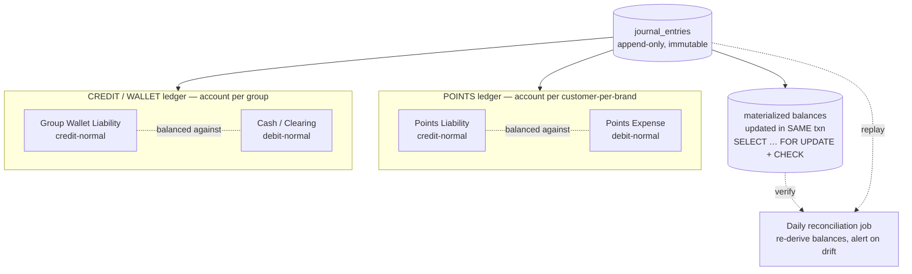
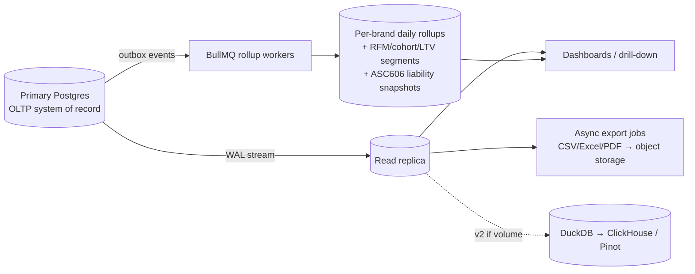
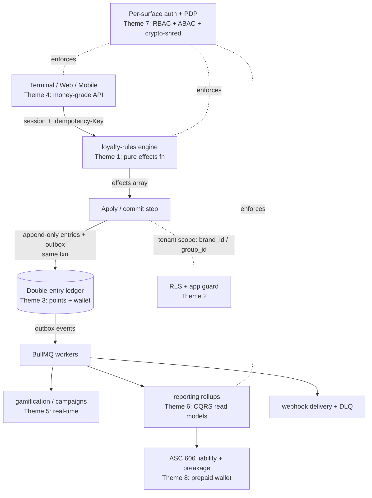

# Research Notes

**00 — Research Notes: Industry-Standard Loyalty Engine Architecture & Feature Expectations**

*Phase 0 evidence base for a multi-tenant, closed-loop, B2B2C loyalty platform. Last updated 2026-06-13.*

---

## Purpose & how to read this document

This is the **evidence base** the rest of the Phase 0 plan rests on. It surveys what mature commercial loyalty platforms (Talon.One, Voucherify, Open Loyalty, Antavo, Capillary, Comarch, Smile.io, Square, Stripe, Adyen, Toast) and the underlying systems literature (Modern Treasury, TigerBeetle, Kleppmann, AWS/Azure SaaS guidance, the Big 4 accounting firms) actually do, then states **the pattern we will adopt** and **the pitfalls we will avoid**.

Eight themes, each in the same shape:

1. **Engine architecture & rules engines** — the headless "effects" decision model
2. **Multi-tenancy** — shared schema + RLS for thousands of tenants
3. **Ledger & correctness** — immutable double-entry, idempotency, concurrency
4. **Terminal / POS integration** — money-grade API contract at the lane
5. **Feature & gamification expectations** — what a 2025–2026 program must ship
6. **Reporting at scale** — Postgres-first CQRS read models
7. **Security, RBAC scoping & GDPR** — defense in depth, crypto-shredding
8. **Loyalty economics & liability** — ASC 606, breakage, prepaid wallets

The recommendations here are deliberately **consistent with the locked architectural decisions** (NestJS modular monolith, Turborepo + pnpm, PostgreSQL single shared schema + RLS, double-entry immutable ledger, BullMQ/Redis, CQRS read models, per-surface auth, prepaid wallet). Where the research surfaces a credible alternative, it is noted as an alternative — not as a contradiction.

---

## Theme 1 — Engine architecture & rules engines

### What the industry does

Modern loyalty engines have converged on a small, recognizable set of patterns, best exemplified by **[Talon.One](https://docs.talon.one/docs/dev/integration-api/api-effects)**. The dominant model is a **stateless rules engine** that receives a *customer session* (cart + profile + events), evaluates campaigns/rules, and returns an **ordered-independent array of typed effects** (`setDiscount`, `addLoyaltyPoints`, `deductLoyaltyPoints`, `triggerWebhook`, `addToAudience`, `rollbackAddedLoyaltyPoints`, etc.). The integration layer interprets and applies those effects against its own system of record. Crucially, **the engine itself does not mutate balances or carts** — it *decides and emits*, keeping the engine headless and API-first.

This produces a clean closed-loop contract:

```mermaid
flowchart LR
    POS[POS / Web / Mobile] -->|1. send session/event| ENG[Rules Engine<br/>pure decision fn]
    ENG -->|2. evaluate rules| ENG
    ENG -->|3. return effects[]| APPLY[Apply / Commit layer]
    APPLY -->|4. mutate system of record| LEDGER[(Ledger / Wallet)]
    APPLY -->|optional ack| POS
```

Supporting patterns observed across **[Open Loyalty](https://openloyalty.io/insider/loyalty-system-architecture-how-modern-platforms-are-built)**, **[Grid Dynamics](https://www.griddynamics.com/blog/building-modern-customer-loyalty-engine)**, **[Voucherify](https://docs.voucherify.io/build/loyalty-points)**, **[Antavo](https://developers.antavo.com/)**, **[Comarch](https://www.currencyalliance.com/insights/loyalty-rules-and-the-loyalty-rules-engine)**:

- **Customer session as an explicit state machine.** Talon.One sessions move `open → closed → (cancelled | partially_returned)`, with reopen. **Points/discounts commit only when the session is CLOSED**; cancelling/reopening emits *rollback effects* that undo prior effects; partial returns roll back per-item effects only. Attribute updates are intentionally **not** rolled back (audit trail). Re-sending a session update re-evaluates and reconciles → safe retry semantics. ([Talon.One — Customer sessions](https://docs.talon.one/docs/dev/concepts/entities/customer-sessions))
- **Request serialization per profile/session** for correctness. Talon.One serializes concurrent writes per profile/session integration ID (allows ~3 parallel, queues up to 2, returns `409 'too many requests updating this profile/session'` beyond that), avoiding lost-update races without distributed locks. ([Talon.One — Events](https://docs.talon.one/docs/dev/concepts/events))
- **A serializable rule DSL.** Conditions are composable groups (AND/OR/brackets) over typed, namespaced attributes (built-in + custom + filter + placeholder) with a bounded operator set (`equals`, `gt`, `lt`, `startsWith`, `endsWith`, `contains`, `matches` via **RE2** — a deliberately safe regex engine that bounds evaluation cost). Voucherify exposes the same shape explicitly across six condition domains. ([Talon.One — Available conditions](https://docs.talon.one/docs/product/rules/conditions/available-conditions), [Voucherify — Validation rules](https://docs.voucherify.io/optimize/create-validation-rules))
- **Schema-flexible attributes.** Custom attributes on every entity (profile, session, cart item, event) plus auto-generated filter attributes — "schema-independent data model, no ETL/middleware" — let each merchant model their own data without engine migrations.
- **Campaign evaluation groups** with explicit *modes* (`stackable` / `first-campaign` / `highest-discount`) and *scopes* (session vs item), with cascading discounts applied to already-discounted totals and a hard floor at zero. This is how stacking, exclusivity, and budget governance are controlled declaratively.
- **Budgets/limits as engine-side constraints**, checked on every session update but only **consumed on close** (preview vs commit). A coupon can be offered then become invalid before checkout if budget is exhausted by intervening sessions.
- **Daily batch recalc complements real-time earn.** Voucherify runs a midnight job in a strict order: *activate pending → auto-redeem checks (capped 10/customer/day) → tier recalc → expire points → tier recalc again*. Earn/burn is real-time; tiers and expiry are eventually-consistent batch concerns.

### The pattern we adopt

- **Make our `loyalty-rules` module a pure decision function.** Input: a session/profile/event snapshot. Output: an **ordered-independent array of typed effects**. The engine never writes balances; a separate **apply/commit step** (in `ledger`/`wallet`) interprets effects idempotently. This is the single most important pattern to copy — it gives testability, deterministic replay, and channel reuse across POS/web/mobile.
- **Model a transaction context (session) as a state machine** `open → closed → cancelled/partially_returned (reopen allowed)`. Commit ledger effects only on close; define rollback effects for cancel/reopen/partial-return. Returns, voids, and retries become first-class, not bolt-on.
- **Store rules as data** — a versioned, serializable JSON tree of composable condition groups over namespaced attributes (`profile.*`, `session.*`, `item.*`, `event.*`) with a bounded operator set and an **RE2-style safe regex**. Evaluate in a sandboxed interpreter with a per-evaluation timeout. This enables a no-code builder later without code deploys.
- **Implement evaluation groups** with `stackable / first-match / highest-value` modes and session/item scopes, cascading discounts, and a zero floor — declaratively solving promotion stacking and exclusivity.
- **Separate real-time decisioning from periodic recalc.** Earn/burn and effect emission in real time (synchronous request path); a scheduled BullMQ job does pending→active activation, expiration sweeps, and tier recomputation — idempotent and safely re-runnable. This maps directly to our `gamification` evaluation, `campaigns`, and point-expiry sweep workers.
- **Headless/API-first from day one.** Every mechanic (members, transactions, earn rules, redemptions, campaigns, rewards, tiers) is exposed via REST (auto-generated OpenAPI/Swagger from NestJS), plus webhooks and a batch/export path. Support built-in vs custom event ingestion, with a queued/async events endpoint for high-traffic spikes.

### Pitfalls to avoid

- **Letting the engine mutate balances/carts directly** instead of emitting effects a separate idempotent apply-step commits — destroys testability, replay, and retry safety. The engine decides; it does not mutate.
- **Order-dependent effect handling.** Talon.One explicitly warns integration logic must *not* depend on the array order. Treat effects as an unordered set keyed by `effectType + props`.
- **Unbounded condition expressions** (especially user-authored regex). Catastrophic backtracking blows up evaluation latency at transaction time. Use the bounded operator set, RE2, and budget/timeout evaluation.
- **Treating tier/expiration recomputation as real-time per-transaction work** — expensive and racy. Make it an idempotent scheduled batch and keep it eventually consistent.
- **Synchronously coupling fulfillment** (voucher issuance, emails, external syncs) to evaluation — a slow downstream then blocks the purchase path. Decouple via outbox/events (see Theme 3).

---

## Theme 2 — Multi-tenancy (PostgreSQL, B2B2C)

### What the industry does

The **[AWS SaaS Tenant Isolation Strategies whitepaper](https://docs.aws.amazon.com/whitepapers/latest/saas-tenant-isolation-strategies/the-bridge-model.html)** defines three models: **silo** (resource per tenant — highest cost, no noisy neighbor), **pool** (shared infrastructure — lowest cost, max noisy-neighbor exposure), and **bridge** (a mix). In Postgres terms: silo ≈ database/instance per tenant; bridge ≈ schema-per-tenant or db-per-tenant on shared infra; **pool ≈ shared schema + tenant key column + Row-Level Security (RLS)**. ([AWS — Postgres data access patterns](https://aws.amazon.com/blogs/database/choose-the-right-postgresql-data-access-pattern-for-your-saas-application/))

- **[PlanetScale](https://planetscale.com/blog/approaches-to-tenancy-in-postgres)** recommends **shared schema** as the simplest and most scalable model — reaching many thousands of tenants — and warns schema-per-tenant and db-per-tenant likely will not scale past a few hundred. Schema-per-tenant suffers **shared-catalog bloat** that slows planning/migrations; db-per-tenant suffers **pool exhaustion** (poolers key on db+user) plus ~8 MB template overhead per database.
- The **most fragile part of RLS is tenant-context propagation**, not the policies. The canonical policy filters the tenant key against a session setting read via `current_setting(...)` set by `SET`/`set_config`. Under transaction-pooling (PgBouncer), a *session-level* setting **leaks** the prior tenant's context to the next request — so you must use a **transaction-scoped `SET LOCAL`** that resets at commit.
- RLS is **bypassed by superusers, `BYPASSRLS` roles, and the table owner by default**. Run the app as a **dedicated non-owner login role** (`NOINHERIT`, no bypass) with **`FORCE ROW LEVEL SECURITY`** so even the owner is subject to policy. Views/`SECURITY DEFINER` functions silently bypass RLS unless set `security_invoker`.
- Separate the `USING` (read filter) from `WITH CHECK` (write guard) — without `WITH CHECK`, a tenant can *write* rows tagged with another tenant's id even if it can't read them. **Fail closed**: an unset/empty context returns zero rows (`NULLIF(current_setting('app.current_brand', true), '')`).
- **[Supabase](https://supabase.com/docs/guides/troubleshooting/rls-performance-and-best-practices-Z5Jjwv)** reports **>100× speedup** when the tenant key is indexed and context lookups are wrapped in a subselect (run once per statement as an init plan).
- **[Citus / Azure SQL hybrid sharding](https://learn.microsoft.com/en-us/azure/azure-sql/database/saas-tenancy-app-design-patterns?view=azuresql)** distributes by tenant key, co-locates related tables on one shard, and can isolate a noisy/large tenant onto its own shard. Tenant data follows a **Zipf power law**, so isolating the few biggest tenants is high-leverage.

### The pattern we adopt

- **Shared schema + RLS (pool) as the primary architecture.** It scales to thousands of tenants and keeps migrations a single operation.
- **`brand_id` is the primary isolation key** for loyalty data (closed-loop). Carry `platform_id`/`group_id`/`brand_id`/`branch_id` on every loyalty table, with `brand_id NOT NULL` and indexed, leading composite indexes. **Prepaid wallet/credits are scoped to `group_id`** (per the locked decisions). RLS policy filters `brand_id` against `NULLIF(current_setting('app.current_brand', true), '')`; branch visibility is a narrower policy or app filter within the brand.
- **Run the app under a non-owner role** (`LOGIN`, `NOINHERIT`, no `BYPASSRLS`) with `ENABLE`/`FORCE` RLS on every tenant table. Migrations run under a separate owner role the request path never uses.
- **Transaction-scoped context.** Each request opens a transaction (our `terminal-gateway`/`identity` guard) and issues `SET LOCAL app.current_brand = …` (and `app.current_group`, etc.) before any query. Default the setting to empty string at the role level so unset sessions **fail closed**. Never use bare `SET`.
- **Defense in depth:** the **app-layer tenant-scoping guard** is the everyday mechanism; **RLS is the backstop**. Both `USING` and `WITH CHECK` on every policy, plus separate INSERT/UPDATE `WITH CHECK`.
- **A CI suite that connects as the non-owner app role** and asserts cross-brand reads and writes return zero rows or are rejected. This is non-negotiable.
- **Sharding-ready:** keep `brand_id` as the leading PK element / future distribution column so a large/noisy brand can move to a Citus shard or dedicated database with no schema change (mirrors the AWS bridge model).
- **Noisy-neighbor guardrails:** `statement_timeout`, `idle_in_transaction_session_timeout`, pooler query timeouts, per-tenant connection caps, per-brand token-bucket rate limiting (Redis), per-tenant monitoring.

### Pitfalls to avoid

- **Session-level settings under pooling leak tenants.** Use `SET LOCAL`. Owner/bypass roles skip RLS unless forced.
- **Missing `WITH CHECK`** allows cross-brand writes; **unset context** can dump all tenants; **views/definer functions** bypass RLS. Require `WITH CHECK`, fail closed, prefer `security_invoker`. Route cross-brand reporting through **audited `SECURITY DEFINER` functions**, never by loosening policies.
- **Schema-/db-per-tenant traps** (catalog bloat, pool exhaustion). Stay on indexed shared schema with app scoping + RLS.
- **Tenant isolation ≠ noisy-neighbor control** — partitioning/RLS prevents leakage but does not stop one tenant starving shared CPU/IO. Mitigate separately (replicas, timeouts, rate limits).

---

## Theme 3 — Ledger & correctness

### What the industry does

Consensus across **[Modern Treasury](https://www.moderntreasury.com/journal/accounting-for-developers-part-i)**, **[Stripe](https://stripe.dev/blog/ledger-stripe-system-for-tracking-and-validating-money-movement)**, **[TigerBeetle](https://docs.tigerbeetle.com/concepts/debit-credit/)**, and **[Kleppmann](https://martin.kleppmann.com/2015/05/27/logs-for-data-infrastructure.html)**: a production ledger is an **immutable, append-only, double-entry** system where **balances are derived from journal entries, not mutated in place**.

- **Double-entry core.** Every transaction has ≥2 entries summing to zero. Debit-normal accounts (assets, expenses) increase on debit; credit-normal accounts (liabilities, equity, revenue) increase on credit. The ledger is correct iff Σ(debit-normal) = Σ(credit-normal).
- **Loyalty points are a credit-normal liability** (an ASC 606 material-right contract liability / deferred revenue). Prepaid **wallet credits are a credit-normal stored-value liability** ([Deloitte ASC 470-10](https://dart.deloitte.com/USDART/home/codification/liabilities/asc470-10/roadmap-debt/chapter-9-debt-extinguishments/9-4-derecognition-liabilities-for-prepaid)).
- **Immutability is universal.** Stripe never deletes/modifies transactions and reconstructs past state by replaying events; TigerBeetle is append-only; Kleppmann shows an append-only ordered log removes race conditions and lets you rebuild views by replaying from offset zero. **Corrections are reversing entries, never `UPDATE`/`DELETE`.**
- **Derived vs materialized balances.** [Modern Treasury](https://www.moderntreasury.com/journal/how-to-scale-a-ledger-part-ii) stores immutable entries plus five fast fields (`posted_debits`, `posted_credits`, `pending_debits`, `pending_credits`, `normal_balance`) and computes posted/pending/available on demand. Materialized balances are an **optimization that must be re-derivable and reconciled**.
- **Pending/posted/available** models holds. TigerBeetle [two-phase transfers](https://docs.tigerbeetle.com/coding/two-phase-transfers/) reserve into `debits_pending`/`credits_pending`; `post_pending_transfer` settles (optionally partial); `void_pending_transfer` cancels; a timeout auto-voids. This is auth-then-capture / reserve-then-drawdown.
- **Idempotency keys** make retries safe ([Stripe](https://stripe.com/blog/idempotency), [Brandur Leach](https://brandur.org/idempotency-keys)): an `idempotency_keys` table keyed on `(actor_id, key)` storing method/params/path/response/recovery_point, run in a `SERIALIZABLE` transaction, replaying the stored response on retry and rejecting same-key/different-params.
- **Three concurrency strategies** prevent lost updates/overdrafts: pessimistic `SELECT … FOR UPDATE`; optimistic `lock_version`; `SERIALIZABLE`/SSI predicate locking ([PG docs 13.2](https://www.postgresql.org/docs/current/transaction-iso.html)). Modern Treasury [chose optimistic locking](https://www.moderntreasury.com/journal/designing-ledgers-with-optimistic-locking) for a read-heavy workload, versioning a separate account-version row.
- **Negative balances/double-spend are best prevented at the DB layer.** TigerBeetle's `debits_must_not_exceed_credits` is inviolable. The Postgres equivalent: a conditional `UPDATE … WHERE available_balance - :amount >= 0` checking affected rows, plus a `CHECK`, inside a locked read-modify-write.
- **Integer minor units only.** Store money/points as `bigint` minor units paired with an ISO 4217 / asset code; never floats. ([Modern Treasury — Floats don't work](https://www.moderntreasury.com/journal/floats-dont-work-for-storing-cents))
- **Reconciliation proves more than balance.** Σ(debit)=Σ(credit) proves arithmetic, not classification or timing. Stripe uses clearing/suspense accounts that must net to zero, plus completeness and timeliness checks.
- **Event sourcing and a double-entry ledger are the same pattern** — the journal-entry table is the event log; balances are the read model; ordering is critical. A specialized ledger schema beats a generic event store because integrity constraints and balances are first-class.

### The pattern we adopt

Per the locked decisions, we run **two ledgers on one engine**:



- **Append-only journal entries are the source of truth**: `id, transaction_id, account_id, direction, amount_minor (bigint), asset_code, occurred_at, created_at`. Enforce per-transaction Σ(debit)=Σ(credit) via constraint/trigger. Never `UPDATE`/`DELETE`; corrections are reversing transactions referencing the original. **Points stored as whole integers; money as integer minor units.** Use separate ledger/asset IDs so points and currency never mix in an entry.
- **Materialized balance rows updated in the SAME DB transaction** as the journal entries (per the locked decision), guarded by `SELECT … FOR UPDATE` row locks + `CHECK` constraints to prevent negative balances and double-spend. Track posted/pending debits/credits + `normal_balance` + `lock_version`. A scheduled job re-derives from entries and **alerts on drift**.
- **Idempotency-key table on every mutating op** (earn, redeem, top-up, spend, reverse), unique on `(actor_id, key)`, processed in a `SERIALIZABLE`/`REPEATABLE READ` transaction, replaying the stored response on retry and rejecting param mismatches. Propagate a derived key to any downstream PSP so external charges dedupe too.
- **Reserve-then-commit (two-phase)** for redemptions and wallet spend: authorization writes pending entries reducing *available* balance; capture posts them; cancel/timeout voids and restores. **Redemption critical sections use `REPEATABLE READ`/`SERIALIZABLE`** (locked decision).
- **DB-layer non-negativity:** conditional `UPDATE … WHERE available_balance - :amount >= 0`, zero affected rows = insufficient balance — the Postgres analogue of `debits_must_not_exceed_credits`.
- **Concurrency strategy:** default optimistic `lock_version` for this read-heavy workload; fall back to `SELECT … FOR UPDATE` for known hot accounts (shared promo pool, high-traffic group wallet) to avoid optimistic retry storms.
- **Transactional OUTBOX** (locked decision): write the ledger change + an outbox event in one DB transaction; a separate BullMQ publisher emits domain events (`points_earned`, `tier_upgraded`, `reward_issued`) after commit → webhooks with retries + DLQ. Fulfillment is a decoupled consumer that survives outages.
- **Expiry/breakage as explicit ledger events**, not silent deletions: an expiry job posts a reversing/breakage transaction (debit Points Liability, credit Breakage Income) so the audit trail and statements stay reconstructable (ties to Theme 8).
- **Reconciliation first-class:** (a) global invariant Σ(credit-normal)=Σ(debit-normal); (b) clearing/suspense accounts that net to zero with stuck-money alerts; (c) subledger-to-control tie-outs per brand/group/member; (d) completeness checks that each business event produced a matching transaction.

### Pitfalls to avoid

- **Mutating balances in place** instead of appending entries — destroys audit, breaks reconciliation, reintroduces races.
- **Editing/deleting historical entries** to fix mistakes — breaks reproducibility and ASC 606 reporting. Always reverse.
- **Application-only balance checks (read-then-write) without a lock or constraint** — the canonical double-spend (TOCTOU). Enforce non-negativity in the locked transaction or via conditional `UPDATE`/`CHECK`.
- **Floats/doubles** for points or money. Integer minor units only.
- **Treating Σ(debit)=Σ(credit) as proof of correctness** — it isn't; reconciliation is still required.
- **Idempotency done wrong** — keying on the key alone (not the actor), not validating params, not persisting the response, long-lived keys, or forgetting to propagate to PSP calls (→ real double charges).
- **Conflating "earned" with "spendable" points** — without a pending/activation hold, returns and fraud let customers spend points they should never have had. Model `pending → active` with the expiration clock starting at activation.
- **Silent expiry** (deleting/zeroing points) instead of a breakage/reversal transaction.

---

## Theme 4 — Terminal / POS integration

### What the industry does

POS earn/burn should be modeled on the primitives mature **payment-terminal** APIs use, because **loyalty points carry monetary value and demand exactly-once semantics**. Reference platforms: **[Stripe Terminal](https://docs.stripe.com/terminal/features/operate-offline/overview)**, **[Square Terminal/Loyalty](https://developer.squareup.com/docs/terminal-api/overview)**, **[Adyen Terminal API / Nexo](https://docs.adyen.com/point-of-sale/design-your-integration/terminal-api)**, **[Toast](https://doc.toasttab.com/doc/devguide/apiLoyaltyIntegrationAuthentication.html)**, Clover/PAX Android.

- **Idempotency is universal and mandatory** on every points-affecting write. Stripe uses an [`Idempotency-Key` header](https://docs.stripe.com/api/idempotent_requests) (V4 UUID, ≤255 chars, cached ≥24h, returns the original status+body on replay incl. 500s, errors on param mismatch). Square requires an `idempotency_key` body field. Adyen uses a `ServiceID` unique per terminal (POIID) within 48h.
- **Earn/burn maps onto authorize/capture/void.** Square delayed capture: create with `autocomplete=false` (APPROVED), then `CompletePayment` (capture) or `CancelPayment` (void); **authorized payments auto-void after 36h (card-present) / 7d otherwise** ([Square — one-off payments](https://developer.squareup.com/docs/terminal-api/square-terminal-payments)). The loyalty analog: a redeem-authorization *holds* points, capture confirms against the settled sale, void/expiry releases the hold. Refunds use a compensating **reverse**, never mutation.
- **Async result delivery uses BOTH webhooks and polling.** Square recommends Terminal webhooks (`terminal.checkout.created/updated`) because of request-to-completion delay, but lets you `GET` the checkout as a fallback. **Design rule: the POS must always have a pollable `GET` on transaction state.**
- **Webhook signing = HMAC-SHA256 over `timestamp + "." + raw_body`**, signature + timestamp in headers. Verify on **raw bytes before JSON parsing** (re-serialization breaks the MAC), constant-time compare, reject >5-min skew, dedupe on provider event id (at-least-once). ([Hooque webhook security](https://hooque.io/guides/webhook-security/), [Stripe webhook guide](https://www.hooklistener.com/learn/stripe-webhook-security-guide))
- **Secret rotation uses overlapping secrets** — accept `{current, previous}` for 24–48h. Same for device secrets/API keys.
- **Offline / store-and-forward is first-class, not an error path.** Stripe stores payments locally, survives reboots, auto-forwards on reconnect; Adyen supports offline EMV / store-and-forward where the PSP reference is generated only on reconnect ([Adyen offline](https://docs.adyen.com/point-of-sale/offline-payment)). Loyalty implication: offline earn/redeem must be **provisional**, signed locally, queued with the idempotency key, and **server-authoritative on sync** (may downgrade to a reversal).
- **Two-phase device provisioning.** A short-lived single-use **pairing code** provisions a device → long-lived device secret in the keystore → exchanged for **short-lived (~1h) bearer/connection tokens** scoped to a store/lane.
- **Customer identification is a separate resolve step.** Square `SearchLoyaltyAccounts` by phone/customer id. Practical lane identifiers: phone, scanned QR/barcode (rotating member code), NFC tap, raw loyalty ID. Resolve returns an **opaque short-lived member token** so PII isn't echoed per line.
- **Square's loyalty ledger is event-sourced/append-only:** `AccumulateLoyaltyPoints` (earn from `order_id`), `AdjustLoyaltyPoints` (+/−, `allow_negative_balance` for refunds), `CalculateLoyaltyPoints` (preview/quote). Balance is derived, never overwritten. ([Square — Manage loyalty points](https://developer.squareup.com/docs/loyalty-api/loyalty-points))
- **Adyen's Nexo `SaleToPOIRequest/Response`** is a clean narrow envelope (`MessageHeader` with `ServiceID`/`SaleID`/`POIID` + category body, responses echo header) returning a `POITransactionID`. A reusable envelope+correlation-id pattern.
- **Android smart terminals (PAX/Verifone/Clover) are semi-integrated** — the POS fires an Intent / calls the vendor SDK and the secure on-device app handles card data. Loyalty rides as a **value-added-service tender/Intent**, so the engine never touches PAN ([Clover docs](https://docs.clover.com/dev/docs/home), [Cybersource PAX](https://developer.cybersource.com/docs/cybs/en-us/pax-all-in-one/integration/all/na/pax-all-in-one/pax-aio-intro.html)).

### The pattern we adopt

A **single narrow, versioned surface** under `/v1/terminal/*` (locked decision), treated like a payment API:

| Endpoint | Purpose |
|---|---|
| `POST /v1/members/resolve` | identifier `{type: phone\|qr\|nfc\|loyalty_id\|card_token, value}` → opaque member token |
| `POST /v1/quotes` | preview earn/discount (no mutation) — "earn X / redeem Y for $Z off" |
| `POST /v1/transactions` | earn (single capture) or redeem-authorize |
| `POST /v1/transactions/{id}/capture` | confirm against settled sale |
| `POST /v1/transactions/{id}/void` | release hold |
| `POST /v1/transactions/{id}/reverse` | compensating refund (append-only) |
| `GET /v1/transactions/{id}` | poll fallback to a definitive state before printing receipt |
| device + webhook admin | provisioning, rotation, subscriptions |

- **Mandatory `Idempotency-Key` header** on every ledger-touching POST (POS-generated V4 UUID derived from cart/check + lane + intent). Persist `key → {status, response, request-hash}` ≥24h; replay on match; `409` on same-key/different-hash.
- **Explicit transaction state machine** `PENDING → AUTHORIZED → CAPTURED`, terminal `VOIDED/EXPIRED/REVERSED/FAILED`. Earn at a settled sale collapses to a single `CAPTURED` write; redemptions authorize-then-capture and **auto-release on TTL** (mirror Square's 36h/7d). Refunds emit a linked `REVERSE` (append-only).
- **Auth = per-terminal API key (publishable id) + secret used for HMAC request signing; short-lived access tokens** (locked decision). Two-tier: single-use pairing code → device secret → ~1h tokens scoped to a store/lane. Rotate device + webhook signing secrets with `{current, previous}` overlap.
- **Store-and-forward in the POS SDK** (`packages/sdk-terminal`): offline → validate the member token locally, compute a provisional result, sign the queued request with its idempotency key, show provisional UI, forward on reconnect. Server is authoritative on sync and may downgrade an offline redeem to a reversal. **Bound offline exposure** with per-member/per-device offline points limits and a max queue age (clock-skew handling).
- **Signed webhooks AND pollable GET.** `X-Loyalty-Signature: t=<ts>,v1=<hex>` = HMAC-SHA256 over `timestamp.rawbody`; consumers verify on raw bytes, reject >5-min skew, dedupe on `event_id`; exponential-backoff retries + DLQ (BullMQ). Always allow `GET /v1/transactions/{id}` to reach a definitive state.
- **Decouple identity** via `resolve` returning an opaque short-lived member token; support rotating QR/NFC codes to prevent member-id harvesting.
- **Quotes** (`CalculateLoyaltyPoints`-style) preview without mutation; the subsequent earn/redeem references the quote id.
- **Android smart terminals:** loyalty as a value-added-service tender/Intent — the engine only sees member tokens and order totals, staying out of PCI scope.
- **Version conservatively/additively:** never repurpose a field; gate breaking changes behind `/v2`; keep idempotency, signing, and state-machine semantics stable across versions (terminals update slowly). Echo a correlation id on every response and webhook.

### Pitfalls to avoid

- **Fire-and-forget calls** without mandatory idempotency keys → network retries double-earn/double-burn.
- **Verifying webhook signatures after JSON parse/re-serialize** → silently broken HMAC. Verify raw bytes, constant-time, enforce skew window + event-id dedupe.
- **Authoritative offline grants at the lane** without a server reconcile + reversal path and exposure caps → over-redemption you can't claw back.
- **Mutating committed entries on refund** instead of appending compensating reverses.
- **No TTL/auto-expiry on redeem holds** → abandoned carts permanently strand a member's balance.
- **Long-lived static keys baked into terminals** → wide blast radius on loss/theft. Use pairing → short-lived scoped tokens with overlapping rotation.
- **A chatty/wide surface that breaks across versions** → stranded fleets. Keep it narrow and additive.
- **Echoing raw PII (phone) per transaction** and guessable QR/NFC codes → member-id harvesting + PII over-collection.

---

## Theme 5 — Feature & gamification expectations (2025–2026)

### What the industry does

The category is healthy and ROI-positive — **[Antavo](https://antavo.com/blog/global-customer-loyalty-report-2025/)** reports 83% of program owners see positive ROI averaging **5.2×**, with ~31% of marketing budgets going to loyalty/CRM — so feature expectations have risen. Modern programs layer: a flexible **points engine** at the core, **tiers/status** for aspiration, **gamification** for engagement, and **AI/RFM personalization** on top.

- **Earning rules are rule-engine driven, not hard-coded:** per-spend, per-visit/check-in, per-SKU/category, per-channel (online/in-store/app), fixed bonus, per-segment. ([Open Loyalty points](https://www.openloyalty.io/product/loyalty-points-system), [Voucherify](https://docs.voucherify.io/build/loyalty-points))
- **Multipliers are a distinct, layered concept:** permanent tier multipliers (Gold = 1.5×), time-bound campaign multipliers (Double-Points Weekend), category/SKU multipliers, segment-targeted, behavioral (anniversary/referral/social). Critical design choice: **stacking logic (combine vs take-highest) + per-transaction caps**. ([Voucherify multipliers](https://www.voucherify.io/glossary/loyalty-points-multipliers))
- **Non-transactional earning is standard:** reviews, referrals, signup, profile completion, wishlist adds, social shares, app activity, events — doubling as gamified data collection (55.1% will share more via games/quizzes; only 42% of programs offer it, 75.7% plan to).
- **Point state model matters at the data layer:** active / pending (return window) / burned / expired, with **multiple wallets** (separate base vs promotional pools with independent expiry).
- **Tiers** qualify on configurable criteria (spend / points / visits / tenure / combination); benefits include multipliers, discounts, free shipping, early access, priority support. **Tier lifecycle** is key: review/reset periods (calendar / rolling / anniversary), downgrade logic, **grace periods**. **Loss aversion** (fear of dropping a tier) is a stronger motivator than advancement, so progress-to-next-tier visibility and downgrade nudges are deliberate. ([Open Loyalty tiers](https://www.openloyalty.io/product/tier-loyalty-program), [Antavo tiers](https://antavo.com/blog/tiered-loyalty-program-effectiveness-2025/))
- **Campaigns:** double-points/bonus days, time-windowed happy-hour, seasonal multipliers, targeted/segmented deployment — with **no-code/drag-and-drop builders** an explicit expectation.
- **Gamification mechanic set (8 high-ROI):** progressive tiers with visible progress, streaks, time-bound challenges/missions/quests, badges/achievements, progress bars, time-limited events, **micro/segmented leaderboards** (rank vs nearby peers, not global top), games of chance (spin/scratch). Up to **47% engagement lift / ~22% loyalty increase**. **Rewards must fire in real time / in-session** — batch processing kills the dopamine loop. ([Xtremepush](https://www.xtremepush.com/blog/7-gamification-mechanics-that-drive-player-loyalty-points-badges-leaderboards-tiers-challenges-streaks-and-rewards), [Open Loyalty gamification](https://www.openloyalty.io/product/customer-gamification-software), [Smile.io](https://blog.smile.io/gamification-can-improve-vip-loyalty-program/))
- **Achievements** are single-rule milestones or multi-dimensional (composed of several rules), triggered by transactions/referrals/behaviors/other achievements ([Open Loyalty Achievements](https://www.openloyalty.io/product/achievements)).
- **Referrals are double-sided** (78% of programs; converts better than single-sided): unique codes/links, end-to-end attribution, fraud caps, ideally tiered rewards — integrated with points/VIP, not standalone.
- **RFM segmentation** is the analytics backbone: 1–5 scoring on R/F/M via quantiles → named segments (Champions, Loyalists, At-Risk, Dormant, New) → per-segment action. ([Shopify RFM](https://www.shopify.com/blog/rfm-analysis))
- **Personalization + AI** is the dominant trend: 37.1% of programs already use AI; 73% of shoppers want personalized rewards but only ~45% of brands deliver — a clear gap. ([Talon.One 2026 guide](https://www.talon.one/blog/customer-loyalty-programs))
- **Expiry/breakage** is a deliberate policy area: 12–24 months typical (6 for some CPG/food), commonly **rolling/sliding** (last balance-change date resets the countdown), with proactive **pre-expiry notifications 1–2 months out**. ([Voucherify expiry](https://www.voucherify.io/blog/guide-to-loyalty-points-expiration))
- **High-demand features with adoption gaps:** reward customization (81.2% want / 49.2% have), family accounts/point pooling (76% want / ~44% have), no-expiration (40.7% want). **Mobile-first matters — 59% prefer app interaction.**
- **Paid/subscription** and **coalition** loyalty are recognized as more advanced program types layered on the core earn/burn engine ([Paytronix](https://www.paytronix.com/resources/reports/restaurant-loyalty-insights-report)).

### The pattern we adopt

**V1 table-stakes (build first):**

- A configurable **earning-rule engine** (per-spend, per-visit, per-SKU/category, fixed bonus, per-channel) with a **separate multiplier concept** (tier + campaign), explicit **stacking mode + per-transaction caps**. *Hard-coding "X points per dollar" will not survive first contact with marketing.*
- **Explicit point state** (active/pending/redeemed/expired) on the immutable ledger (Theme 3) — foundational for expiry, breakage, fraud audit, disputes; painful to retrofit. Support **multiple wallets** (base vs promotional) so family/coalition can be added later without a rewrite.
- **3–5 membership tiers** on a configurable metric, with multipliers + benefit flags, a tier review/reset job (calendar or rolling) + grace period, and **stored "progress to next tier"** for progress-bar UI.
- **Earn/burn redemption** with a coupon/voucher subsystem (unique codes, validity windows, min-spend/eligible-SKU rules, single/multi-use, per-customer limits).
- **Double-sided referral** on the same points ledger (code/link, attribution on the referred user's qualifying action, reward to both, basic fraud caps).
- **Rolling (sliding-window) expiry** (default 12 months) + scheduled **pre-expiry notification** trigger; expose **breakage as a report** early (issued vs redeemed vs expired) for finance.
- **Omnichannel identity** — a single profile resolvable across web/app/POS (our `identity` module: global person, per-brand membership, per-brand wallet) and a near-real-time points API.

**Advanced (Phase 2+), designed-for now:**

- Layer gamification incrementally via the `gamification` module + BullMQ event evaluation: **badges/achievements + progress visualization first** (cheapest, high perceived value), then streaks + time-bound challenges/missions, then micro-leaderboards + games-of-chance. **Critical: celebrations fire in real time / in-session** (event-driven, not nightly cron).
- **RFM segmentation** as a scheduled scoring job (Theme 6) feeding campaign targeting (Champions → exclusive offers; At-Risk → re-engagement; Dormant → win-back) — the bridge to AI personalization.
- **Defer** family/point-pooling, paid/subscription tiers, coalition (shared currency), and full AI reward recommendation — but the **account + multi-wallet + ledger model is designed now** so they slot in without a rewrite (a wallet can later belong to a household; multiple point types/wallets are supported). This aligns with the locked **open-loop readiness** decision: a future coalition currency is just a platform-scoped account type + currency, no ledger rewrite.

### Pitfalls to avoid

- **Single mutable balance** instead of an event ledger — the most common irreversible v1 mistake.
- **Hard-coding earning math** in code rather than data-driven rules — engineering becomes the bottleneck. Build the rule engine even if the first rule set is trivial.
- **Batch/overnight gamification rewards/tier changes** — kills the dopamine/habit loop. Must be event-driven and in-session.
- **Aggressive/opaque expiry without notification** — 40.7% actively want no expiration; use a rolling window and notify 1–2 months ahead.
- **Over-scoping v1** with coalition/paid/family/AI before the core loop is solid.
- **Single-sided or untracked referrals** — tie rewards to the referred user's *qualifying action*, not signup; cap fraud (self-referral, code farming).
- **Global/full leaderboards and steep tier ladders** — demotivate the majority. Use micro/segmented leaderboards and attainable thresholds.
- **Ignoring breakage in financial modeling** — reserve ≥12 months of issuance/redemption data and a defined revenue-recognition policy before scaling generosity (Theme 8).

---

## Theme 6 — Reporting & analytics at scale

### What the industry does

For a write-heavy + read-heavy multi-tenant platform, the dominant pattern is a staged, **Postgres-first** architecture: keep Postgres as the OLTP system of record, then layer **logical CQRS read models, pre-aggregated rollup tables, and materialized/continuous aggregates**.

- **CQRS does not require event sourcing or separate databases** — the practical pattern is logical separation: a normalized write model + denormalized read models that can live in the same Postgres initially and scale out later ([Azure — CQRS](https://learn.microsoft.com/en-us/azure/architecture/patterns/cqrs)).
- **The highest-leverage first step is a streaming read replica** to offload reporting/BI/dashboards off the primary, accepting seconds-of-lag async replication ([AWS RDS read replicas](https://docs.aws.amazon.com/AmazonRDS/latest/UserGuide/USER_PostgreSQL.Replication.ReadReplicas.html)).
- **Pre-aggregated rollup tables** (per-tenant, per-day grain) are the core analytics primitive — dashboards hit summaries, not raw history. Maintained by scheduled jobs, triggers, `pg_ivm`, or TimescaleDB continuous aggregates.
- **Plain materialized views** require full recompute; `REFRESH … CONCURRENTLY` avoids blocking readers **but** needs a non-partial, non-expression, **non-nullable** UNIQUE index (the `NULL=NULL` pitfall makes all rows look changed) and allows only one refresh at a time ([PG docs — REFRESH MV](https://www.postgresql.org/docs/current/sql-refreshmaterializedview.html)).
- **`pg_ivm`** adds true incremental view maintenance via triggers, but **blocks writes during maintenance, is not fully production-hardened, and is unavailable on RDS/Cloud SQL** ([pganalyze](https://pganalyze.com/blog/5mins-postgres-15-beta1-incremental-materialized-views-pg-ivm)).
- **TimescaleDB continuous aggregates** incrementally refresh per changed time-bucket — ideal for time-series rollups; Cloudflare reported **5–35× latency** and **~33× storage** improvements ([Cloudflare](https://blog.cloudflare.com/timescaledb-art/), [Timescale](https://medium.com/timescale/real-time-analytics-for-time-series-a-devs-intro-to-continuous-aggregates-b9c38b5746f0)).
- **RFM, cohort retention, churn, LTV** are all SQL window-function aggregates over a per-customer summary (days-since-last-purchase, order count, revenue sum, `NTILE` scoring), **recomputed on a schedule** (nightly / ≥quarterly for RFM) into a segment table — static never-refreshed scores are a documented anti-pattern ([OWOX](https://www.owox.com/glossary/rfm-segmentation), [Apte](https://apte.ai/news/2026/03/23/rfm-segmentation-improve-retention-ltv/)).
- **Points liability is an ASC 606 deferred-revenue problem** needing an immutable earn/redeem/expire ledger + a periodic liability snapshot — not just a running balance ([TrueLoyal](https://www.trueloyal.com/blog/financial-accounting-for-liability-from-rewards-programs)).
- **The "Postgres wall"** is architectural: row-store + MVCC tuple-visibility checks make GROUP BY/window/multi-join scans degrade once the working set exceeds RAM; warning signs are dashboard queries going from ~50ms to 10+s ([MotherDuck](https://motherduck.com/learn/duckdb-vs-postgres-embedded-analytics/)).
- **OLAP engine choice** when you hit the wall: **ClickHouse** (simpler ops, strong <100 cores/<1TB, batch warehousing); **Druid/Pinot** (near-identical segment architectures for user-facing high-concurrency sub-100ms, far higher operational burden — ZooKeeper/Helix/deep storage) ([Leventov](https://leventov.medium.com/comparison-of-the-open-source-olap-systems-for-big-data-clickhouse-druid-and-pinot-8e042a5ed1c7), [StarTree](https://startree.ai/compare/apache-pinot-vs-apache-druid/)). **DuckDB/[pg_duckdb](https://github.com/duckdb/pg_duckdb)** on a replica is the lowest-friction intermediate step (a UDisc query went 2 min → ~5 s).
- **dbt** provides transformation discipline regardless of engine: staging → intermediate → marts, incremental models (`unique_key`, `is_incremental()`, lookback window for late-arriving facts), tests, scheduled full-refreshes ([dbt incremental](https://docs.getdbt.com/best-practices/materializations/4-incremental-models)).
- **Tenant isolation ≠ noisy-neighbor control** — RLS prevents leakage but not CPU/IO starvation ([PlanetScale](https://planetscale.com/blog/approaches-to-tenancy-in-postgres)).
- **Large exports must be background-job + streaming** — sync <10k rows, async background >100k, cursor/batch ~1k rows/fetch, email/poll-for-download to dodge the 30–60s HTTP timeout ([Tejaya Tech](https://tejaya.tech/p/handling-large-csv-downloads-gracefully-with-queues-background-jobs)).

### The pattern we adopt

This is exactly the locked **CQRS read-model** decision. Staged:

- **Stage 1 (Postgres-first):** Postgres as system of record; add a **streaming read replica** and route all reporting/dashboard/export queries to it via a separate read-only pool. Removes analytics contention from the write path with near-zero app complexity.
- **Logical CQRS:** event-driven, denormalized **per-tenant daily rollup tables** (e.g., `brand_daily_metrics`: transactions, points_earned, points_redeemed, revenue, active_customers) refreshed by **BullMQ scheduled jobs** (locked: reporting rollups worker). All date-range filtering and drill-down serve from rollups; drill to raw transactions only on demand.
- **Append-only points ledger** (Theme 3) as source of truth; derive balances and the **ASC 606 liability snapshot** (`Outstanding × CPP × URR`) as periodic materialized snapshots so finance reports are reproducible — never overwrite a running balance.
- **RFM / cohort / churn / LTV as scheduled batch aggregates** into segment tables keyed by `(brand_id, customer_id)` with a stored **as-of date** for point-in-time reproducibility; validate RFM codes against historical retention/LTV gradients before targeting.
- **For time-series rollups:** prefer scheduled `INSERT … ON CONFLICT` incremental jobs on managed Postgres; if self-hosting and volume warrants, TimescaleDB continuous aggregates. If using plain materialized views, always create the non-nullable, non-partial UNIQUE index and use `REFRESH … CONCURRENTLY`, scheduled off-peak and serialized.
- **dbt early — even against Postgres** — for staging/intermediate/marts layering, incremental models (with lookback for late-arriving loyalty events), tests, and scheduled full-refreshes. Makes the eventual OLAP migration a config change, not a rewrite.
- **Stage 2 (OLAP later), only on documented signals** (rollup/dashboard queries over tens-to-hundreds of millions of rows exceeding seconds, high-concurrency user-facing analytics, replica still bottlenecked): start with **DuckDB/pg_duckdb on the replica** or batch Parquet exports; choose **ClickHouse** for internal batch analytics, **Pinot/Druid** only for genuinely user-facing sub-100ms tenant dashboards. This matches the locked decision to **defer ClickHouse/OLAP to v2 if volume demands**.
- **Exports** = asynchronous BullMQ jobs streaming from the replica/rollup layer in ~1k-row batches → object storage → email/poll-for-download. Enforce `brand_id` scoping (RLS) on every export and rollup query. Served off read replicas (locked decision).



### Pitfalls to avoid

- **Computing RFM/cohort/churn/LTV/liability live on raw tables or the OLTP primary** → noisy-neighbor contention degrading the write path. Serve from rollups on a replica.
- **`REFRESH MATERIALIZED VIEW` (non-concurrent)** locks the view; `CONCURRENTLY` without a proper non-nullable, non-partial unique index fails or silently degrades (the `NULL=NULL` trap).
- **`pg_ivm` on managed Postgres** — a dead end; also blocks writes and isn't production-hardened.
- **Jumping straight to Druid/Pinot** — over-engineering; start with replica + DuckDB.
- **Running-balance-only** instead of an immutable ledger → non-reproducible ASC 606/breakage and broken point-in-time reporting; breakage set once and never re-estimated misstates liability.
- **Conflating tenant isolation with noisy-neighbor control** — and a query that forgets the `brand_id` predicate silently leaks across tenants.
- **Synchronous large exports** — buffer entire result sets and blow the 30–60s timeout.
- **Incremental drift from late-arriving events** — add a lookback window + scheduled full refreshes.
- **Snapshotting segments without an as-of date** — destroys point-in-time reproducibility.

---

## Theme 7 — Security, RBAC scoping, API-key management & GDPR

### What the industry does

- **Derive tenant from verified JWT claims, never client headers**; resolve platform/group/brand/branch scope server-side ([OWASP Multi-Tenant Cheat Sheet](https://cheatsheetseries.owasp.org/cheatsheets/Multi_Tenant_Security_Cheat_Sheet.html)).
- **AWS separates authorization from tenant isolation** — an authorized user can still reach another tenant's data, so **RBAC alone cannot guarantee brand separation** ([AWS multi-tenant authz](https://docs.aws.amazon.com/prescriptive-guidance/latest/saas-multitenant-api-access-authorization/introduction.html), [AWS isolation whitepaper](https://docs.aws.amazon.com/pdfs/whitepapers/latest/saas-tenant-isolation-strategies/saas-tenant-isolation-strategies.pdf)).
- **PAP / PDP / PEP** design with a central engine (Amazon Verified Permissions + Cedar, or OPA + Rego): **RBAC for functionality, ABAC brand tags for isolation**.
- **PostgreSQL RLS is defense in depth** — enable on every tenant table, lead indexes with the tenant key, set tenant via session variable, limit bypass to migration roles ([Leapcell RLS](https://leapcell.io/blog/achieving-robust-multi-tenant-data-isolation-with-postgresql-row-level-security)).
- **[RFC 9700](https://www.rfc-editor.org/info/rfc9700/)** mandates Authorization Code + PKCE even for server clients, deprecates Implicit and ROPC, requires exact redirect-URI matching and sender-constrained tokens.
- **[Auth0](https://auth0.com/docs/get-started/architecture-scenarios/business-to-business/authorization)** / **[Clerk](https://clerk.com/articles/organizations-and-role-based-access-control-in-nextjs)** Organizations scope roles per tenant, allow one user different roles across brands, and restrict M2M grants to specific organizations.
- **SMS OTP is a NIST restricted authenticator** — short expiry, per-phone and per-IP limits with backoff, single-use codes, then a short-lived JWT + refresh with **no PII** ([Prelude](https://prelude.so/blog/secure-otp)).
- **Terminals use AWS SigV4-style HMAC signing** — canonical request, credential scope bound to date/region/service, signed headers, timestamp, and a nonce to defeat replay ([AWS SigV4](https://docs.aws.amazon.com/IAM/latest/UserGuide/reference_sigv.html)).
- **Prefer near-zero-lifetime dynamic credentials**; otherwise auto-rotate with overlapping dual keys, store **hashed** key material, scope narrowly, support instant revocation ([CIAM Compass](https://guptadeepak.com/ciam-compass/best-practices/api-key-rotation/), [OWASP Secrets Mgmt](https://cheatsheetseries.owasp.org/cheatsheets/Secrets_Management_Cheat_Sheet.html)).
- **NIST SC-28 envelope encryption** — per-record data keys wrapped by a KMS master key, AES-256-GCM, ≥256-bit for PII; per-record keys enable **crypto-shredding** ([NIST SP 800-209](https://nvlpubs.nist.gov/nistpubs/SpecialPublications/NIST.SP.800-209.pdf), [Conduktor crypto-shredding](https://www.conduktor.io/glossary/crypto-shredding-for-kafka)).
- **Rate limiting per-tenant and tiered** via token-bucket / sliding-window counters synced through Redis, with strict auth/OTP limits and cross-tenant access alerts.
- **EDPB confirms pseudonymized data is still personal data** and masking fails Article 17 unless deleted or truly anonymized — so **crypto-shredding + PII off-ledger** is the leading reconciliation ([EDPB Pseudonymisation 01/2025](https://www.edpb.europa.eu/system/files/2025-01/edpb_guidelines_202501_pseudonymisation_en.pdf), [EDPB erasure report](https://www.reedsmith.com/our-insights/blogs/viewpoints/102mm9l/edpb-report-on-the-right-to-erasure-key-takeaways-from-the-2025-coordinated-enfo/)).
- **Tamper-evident audit logs** chain each entry's hash over the prior hash, anchor to WORM per **[NIST SP 800-92](https://csrc.nist.gov/pubs/sp/800/92/final)**, log tenant context, and pair with per-region residency and retention schedules.

### The pattern we adopt

This maps to the locked **per-surface auth**, **column-level PII encryption + pseudonymization erasure**, and **full audit log** decisions.

- **A central PDP for all four surfaces**, enforced at every API, encoding the platform → group → brand → branch hierarchy as policy entities so a brand-admin token resolves only its brand and child branches. **RBAC for functionality + ABAC brand/branch tags as the hard isolation boundary.**
- **Defense in depth in PostgreSQL** (Theme 2): RLS on every tenant table, tenant context from the verified token, tenant-leading indexes, negative cross-brand tests in CI.
- **Auth differentiated per surface** (locked):
  - **Superadmin & Brand Admin** — **in-house** email + password (argon2id) + **TOTP MFA** → scoped JWT, RBAC bound to a scope node. *No third-party IdP* (decision 2026-06-13); the Auth0/Clerk references below are cited as evidence of how B2B orgs model per-tenant roles — we implement that pattern ourselves, applying RFC 9700 hardening in our own first-party auth-code+PKCE flow.
  - **Customer** — phone/OTP → short-lived JWT (access + refresh) via the customer SDK, **no PII in the token**; harden OTP with short single-use codes, per-phone/per-IP caps + backoff, separate wrong/expired counters; offer passkeys/TOTP as an upgrade path.
  - **Terminal** — per-terminal API key + **HMAC (SigV4-style) request signing** with timestamp + nonce + bounded skew (Theme 4), short-lived access tokens.
- **Superadmin impersonation/support tooling, fully audited** (locked).
- **Per-record envelope encryption for PII** so erasure = **crypto-shred the subject key**, recording the key→record mapping in the audit trail. **Keep PII off the immutable ledger** — store only a pseudonymous reference so GDPR/CCPA erasure crypto-shreds off-ledger PII while the hash chain and balances stay verifiable (the locked "pseudonymization/tombstoning while preserving the immutable financial ledger" decision).
- **Centralize secrets** with least privilege + automated rotation, prefer dynamic short-lived credentials, dual-key overlapping rotation windows, secret scanning in pre-commit/CI/repos.
- **Per-tenant tiered rate limiting** via Redis (stricter for auth/OTP) with real-time anomaly alerts.
- **Tamper-evident, hash-chained, append-only audit logging** with Merkle anchoring to WORM per NIST SP 800-92, tenant context on every entry, paired with **configurable retention + region residency** (decision 2026-06-13: default UAE primary, **per-tenant region pinning** for multi-country residency — each group's write path is pinned to its home region).

### Pitfalls to avoid

- **Trusting a tenant/brand id from a header/query param/client-set claim** — the top cause of cross-tenant leakage. Use server-verified claims only.
- **Relying on RBAC alone for isolation** — also enforce ABAC + RLS.
- **RLS gaps** — a tenant table without a policy, a missing tenant-leading index, data exposed via privileged bypass roles.
- **Treating pseudonymization/masking as erasure** — EDPB holds pseudonymized data is still personal data; soft-delete is not Article 17 erasure. Use crypto-shredding.
- **Writing PII into the immutable ledger** then being unable to honor erasure. Keep PII off-ledger.
- **Long-lived/broad/hardcoded API & HMAC secrets** for terminals without rotation, scoping, hashing, replay protection, revocation.
- **Uncompensated SMS OTP** without per-phone/per-IP limits — invites pumping fraud, brute force, SIM-swap risk.
- **Audit logs as mutable rows** without tenant context, hash chaining, or region-pinned storage.

> **Provenance note:** Area 7's research summary contained a parser-probe artifact ("testing whether slashes or hyphenated tokens break schema validation"). The substantive findings, recommendations, and citations are intact and used above; the meta-line is disregarded as non-substantive.

---

## Theme 8 — Loyalty economics: liability, breakage & prepaid wallet

### What the industry does

Under **ASC 606 / IFRS 15**, loyalty points awarded with a purchase are a **"material right" and a separate performance obligation**: part of each sale's transaction price is allocated to the points (by relative standalone selling price, SSP) and **deferred as a contract liability**, released to revenue **as points are redeemed**. The portion expected never to be redeemed (**breakage**) is recognized **in proportion to the actual redemption pattern** (the *proportional method*) — or only when redemption becomes remote (the *remote method*), if the entity doesn't expect to be entitled to breakage. **Breakage is NOT variable consideration** — it changes only the *timing*, not the *total*, of revenue.

- **Material right + separate performance obligation:** ASC 606-10-55-42…55-46 and IFRS 15 B39–B43 ([PwC 7.2](https://viewpoint.pwc.com/dt/us/en/pwc/accounting_guides/revenue_from_contrac/revenue_from_contrac_US/chapter_7_options_to_US/72customer_options_t_US.html), [EY Technical Line](https://www.ey.com/content/dam/ey-unified-site/ey-com/en-us/technical/accountinglink/documents/ey-tl03068-171us-04-23-2024.pdf), [KPMG Handbook](https://kpmg.com/kpmg-us/content/dam/kpmg/frv/pdf/2024/handbook-revenue-recognition-1224.pdf)).
- **Allocation by relative SSP adjusted for redemption likelihood:** points' SSP = value/point × expected redemption rate (e.g., $0.10 × 95% = effective SSP/point).
- **Two breakage methods:** *proportional* (recognize breakage as points redeem) vs *remote* (release on remoteness) ([Deloitte Roadmap 8.8](https://dart.deloitte.com/USDART/home/codification/revenue/asc606-10/roadmap-revenue-recognition/chapter-8-step-5-determine-when/8-8-customers-unexercised-rights-breakage), [PwC 7.4](https://viewpoint.pwc.com/dt/us/en/pwc/accounting_guides/revenue_from_contrac/revenue_from_contrac_US/chapter_7_options_to_US/74unexercised_rights_US.html)).
- **Liability valuation:** `Outstanding Points × Cost-Per-Point × Ultimate Redemption Rate` = `Outstanding × CPP × (1 − Ultimate Breakage Rate)` ([Milliman](https://www.milliman.com/en/insight/loyalty-programs-the-crown-jewels), [Brandmovers CFO guide](https://blog.brandmovers.com/what-cfos-need-to-know-about-loyalty-program-liability-in-2026), [True Loyal](https://www.trueloyal.com/blog/financial-accounting-for-liability-from-rewards-programs)).
- **CPP is redemption-mix dependent**, not fixed: `CPP = Cost of Redemptions / Points Redeemed`; build a weighted-average from each redemption type's probability × unit cost.
- **Estimating URR/UBR** via cohort/vintage triangles (Point-Issuance-Period vs Member-Join-Period), Markov-chain/ML; needs ≥2 years (3–5 preferred), separate high-value vs dormant cohorts, seasonality + program-change adjustments. **FIFO** is the industry-standard redemption sequencing ([CAS paper](https://www.casact.org/pubs/forum/12sumforum/Gault_Llaguno_Menard.pdf)).
- **Industry ranges:** redemption ~15–30% (threshold + expiry effects) → high breakage; deferred revenue often only ~1–1.5% of total revenue but a material balance-sheet liability.
- **Prepaid wallet credits = stored-value liability** ([Deloitte ASC 470-10](https://dart.deloitte.com/USDART/home/codification/liabilities/asc470-10/roadmap-debt/chapter-9-debt-extinguishments/9-4-derecognition-liabilities-for-prepaid)): top-up debits Cash / credits Wallet Liability; spend debits Wallet Liability / credits Revenue.
- **Pricing model trade-offs:** per-point-issued (merchant eats expiry cost; platform keeps breakage); per-redemption (lower baseline; merchant keeps breakage; "growth becomes a penalty"); flat/tiered subscription ([Preferred Patron](https://www.preferredpatron.com/blog/2026/05/22/loyalty-program-pricing/), [Loyalty & Reward Co](https://loyaltyrewardco.com/3-types-of-merchant-funded-loyalty-programs/)).
- **Escheatment:** points issued under a loyalty/promotional program *without separate consideration* are **generally exempt**; purchased gift cards/stored value may be escheatable (Delaware is aggressive, <$5 de-minimis, qui tam False Claims suits — Overstock ~$3M, >$25M in settlements) ([EisnerAmper](https://www.eisneramper.com/insights/tax/unclaimed-property-reporting-gift-cards-0325/), [Nat'l Law Review](https://natlawreview.com/article/gift-card-alert-delaware-rewrites-its-unclaimed-property-law), [Lexology](https://www.lexology.com/library/detail.aspx?g=ab6aa1d8-2d55-4a0b-8fbb-ffc7700416a4)).
- **Prepaid float operations** ([Float Financial](https://help.floatfinancial.com/hc/en-us/articles/4413107787284-Auto-Topups-and-Auto-Paydowns)): minimum-balance threshold, preset top-up, periodic balance checks, auto-transfer, low-balance alerts.

### The pattern we adopt

This is the locked **prepaid wallet (group-scoped) + double-entry wallet ledger** decision, made economically defensible:

- **Prepaid merchant/group wallet drawn down at REDEMPTION (cost-per-redemption) by default.** Aligns platform cash with realized cost, lets the merchant keep breakage's benefit, and avoids charging for points that expire. The prefunded balance is a **platform customer-deposit liability** until a draw occurs — **never platform revenue on receipt.**
- **Configurable drawdown trigger** (superadmin enum): `ISSUANCE_TIME` (predictable; platform keeps breakage) vs `REDEMPTION_TIME` (default; merchant keeps breakage) vs hybrid *reserve-at-issuance, settle-at-redemption* (soft hold released on expiry → accurate liability visibility without losing breakage).
- **Configurable Cost-Per-Point:** (a) FIXED per point, (b) TIERED/per-reward-type, (c) WEIGHTED-AVERAGE from historical redemption mix, refreshed periodically. **Store the CPP used on every wallet-debit ledger entry** so statements are reproducible.
- **Three monetary layers, never conflated:** (1) prepaid wallet balance (cash float / platform deposit liability, scoped to `group_id`); (2) outstanding **points liability** (`Outstanding × CPP × URR` — an estimate for reporting/alerting, not a cash movement, scoped to `brand_id`); (3) **platform revenue** (markup/margin). Add a configurable platform **markup** per drawdown (% or per-point fee).
- **Low-balance guardrail engine:** per-merchant minimum-balance threshold (absolute and/or days-of-runway by burn rate), tiered alerts (warning → critical → blocked), notifications to merchant + superadmin, optional **auto-top-up**, and an explicit overdraw policy (block-and-alert / negative-up-to-credit-limit / queue).
- **Full double-entry wallet ledger** (Theme 3) for every event (top-up credit, redemption debit, expiry/breakage adjustment, reversal/refund, platform fee) — immutable, append-only, idempotency-keyed, reconciled to held cash daily.
- **Statement & invoice-ready exports** (Theme 6 async export path): per-period statements (opening, top-ups, redemptions with CPP, fees, expiries/breakage, closing) as CSV/PDF, plus a journal-entry CSV mapping to deferred-revenue / contract-liability / revenue GL accounts, and an outstanding-points-liability snapshot for the merchant's own ASC 606 reporting.
- **Cohort metadata on points** (issue date, program version, earn rule, expiry date, brand) and **FIFO redemption** to support defensible breakage modeling. Surface a per-merchant URR starting from a configurable default (e.g., 70%) refreshed from the merchant's own data once 2+ years exist.
- **Configurable expiry + breakage event:** on expiry, emit a ledger/analytics breakage event, credit the wallet back if drawdown is at issuance (or recognize platform breakage per policy), and release any soft-hold reservation — recognized on the **proportional pattern**, not all at once.
- **Escheatment module** (configurable per jurisdiction): flag by dormancy, classify exempt loyalty/promotional awards vs escheatable purchased stored value, generate NAUPA-format reports, per-state dormancy/de-minimis rules. Default to treating promotional points issued without consideration as exempt.

### Pitfalls to avoid

- **Charging at issuance by default** — optics/commercial risk (platform profits from never-redeemed points; merchant pays for expiring points) and shifts breakage accounting to the platform's books. Prefer redemption-time drawdown unless the merchant opts in.
- **Treating the prepaid balance as revenue on receipt** — a serious accounting error; it's a deposit/contract liability until drawn.
- **Mis-estimating breakage** — under-estimating ties up cash; over-estimating risks a significant revenue reversal (violates the variable-consideration constraint). Build true-up logic; re-estimate URR/breakage each period.
- **Recognizing all breakage at once** on expiry — wrong under the proportional method; release in proportion to the redemption pattern.
- **Escheatment misclassification** — don't assume all balances are exempt; cash-loaded/purchased stored value may be reportable (Delaware). Make rules configurable; get jurisdiction-specific advice.
- **Silent overdraw or hard-block with no warning** — both create incidents. Require low-balance alerts + auto-top-up + an explicit overdraft policy.
- **A single fixed CPP** against a high-cost reward mix — systematically under-funds the wallet and under-states liability. Use weighted-average, refreshed.
- **Non-reproducible statements** — if CPP/breakage/FX/markup aren't stored per ledger line, regenerated statements disagree with what was charged. Persist all rate inputs per line; keep the ledger immutable + idempotent.

---

## Cross-cutting synthesis: how the eight themes lock together



**The five load-bearing decisions** every other doc must respect:

1. **The engine decides, it never mutates** (Theme 1) → testability, replay, channel reuse.
2. **The ledger is immutable, append-only, double-entry, idempotent** (Theme 3, 8) → correctness, auditability, ASC 606 compliance.
3. **Tenant isolation is `brand_id`/`group_id` + RLS + app guard, failing closed** (Theme 2, 7) → no cross-tenant leakage.
4. **Exactly-once at the lane via mandatory idempotency keys + state machine + store-and-forward** (Theme 4) → points = money.
5. **Postgres-first CQRS read models, OLAP deferred to v2** (Theme 6) → analytics never contend with the write path.

---

## References

### Theme 1 — Engine architecture & rules engines
- Talon.One — API effects — https://docs.talon.one/docs/dev/integration-api/api-effects
- Talon.One — Customer session entity — https://docs.talon.one/docs/dev/concepts/entities/customer-sessions
- Talon.One — Events — https://docs.talon.one/docs/dev/concepts/events
- Talon.One — Available conditions — https://docs.talon.one/docs/product/rules/conditions/available-conditions
- Talon.One — Loyalty programs overview — https://docs.talon.one/docs/product/loyalty-programs/overview
- Talon.One — Setting up campaign priorities / evaluation — https://docs.talon.one/docs/product/applications/setting-up-campaign-priorities
- Open Loyalty — Earning rules — https://docs.openloyalty.io/en/latest/userguide/earning_rules/
- Open Loyalty — Loyalty system architecture — https://openloyalty.io/insider/loyalty-system-architecture-how-modern-platforms-are-built
- Grid Dynamics — Building a modern customer loyalty engine — https://www.griddynamics.com/blog/building-modern-customer-loyalty-engine
- Voucherify — Loyalty points — https://docs.voucherify.io/build/loyalty-points
- Voucherify — Create validation rules — https://docs.voucherify.io/optimize/create-validation-rules
- Antavo — Developer documentation — https://developers.antavo.com/
- The Idempotent Ledger (M. Adeyemi, Medium) — https://medium.com/@adeyemi_malik/the-idempotent-ledger-solving-the-duplicate-event-problem-in-high-throughput-financial-systems-e41dfa390f25
- Loyalty rules engine — Currency Alliance — https://www.currencyalliance.com/insights/loyalty-rules-and-the-loyalty-rules-engine

### Theme 2 — Multi-tenancy patterns on PostgreSQL
- AWS — SaaS Tenant Isolation Strategies (silo/bridge/pool) — https://docs.aws.amazon.com/whitepapers/latest/saas-tenant-isolation-strategies/the-bridge-model.html
- AWS — Choose the right PostgreSQL data access pattern — https://aws.amazon.com/blogs/database/choose-the-right-postgresql-data-access-pattern-for-your-saas-application/
- Microsoft Azure — SaaS tenancy app design patterns — https://learn.microsoft.com/en-us/azure/azure-sql/database/saas-tenancy-app-design-patterns?view=azuresql
- PlanetScale — Approaches to tenancy in Postgres — https://planetscale.com/blog/approaches-to-tenancy-in-postgres
- Supabase — RLS performance and best practices — https://supabase.com/docs/guides/troubleshooting/rls-performance-and-best-practices-Z5Jjwv

### Theme 3 — Double-entry ledger design
- Modern Treasury — Accounting for Developers, Part I — https://www.moderntreasury.com/journal/accounting-for-developers-part-i
- Modern Treasury — Designing Ledgers with Optimistic Locking — https://www.moderntreasury.com/journal/designing-ledgers-with-optimistic-locking
- Modern Treasury — How to Scale a Ledger, Part II — https://www.moderntreasury.com/journal/how-to-scale-a-ledger-part-ii
- Stripe — Ledger: tracking and validating money movement — https://stripe.dev/blog/ledger-stripe-system-for-tracking-and-validating-money-movement
- TigerBeetle — Debit/Credit Schema — https://docs.tigerbeetle.com/concepts/debit-credit/
- TigerBeetle — Two-Phase Transfers — https://docs.tigerbeetle.com/coding/two-phase-transfers/
- TigerBeetle — Multi-Debit, Multi-Credit Transfers — https://docs.tigerbeetle.com/coding/recipes/multi-debit-credit-transfers/
- Brandur Leach — Implementing Stripe-like Idempotency Keys in Postgres — https://brandur.org/idempotency-keys
- Stripe — Designing robust and predictable APIs with idempotency — https://stripe.com/blog/idempotency
- Martin Kleppmann — Using logs to build a solid data infrastructure — https://martin.kleppmann.com/2015/05/27/logs-for-data-infrastructure.html
- PostgreSQL Docs — 13.2 Transaction Isolation — https://www.postgresql.org/docs/current/transaction-iso.html
- Modern Treasury — Floats Don't Work For Storing Cents — https://www.moderntreasury.com/journal/floats-dont-work-for-storing-cents
- Deloitte — Derecognition of Liabilities for Prepaid Stored-Value Products (ASC 470-10) — https://dart.deloitte.com/USDART/home/codification/liabilities/asc470-10/roadmap-debt/chapter-9-debt-extinguishments/9-4-derecognition-liabilities-for-prepaid
- DataStudios — Accounting for Customer Loyalty Programs under ASC 606 — https://www.datastudios.org/post/accounting-for-customer-loyalty-programs-under-asc-606

### Theme 4 — Payment terminal / POS integration
- Stripe — Idempotent requests — https://docs.stripe.com/api/idempotent_requests
- Adyen — Terminal API (design your integration) — https://docs.adyen.com/point-of-sale/design-your-integration/terminal-api
- Adyen — Offline payments (point of sale) — https://docs.adyen.com/point-of-sale/offline-payment
- Square — Terminal API overview — https://developer.squareup.com/docs/terminal-api/overview
- Square — Take One-Off Payments (Terminal) — https://developer.squareup.com/docs/terminal-api/square-terminal-payments
- Square — Manage Loyalty Points — https://developer.squareup.com/docs/loyalty-api/loyalty-points
- Square — Payments API Webhooks — https://developer.squareup.com/docs/payments-api/webhooks
- Stripe — Terminal offline mode overview — https://docs.stripe.com/terminal/features/operate-offline/overview
- Stripe — Terminal fleet offline mode — https://docs.stripe.com/terminal/fleet/offline-mode
- Toast — Loyalty integration authentication — https://doc.toasttab.com/doc/devguide/apiLoyaltyIntegrationAuthentication.html
- Hooque — Webhook Security Best Practices — https://hooque.io/guides/webhook-security/
- Hooklistener — Stripe Webhook Security Guide (2026) — https://www.hooklistener.com/learn/stripe-webhook-security-guide
- CIAM Compass — API key rotation do's and don'ts — https://guptadeepak.com/ciam-compass/best-practices/api-key-rotation/
- Cybersource — PAX All-in-One Android SDK integration — https://developer.cybersource.com/docs/cybs/en-us/pax-all-in-one/integration/all/na/pax-all-in-one/pax-aio-intro.html
- Clover — Developer Docs Home — https://docs.clover.com/dev/docs/home

### Theme 5 — Feature & gamification expectations
- Antavo — Global Customer Loyalty Report 2025 — https://antavo.com/blog/global-customer-loyalty-report-2025/
- Antavo — Do Tiered Loyalty Programs Work In 2025? — https://antavo.com/blog/tiered-loyalty-program-effectiveness-2025/
- Antavo — The Element of Surprise and Delight — https://antavo.com/blog/surprise-and-delight/
- Talon.One — Customer loyalty programs: A 2026 guide — https://www.talon.one/blog/customer-loyalty-programs
- Open Loyalty — Loyalty Points System — https://www.openloyalty.io/product/loyalty-points-system
- Open Loyalty — Customer Gamification Software — https://www.openloyalty.io/product/customer-gamification-software
- Open Loyalty — Tier Loyalty Program Software — https://www.openloyalty.io/product/tier-loyalty-program
- Open Loyalty — Achievements Module — https://www.openloyalty.io/product/achievements
- Voucherify — What is a loyalty points multiplier? — https://www.voucherify.io/glossary/loyalty-points-multipliers
- Voucherify — Guide to loyalty points expiration — https://www.voucherify.io/blog/guide-to-loyalty-points-expiration
- Xtremepush — 7 Gamification Mechanics That Drive Loyalty — https://www.xtremepush.com/blog/7-gamification-mechanics-that-drive-player-loyalty-points-badges-leaderboards-tiers-challenges-streaks-and-rewards
- Smile.io — How Gamification Can Improve Your VIP Loyalty Program in 2025 — https://blog.smile.io/gamification-can-improve-vip-loyalty-program/
- Smile.io — Top Loyalty Program Features — https://blog.smile.io/loyalty-program-features/
- Paytronix — 2025 Restaurant Loyalty Insights Report — https://www.paytronix.com/resources/reports/restaurant-loyalty-insights-report
- Shopify — What Is RFM Analysis? — https://www.shopify.com/blog/rfm-analysis
- Brandmovers — Why You Should Care About Your Loyalty Program's Point Breakage Rate — https://blog.brandmovers.com/what-is-point-breakage-and-why-should-you-care

### Theme 6 — Reporting & analytics at scale
- Microsoft Azure — CQRS Pattern — https://learn.microsoft.com/en-us/azure/architecture/patterns/cqrs
- AWS — Working with read replicas for Amazon RDS for PostgreSQL — https://docs.aws.amazon.com/AmazonRDS/latest/UserGuide/USER_PostgreSQL.Replication.ReadReplicas.html
- PostgreSQL Docs — REFRESH MATERIALIZED VIEW — https://www.postgresql.org/docs/current/sql-refreshmaterializedview.html
- pganalyze — Incremental Materialized Views with pg_ivm — https://pganalyze.com/blog/5mins-postgres-15-beta1-incremental-materialized-views-pg-ivm
- Timescale — Real-Time Analytics: Continuous Aggregates — https://medium.com/timescale/real-time-analytics-for-time-series-a-devs-intro-to-continuous-aggregates-b9c38b5746f0
- Cloudflare — How TimescaleDB helped us scale analytics and reporting — https://blog.cloudflare.com/timescaledb-art/
- MotherDuck — DuckDB vs Postgres for embedded analytics / the Postgres Wall — https://motherduck.com/learn/duckdb-vs-postgres-embedded-analytics/
- pg_duckdb — GitHub — https://github.com/duckdb/pg_duckdb
- Roman Leventov — Comparison of Open Source OLAP Systems (ClickHouse/Druid/Pinot) — https://leventov.medium.com/comparison-of-the-open-source-olap-systems-for-big-data-clickhouse-druid-and-pinot-8e042a5ed1c7
- StarTree — Apache Pinot vs Apache Druid — https://startree.ai/compare/apache-pinot-vs-apache-druid/
- dbt Labs — Incremental models in-depth — https://docs.getdbt.com/best-practices/materializations/4-incremental-models
- OWOX — RFM Segmentation explained — https://www.owox.com/glossary/rfm-segmentation
- Apte — Using RFM Segmentation to Boost Retention and LTV — https://apte.ai/news/2026/03/23/rfm-segmentation-improve-retention-ltv/
- TrueLoyal — Financial Accounting for Liability from Rewards Programs — https://www.trueloyal.com/blog/financial-accounting-for-liability-from-rewards-programs
- PlanetScale — Approaches to tenancy in Postgres — https://planetscale.com/blog/approaches-to-tenancy-in-postgres
- Tejaya Tech — How to Handle Large CSV Downloads with Background Jobs — https://tejaya.tech/p/handling-large-csv-downloads-gracefully-with-queues-background-jobs

### Theme 7 — Security, RBAC scoping, API-key mgmt & GDPR
- OWASP — Multi-Tenant Security Cheat Sheet — https://cheatsheetseries.owasp.org/cheatsheets/Multi_Tenant_Security_Cheat_Sheet.html
- AWS — Multi-tenant SaaS authorization — https://docs.aws.amazon.com/prescriptive-guidance/latest/saas-multitenant-api-access-authorization/introduction.html
- AWS — SaaS Tenant Isolation Strategies (whitepaper PDF) — https://docs.aws.amazon.com/pdfs/whitepapers/latest/saas-tenant-isolation-strategies/saas-tenant-isolation-strategies.pdf
- RFC 9700 — OAuth 2.0 Security Best Current Practice — https://www.rfc-editor.org/info/rfc9700/
- Auth0 — Authorization B2B Organizations and RBAC — https://auth0.com/docs/get-started/architecture-scenarios/business-to-business/authorization
- Clerk — Organizations and RBAC in Next.js — https://clerk.com/articles/organizations-and-role-based-access-control-in-nextjs
- AWS IAM — Signature Version 4 for API requests — https://docs.aws.amazon.com/IAM/latest/UserGuide/reference_sigv.html
- OWASP — Secrets Management Cheat Sheet — https://cheatsheetseries.owasp.org/cheatsheets/Secrets_Management_Cheat_Sheet.html
- NIST SP 800-209 — Storage Security Guidelines — https://nvlpubs.nist.gov/nistpubs/SpecialPublications/NIST.SP.800-209.pdf
- EDPB — Guidelines 01/2025 on Pseudonymisation — https://www.edpb.europa.eu/system/files/2025-01/edpb_guidelines_202501_pseudonymisation_en.pdf
- Reed Smith — EDPB Report on the Right to Erasure (2025) — https://www.reedsmith.com/our-insights/blogs/viewpoints/102mm9l/edpb-report-on-the-right-to-erasure-key-takeaways-from-the-2025-coordinated-enfo/
- Conduktor — Crypto-shredding for Kafka — https://www.conduktor.io/glossary/crypto-shredding-for-kafka
- NIST SP 800-92 — Computer Security Log Management — https://csrc.nist.gov/pubs/sp/800/92/final
- Leapcell — PostgreSQL RLS for Multi-Tenant Isolation — https://leapcell.io/blog/achieving-robust-multi-tenant-data-isolation-with-postgresql-row-level-security
- Prelude — Secure OTP, SMS Pumping, SIM Swaps — https://prelude.so/blog/secure-otp

### Theme 8 — Loyalty economics: liability, breakage & prepaid wallet
- PwC — Revenue Guide 7.4 (Unexercised rights / breakage) — https://viewpoint.pwc.com/dt/us/en/pwc/accounting_guides/revenue_from_contrac/revenue_from_contrac_US/chapter_7_options_to_US/74unexercised_rights_US.html
- PwC — Revenue Guide 7.2 (Customer options / material right) — https://viewpoint.pwc.com/dt/us/en/pwc/accounting_guides/revenue_from_contrac/revenue_from_contrac_US/chapter_7_options_to_US/72customer_options_t_US.html
- Deloitte — Revenue Roadmap 8.8 (Unexercised Rights / Breakage) — https://dart.deloitte.com/USDART/home/codification/revenue/asc606-10/roadmap-revenue-recognition/chapter-8-step-5-determine-when/8-8-customers-unexercised-rights-breakage
- EY — Technical Line: revenue standard for retail and consumer products — https://www.ey.com/content/dam/ey-unified-site/ey-com/en-us/technical/accountinglink/documents/ey-tl03068-171us-04-23-2024.pdf
- KPMG — Revenue Recognition Handbook (US GAAP, Dec 2024) — https://kpmg.com/kpmg-us/content/dam/kpmg/frv/pdf/2024/handbook-revenue-recognition-1224.pdf
- Milliman — Loyalty programs: the crown jewels — https://www.milliman.com/en/insight/loyalty-programs-the-crown-jewels
- CAS — Loyalty Rewards and Gift Card Programs: Basic Actuarial Estimation Techniques — https://www.casact.org/pubs/forum/12sumforum/Gault_Llaguno_Menard.pdf
- Brandmovers — What CFOs Need to Know About Loyalty Program Liability in 2026 — https://blog.brandmovers.com/what-cfos-need-to-know-about-loyalty-program-liability-in-2026
- True Loyal — Financial Accounting for Liability from Rewards Programs — https://www.trueloyal.com/blog/financial-accounting-for-liability-from-rewards-programs
- EisnerAmper — Unclaimed Property Reporting: Gift Cards — https://www.eisneramper.com/insights/tax/unclaimed-property-reporting-gift-cards-0325/
- National Law Review — Gift Card Alert: Delaware Rewrites Its Unclaimed Property Law — https://natlawreview.com/article/gift-card-alert-delaware-rewrites-its-unclaimed-property-law
- Lexology — Delaware jury finds retailer liable for gift card breakage in qui tam escheat litigation — https://www.lexology.com/library/detail.aspx?g=ab6aa1d8-2d55-4a0b-8fbb-ffc7700416a4
- Preferred Patron — Loyalty Program Pricing: What Should You Pay? — https://www.preferredpatron.com/blog/2026/05/22/loyalty-program-pricing/
- Loyalty & Reward Co — 3 types of merchant funded loyalty programs — https://loyaltyrewardco.com/3-types-of-merchant-funded-loyalty-programs/
- Float Financial — Auto-Topups and Auto-Paydowns — https://help.floatfinancial.com/hc/en-us/articles/4413107787284-Auto-Topups-and-Auto-Paydowns
