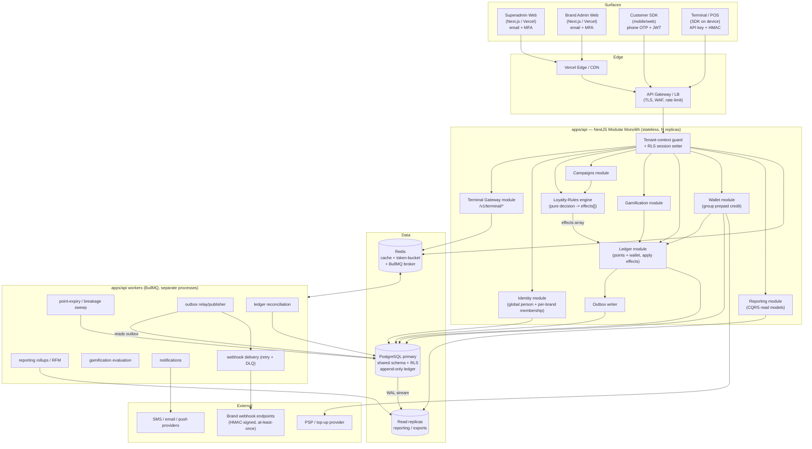

# Architecture

> **Document:** 01 — System Architecture
> **Program:** RFM Loyalty Engine — multi-tenant, closed-loop, B2B2C loyalty platform
> **Status:** Phase 0 baseline. Internally consistent with the locked architectural decisions; alternatives are noted but the recommended baseline is authoritative.

---

## 0. Executive summary

The platform is a **modular monolith** (NestJS + TypeScript) deployed as one API process plus a fleet of BullMQ workers, fronting a **single PostgreSQL database with a shared schema** and **Redis**. Four consumer surfaces — Superadmin web, Brand Admin web, Customer SDK, and Terminal/POS gateway — talk to one versioned API. Inside the API, code is organized into clean domain modules (`ledger`, `loyalty-rules`, `campaigns`, `gamification`, `wallet`, `reporting`, `identity`, `terminal-gateway`) with explicit boundaries so any module can be peeled into its own service later without a rewrite.

Three ideas dominate the design and recur in every section:

1. **The engine decides; it never mutates the system of record directly.** The rules engine is a pure decision function that emits an *ordered-independent array of typed effects* (Talon.One pattern). A separate, idempotent **apply/commit** step interprets effects and writes the ledger. This buys testability, replay, and channel reuse.
2. **Balances are derived from an immutable, append-only, double-entry ledger** — never a mutable integer. Two ledgers (points per customer-per-brand; credit/wallet per group) sit on one engine. Correctness is layered: idempotency keys → row locks / serializable isolation → DB-level non-negativity constraints.
3. **Tenant isolation is defense-in-depth.** A shared schema with `tenant_id` columns is protected by PostgreSQL Row-Level Security (RLS) *and* an app-layer tenant-scoping guard. Loyalty data is scoped to `brand_id` (closed-loop); prepaid wallet/credit data is scoped to `group_id`.

---

## 1. High-level system diagram

### 1.1 Mermaid



### 1.2 ASCII fallback

```
  SUPERADMIN WEB    BRAND ADMIN WEB    CUSTOMER SDK       TERMINAL / POS SDK
  (email + MFA)     (email + MFA)      (phone OTP + JWT)  (API key + HMAC)
       |                 |                  |                   |
       +--------+--------+---------+--------+---------+---------+
                |        (TLS / CDN / WAF / rate-limit)         |
                v                                               v
        +-----------------------------------------------------------+
        |  API GATEWAY / LB  ->  TENANT-CONTEXT GUARD (sets RLS)     |
        +-----------------------------------------------------------+
                |
                v
   +========================  apps/api  (NestJS modular monolith)  =====+
   | terminal-gateway | identity | loyalty-rules(engine) | campaigns    |
   | gamification | LEDGER (apply effects) | wallet | reporting | outbox |
   +===================================================================+
        | engine emits effects[]  ->  ledger applies (idempotent)
        v                          v                         v
   +---------+   WAL stream   +-----------+            +-------------+
   | POSTGRES| -------------> | READ      |            |    REDIS    |
   | primary |                | REPLICAS  |            | cache +     |
   | shared  |                | (reports) |            | rate-limit +|
   | schema  |                +-----------+            | BullMQ      |
   | + RLS   |                                         +-------------+
   | ledger  |                                              ^  |
   +---------+                                              |  v
        ^                                          +--------------------+
        | (read outbox / sweeps / recon)           |   WORKERS (BullMQ) |
        +------------------------------------------| expiry/breakage    |
                                                   | rollups/RFM        |
                                                   | gamification eval  |
                                                   | notifications      |
                                                   | webhook delivery   |
                                                   | outbox relay       |
                                                   | reconciliation     |
                                                   +--------------------+
                                                       |        |     |
                                                       v        v     v
                                                  WEBHOOKS   SMS/EMAIL  PSP
                                                  (brand)   /PUSH      top-up
```

### 1.3 Module boundaries and the peel-out plan

Each domain module owns its tables, its DTOs (zod in `packages/shared`), and a narrow service interface. Cross-module calls go through **injected service interfaces**, never direct table reads into another module's tables. This is the single rule that keeps the monolith service-extractable:

| Module | Owns | Talks to | Extract candidate |
|---|---|---|---|
| `identity` | global person, per-brand membership, member tokens | — | medium |
| `loyalty-rules` | rule DSL storage, evaluation, **effects emission** | identity (read), campaigns | **high** (stateless, CPU-bound) |
| `campaigns` | campaigns, evaluation groups, budgets | loyalty-rules | medium |
| `gamification` | achievements, streaks, challenges, leaderboards | ledger (emit effects), loyalty-rules | high |
| `ledger` | points + wallet journals, balances, idempotency | — (others call it) | **high** (the crown jewel; isolate last but design clean now) |
| `wallet` | group prepaid credit, top-up, drawdown policy | ledger | medium |
| `terminal-gateway` | device auth, HMAC, S&F replay, txn state machine | identity, loyalty-rules, ledger | high |
| `reporting` | rollups, RFM, exports (read replicas only) | — (reads projections) | high |

When a module is extracted, the in-process service call becomes a network call; the **outbox + events** already decouple write-side propagation, so most cross-module communication is async and unaffected.

---

## 2. Tenancy model deep-dive

### 2.1 The hierarchy and the closed-loop rule

```
platform
└── group            (commercial account; owns the prepaid WALLET / credit)
    └── brand         (the loyalty program boundary; POINTS are closed-loop here)
        └── branch    (store / location; a reporting + terminal scope)
```

Two distinct isolation keys, deliberately:

- **`brand_id` is the loyalty isolation key.** Points are *closed-loop per brand* — a member's points in Brand A can never be seen, spent, or mixed with Brand B. Every loyalty table (`membership`, `points_account`, `points_journal`, `points_entry`, `campaigns`, `achievements`, …) carries `brand_id NOT NULL`, indexed, and leads composite indexes.
- **`group_id` is the wallet isolation key.** The prepaid credit/wallet liability is held at the group level (one commercial relationship funds many brands' redemptions). Wallet tables carry `group_id NOT NULL`.

Every row also carries the full ancestor chain (`platform_id`, `group_id`, `brand_id`, and `branch_id` where applicable) denormalized, so policies and queries never need recursive joins and indexes can lead with the relevant key.

### 2.2 Why shared-schema + RLS (and not schema/db-per-tenant)

We expect **thousands** of brands. Mapping to the AWS silo/bridge/pool taxonomy:

| Model | Postgres realization | Why rejected for our scale |
|---|---|---|
| Silo | DB/instance per tenant | Cost, ops blow-up at thousands of tenants. |
| Bridge | Schema-per-tenant / DB-per-tenant on shared infra | **Schema-per-tenant:** shared-catalog bloat slows planning & makes every migration N operations. **DB-per-tenant:** pooler pools are keyed per (db,user) → connection-pool exhaustion, ~8 MB template overhead per DB. Both wall out in the low hundreds. |
| **Pool (chosen)** | **Shared schema + `tenant_id` + RLS** | Scales to many thousands; migrations are one operation; one connection pool. Noisy-neighbor handled separately (§6). |

PlanetScale's guidance is explicit: shared schema is the simplest and most scalable model and reaches many thousands of tenants; schema/db-per-tenant typically will not scale past a few hundred. We adopt it as primary.

### 2.3 RLS: the policies

RLS is **defense in depth, not the only line of defense** (see §2.5). The most fragile part of RLS is *context propagation*, not the policy text — so the rules below are strict and fail-closed.

**Roles.** The request path connects as a dedicated **non-owner login role** with `NOINHERIT` and no `BYPASSRLS`. Migrations run as a *separate owner role* the request path never uses. We use `FORCE ROW LEVEL SECURITY` so even the table owner is subject to policy.

```sql
-- Roles
CREATE ROLE loyalty_app  LOGIN NOINHERIT PASSWORD '...';   -- request path; no BYPASSRLS
CREATE ROLE loyalty_migrator LOGIN;                        -- DDL/migrations only

-- Fail-closed defaults for tenant context (empty string => matches nothing)
ALTER ROLE loyalty_app SET app.current_brand_id = '';
ALTER ROLE loyalty_app SET app.current_group_id = '';
ALTER ROLE loyalty_app SET app.current_branch_id = '';

-- A loyalty (brand-scoped, closed-loop) table
ALTER TABLE points_entry ENABLE ROW LEVEL SECURITY;
ALTER TABLE points_entry FORCE ROW LEVEL SECURITY;

-- Read filter (USING) + write guard (WITH CHECK), both keyed on brand_id.
-- nullif(...,'')::uuid -> NULL when unset => row never matches => fail closed.
-- Wrapped in a subselect so the setting is read once per statement (init-plan), not per row.
CREATE POLICY brand_isolation_select ON points_entry
  FOR SELECT TO loyalty_app
  USING ( brand_id = (SELECT nullif(current_setting('app.current_brand_id', true), '')::uuid) );

CREATE POLICY brand_isolation_insert ON points_entry
  FOR INSERT TO loyalty_app
  WITH CHECK ( brand_id = (SELECT nullif(current_setting('app.current_brand_id', true), '')::uuid) );

CREATE POLICY brand_isolation_update ON points_entry
  FOR UPDATE TO loyalty_app
  USING ( brand_id = (SELECT nullif(current_setting('app.current_brand_id', true), '')::uuid) )
  WITH CHECK ( brand_id = (SELECT nullif(current_setting('app.current_brand_id', true), '')::uuid) );
-- NOTE: points_entry is append-only; UPDATE policy exists only to guard the
-- rare materialized-balance row pattern; the journal/entry tables themselves
-- forbid UPDATE/DELETE via a trigger (see §3).

-- A wallet (group-scoped) table uses group_id instead:
CREATE POLICY group_isolation_all ON wallet_entry
  FOR ALL TO loyalty_app
  USING  ( group_id = (SELECT nullif(current_setting('app.current_group_id', true), '')::uuid) )
  WITH CHECK ( group_id = (SELECT nullif(current_setting('app.current_group_id', true), '')::uuid) );
```

Key correctness choices, each closing a documented RLS hole:

- **Both `USING` and `WITH CHECK` on every policy.** Without `WITH CHECK`, a tenant could *write* rows tagged with another brand's id even though it can't read them.
- **Separate `INSERT` and `UPDATE` `WITH CHECK`** so neither path leaks.
- **Fail closed.** Unset/empty context → `NULL` → zero rows, never "all tenants." Role default is `''`.
- **`current_setting(..., true)`** (the `missing_ok` flag) so a missing GUC matches nothing rather than erroring or matching everything.
- **Subselect-wrapped context lookup** → evaluated once per statement (init-plan); Supabase reports >100× speedups from this plus indexing the tenant key.
- **Views are `security_invoker = true`; helper functions default to `SECURITY INVOKER`.** `SECURITY DEFINER` is reserved for a small set of deliberately-audited cross-brand reporting helpers — never to "loosen" policy.
- **Indexing.** Every policy column is indexed; loyalty composites lead with `brand_id` (e.g., `(brand_id, customer_id, occurred_at)`), wallet composites with `group_id`. We verify via `EXPLAIN ANALYZE` that brand-index scans are used inside policies.

### 2.4 Setting tenant context per request/transaction

We run the pooler in **transaction pooling** mode. Therefore we must use **`SET LOCAL` inside a transaction** (resets at commit) — **never** `SET` (session-level), which would leak the previous request's tenant to the next client on a reused connection. This is the single highest-risk RLS pitfall and the rule is absolute.

NestJS flow per request:

1. **AuthN** resolves the principal and its scope from the *verified* token/claims — never from a client header, query param, or client-set claim (the #1 cross-tenant leak vector).
   - Superadmin/Brand admin: **in-house identity service** — email + password (argon2id) + mandatory TOTP MFA → scoped JWT (access+refresh) carrying the RBAC role bound to a scope node. **No third-party IdP** (decision 2026-06-13); RFC 9700 hardening applied in our own first-party auth-code+PKCE flow.
   - Customer: phone-OTP → short JWT carrying `person_id` + the brand(s) it may act in.
   - Terminal: API key + HMAC → device's `brand_id`/`branch_id`/`group_id`.
2. A **tenant-context interceptor** opens a transaction-scoped connection and issues:

```sql
BEGIN;
SELECT set_config('app.current_brand_id',  $1, true);   -- true = LOCAL (txn-scoped)
SELECT set_config('app.current_group_id',  $2, true);
SELECT set_config('app.current_branch_id', $3, true);
-- ... all module queries for this request run here ...
COMMIT;  -- LOCAL settings reset automatically
```

We standardize on a Prisma middleware / interceptor that guarantees no query in the request executes outside this wrapped transaction, and a CI lint that forbids bare `SET` of `app.*`.

### 2.5 App-layer scoping guard (defense in depth)

RLS is the backstop; the **app-layer tenant-scoping guard is the everyday mechanism**. AWS is explicit that authorization ≠ isolation: an authorized user can still reach another tenant's rows, so RBAC alone cannot guarantee brand separation.

- A NestJS guard derives `{platform, group, brand, branch}` from the verified principal and writes it into a request-scoped `TenantContext`.
- A shared repository base layer injects `brand_id`/`group_id` into every where-clause and every insert payload from `TenantContext` — application code cannot "forget" the predicate.
- **ABAC on top of RBAC:** functional roles grant *capabilities*; the brand/branch attributes are the *hard isolation boundary* on every decision (centralized PDP — e.g., Cedar/OPA-style policy — evaluated at each API). A brand-admin token therefore resolves only its brand and child branches.
- **CI isolation suite:** a test pack connects *as the `loyalty_app` role* and asserts cross-brand reads and writes return zero rows or are rejected — run on every PR. This is what actually proves RLS, not the policy text.

### 2.6 Promoting a big tenant to isolation

Tenant data follows a Zipf power-law; isolating the few biggest brands is high-leverage. Because **`brand_id` leads every loyalty primary key and is the natural distribution column**, we can promote without a schema change:

- **Step 1 (guardrails, always on):** statement timeout, idle-in-transaction timeout, pooler query timeout, per-brand connection caps, per-brand rate limits, per-tenant monitoring (§6.4).
- **Step 2 (noisy/large brand):** introduce **Citus** with `brand_id` as the distribution column and **co-locate all loyalty tables on `brand_id`** so accrual/redemption stay single-shard; isolate the noisy brand to its own shard. RLS + app scoping are preserved unchanged.
- **Step 3 (extreme case / data-residency):** move the brand to a dedicated DB or instance (AWS "bridge"). The app already addresses tenants by id; a routing layer maps that brand to its own connection string. Wallet stays with its group; if a residency rule forces a whole group, the group's brands move together.

Trigger criteria: sustained share of primary CPU/IO above an agreed threshold, or a contractual data-residency requirement.

---

## 3. Ledger & wallet design

### 3.1 Principles (locked)

- **Append-only, immutable, double-entry.** Every movement records balanced entries where `sum(debits) = sum(credits)`. Money/points never appear or disappear.
- **Balances are derived**, with a *materialized* balance row as an optimization that is reconciled against replay (§3.6).
- **Two ledgers, one engine:** (1) **POINTS** ledger — account per *customer-per-brand*; (2) **CREDIT/WALLET** ledger — account per *group*. Separate asset/ledger IDs so points and currency never mix in a single transaction.
- **Whole integers only.** Points are whole integers; money is integer **minor units** (e.g., cents). Never floats. Each amount is paired with an asset/currency code.
- **Corrections are reversing entries**, never `UPDATE`/`DELETE`.

Account normality:

| Ledger | Account | Normality | Meaning |
|---|---|---|---|
| Points | `points_liability:<customer,brand>` | credit-normal | the brand's obligation (ASC 606 deferred-revenue/material-right). Increases on earn. |
| Points | `points_expense:<brand>` | debit-normal | the offsetting source when points are issued. |
| Points | `points_revenue:<brand>` | credit-normal | recognized on redemption. |
| Points | `breakage_income:<brand>` | credit-normal | recognized on expiry/breakage. |
| Wallet | `wallet_liability:<group>` | credit-normal | platform's deposit liability for the group's prefunded balance. |
| Wallet | `cash_clearing:<group>` | debit-normal | top-ups land here from the PSP. |
| Wallet | `redemption_cost:<group>` | debit-normal | drawdown at redemption. |
| Wallet | `platform_fee` | credit-normal | platform markup/margin on each drawdown. |

> Accounting policy (allocation by SSP, proportional vs remote breakage, CPP modes, escheatment) is owned by the **Economics** doc; this doc fixes only the *ledger mechanics* those policies post into.

### 3.2 Point state model

Points are tracked through explicit states so "earned" is never conflated with "spendable":

```
pending --(activation delay elapses)--> active/available --(redeem)--> redeemed
   |                                          |
   +--(return/fraud clawback)--> reversed     +--(expiry sweep)--> expired (breakage)
```

- **Pending** holds account for an activation delay (returns/fraud window). The expiration clock starts at **activation**, not earn.
- **FIFO expiration buckets:** redemption consumes the shortest-expiry available points first; expiry is bucketed.
- Tier recompute, pending→active activation, and expiry are **eventually-consistent scheduled jobs** (§5), not per-transaction work; earn/burn is real-time.

### 3.3 Schema (core tables)

```sql
-- Accounts (one per customer-brand for points; one per group for wallet)
CREATE TABLE ledger_account (
  id            uuid PRIMARY KEY,
  ledger        text NOT NULL CHECK (ledger IN ('points','wallet')),
  account_type  text NOT NULL,           -- liability/expense/revenue/breakage/clearing/fee/cost
  normal_side   text NOT NULL CHECK (normal_side IN ('debit','credit')),
  asset_code    text NOT NULL,           -- 'PTS:<brand>' or ISO-4217 e.g. 'AED'
  -- tenancy
  platform_id   uuid NOT NULL,
  group_id      uuid NOT NULL,
  brand_id      uuid,                     -- NULL for group-scoped wallet accounts
  customer_id   uuid,                     -- NULL for non-member accounts
  UNIQUE (ledger, account_type, brand_id, group_id, customer_id, asset_code)
);

-- Journal = one balanced business event (the "transaction")
CREATE TABLE journal (
  id             uuid PRIMARY KEY,
  ledger         text NOT NULL,
  kind           text NOT NULL,          -- earn | redeem_auth | redeem_capture | void
                                         -- | reverse | topup | drawdown | expiry | adjust | fee
  occurred_at    timestamptz NOT NULL,
  created_at     timestamptz NOT NULL DEFAULT now(),
  reverses_id    uuid REFERENCES journal(id),  -- set on corrections
  source_event   text,                   -- stable business id (e.g. terminal txn id)
  brand_id       uuid, group_id uuid NOT NULL, branch_id uuid,
  idempotency_id uuid NOT NULL REFERENCES idempotency_key(id)
);

-- Entry = one leg; sum over a journal must be zero
CREATE TABLE entry (
  id            uuid PRIMARY KEY,
  journal_id    uuid NOT NULL REFERENCES journal(id),
  account_id    uuid NOT NULL REFERENCES ledger_account(id),
  direction     text NOT NULL CHECK (direction IN ('debit','credit')),
  amount_minor  bigint NOT NULL CHECK (amount_minor > 0),
  asset_code    text NOT NULL,
  -- points-only metadata for FIFO/state
  point_state   text,                    -- pending|active|redeemed|expired|reversed
  expiry_bucket date,
  brand_id      uuid, group_id uuid NOT NULL
);

-- Per-journal balance invariant (debits == credits, single asset)
CREATE FUNCTION assert_balanced() RETURNS trigger AS $$
BEGIN
  IF (SELECT coalesce(sum(CASE WHEN direction='debit' THEN amount_minor ELSE -amount_minor END),0)
        FROM entry WHERE journal_id = NEW.journal_id) <> 0 THEN
    RAISE EXCEPTION 'journal % is unbalanced', NEW.journal_id;
  END IF;
  RETURN NULL;
END $$ LANGUAGE plpgsql;
-- (enforced via a CONSTRAINT TRIGGER ... DEFERRABLE INITIALLY DEFERRED on entry)

-- Append-only enforcement: forbid UPDATE/DELETE on journal & entry
CREATE FUNCTION forbid_mutation() RETURNS trigger AS $$
BEGIN RAISE EXCEPTION 'ledger is append-only'; END $$ LANGUAGE plpgsql;
CREATE TRIGGER no_update_journal BEFORE UPDATE OR DELETE ON journal
  FOR EACH ROW EXECUTE FUNCTION forbid_mutation();
CREATE TRIGGER no_update_entry   BEFORE UPDATE OR DELETE ON entry
  FOR EACH ROW EXECUTE FUNCTION forbid_mutation();
```

### 3.4 Materialized balances + the five fast fields

```sql
CREATE TABLE account_balance (
  account_id      uuid PRIMARY KEY REFERENCES ledger_account(id),
  posted_debits   bigint NOT NULL DEFAULT 0,
  posted_credits  bigint NOT NULL DEFAULT 0,
  pending_debits  bigint NOT NULL DEFAULT 0,   -- holds (redeem authorizations)
  pending_credits bigint NOT NULL DEFAULT 0,
  normal_side     text   NOT NULL,
  lock_version    bigint NOT NULL DEFAULT 0,
  brand_id        uuid, group_id uuid NOT NULL,
  -- DB-level non-negativity for liability accounts (the Postgres analogue of
  -- TigerBeetle debits_must_not_exceed_credits):
  CHECK (
    normal_side <> 'credit'
    OR (posted_credits - posted_debits - pending_debits) >= 0
  )
);
```

`available = posted_credits - posted_debits - pending_debits` (for a credit-normal liability). The materialized row is updated **in the same DB transaction** as the journal/entries.

### 3.5 Idempotency, concurrency & no-negative enforcement

**Idempotency (every mutating op):**

```sql
CREATE TABLE idempotency_key (
  id            uuid PRIMARY KEY,
  actor_id      uuid NOT NULL,           -- terminal/device, customer, or admin
  key           text NOT NULL,           -- client-supplied Idempotency-Key
  request_hash  text NOT NULL,           -- hash of method+path+params
  status        text NOT NULL,           -- processing | done
  response      jsonb,
  created_at    timestamptz NOT NULL DEFAULT now(),
  UNIQUE (actor_id, key)
);
```

- Keyed on `(actor_id, key)` — never on key alone.
- Same key + **same** request hash → replay the stored response (idempotent).
- Same key + **different** request hash → `409`.
- Run the critical section in a transaction; the `idempotency_key` insert (unique constraint) is the dedupe gate. Redis `SETNX` provides a fast first-line lock so only one request proceeds while the DB transaction commits.
- A second, stable dedupe: a partial unique index on `entry(account_id, journal.source_event)` so a replayed source event can never double-post.

**Concurrency control (layered):**

1. **Default: optimistic locking** via `account_balance.lock_version` (per Modern Treasury, right for a read-heavy ledger). The write does `UPDATE ... WHERE account_id=$1 AND lock_version=$v`; zero rows → retry.
2. **Hot accounts** (shared promo pool, a high-traffic group wallet): switch to **pessimistic `SELECT ... FOR UPDATE`** to avoid optimistic retry storms.
3. **Redemption/wallet-spend critical sections** run at **`REPEATABLE READ`/`SERIALIZABLE`** so conflicting read-modify-writes abort with a serialization error rather than overdraw.
4. **Per-customer / per-loyalty-account serialization** of concurrent writes (Talon.One pattern): allow a small number in parallel, queue a few, return `409 too many requests` beyond that. This prevents lost-update races without a global lock.

**No negative balance (three independent guards, belt-and-braces):**

- The `CHECK` constraint on `account_balance` (above) — structural.
- A **conditional decrement**: `UPDATE account_balance SET ... WHERE available - :amt >= 0` inside the locked transaction; **zero rows affected ⇒ `insufficient_balance`**.
- Done inside `SERIALIZABLE`/`FOR UPDATE` so time-of-check ≠ time-of-use races (the canonical double-spend) cannot slip between read and write.

### 3.6 Reconciliation

A scheduled `reconciliation` worker (§5) proves more than arithmetic:

- **Global invariant:** `sum(credit-normal balances) == sum(debit-normal balances)` per ledger.
- **Re-derive** each `account_balance` by replaying `entry` and alert on drift vs. the materialized row.
- **Clearing/suspense accounts must net to zero**; non-zero ⇒ stuck money ⇒ alert.
- **Subledger-to-control tie-outs** per brand (points) and per group (wallet).
- Runs daily and on-demand; results feed the reporting layer.

### 3.7 Worked examples (paired entries)

All amounts integer minor units. `==` denotes a balanced journal (Σdebits = Σcredits).

**(a) EARN — customer earns 500 points at Brand B (pending → activates later).**
Business event from a settled sale; engine emitted `addLoyaltyPoints(500)`; ledger applies:

```
journal: kind=earn, ledger=points, brand_id=B, source_event=POS-txn-9921, idempotency=K1
  DEBIT  points_expense:B        500 PTS:B
  CREDIT points_liability:Cust,B 500 PTS:B   point_state=pending  expiry_bucket=2027-06-30
==> balanced. pending_credits += 500 on the customer's points account.
(Later, the activation job posts a state transition; available rises by 500.)
```

**(b) REDEEM — customer redeems 300 points (authorize → capture).**

*Authorize (hold):*
```
journal: kind=redeem_auth, ledger=points, brand_id=B, source_event=POS-txn-9930, idempotency=K2
  (no posted movement yet; a pending DEBIT hold is recorded)
  pending_debits += 300 on points_liability:Cust,B   -> available drops by 300
  Guard: conditional UPDATE WHERE available - 300 >= 0 (else insufficient_balance)
  TTL set: auto-void if not captured (mirrors card-auth expiry).
```
*Capture (sale settled):*
```
journal: kind=redeem_capture, ledger=points, brand_id=B, source_event=POS-txn-9930, idempotency=K3
  DEBIT  points_liability:Cust,B 300 PTS:B   point_state=redeemed  (FIFO oldest bucket first)
  CREDIT points_revenue:B        300 PTS:B
==> balanced. posted_debits += 300; the 300 pending hold is released.
```
*If voided/expired instead:* `kind=void` releases `pending_debits -= 300`; no posted movement; points return to available.

**(c) WALLET DRAWDOWN — redemption costs the group at cost-per-point; platform takes a fee.**
Redeeming 300 points cost the group, say, 300 minor units of reward cost at the stored CPP, plus a 10% platform fee (33 minor units). Drawdown is a **separate journal on the wallet ledger** (points and currency never mix in one journal):

```
journal: kind=drawdown, ledger=wallet, group_id=G, source_event=POS-txn-9930, idempotency=K4
  DEBIT  wallet_liability:G   330 AED      (reduces the group's prefunded deposit)
  CREDIT redemption_cost:G    300 AED      (merchant's realized reward cost)
  CREDIT platform_fee         30  AED      (platform margin)   [Σcredits=330]
==> balanced. Guard: conditional UPDATE on wallet_liability:G WHERE available-330 >= 0,
    inside SERIALIZABLE; else block-and-alert per low-balance policy.
The CPP and fee rate used are persisted on the journal so statements are reproducible.
```

**Top-up (for completeness):**
```
journal: kind=topup, ledger=wallet, group_id=G, idempotency=K5
  DEBIT  cash_clearing:G      100000 AED
  CREDIT wallet_liability:G   100000 AED   (prefunded deposit liability, NOT revenue)
```

---

## 4. Terminal integration design

### 4.1 The contract (narrow, versioned, additive)

**First-party context (decision 2026-06-13):** RFM Loyalty *is* the payments company and these are **its own POS terminals**, so the loyalty SDK is embedded directly in the terminal payment app — we control the device software and can read the payment transaction context natively. That tightens integration but does **not** loosen the contract: we still treat the terminal surface as a money-grade API (the device is still a remote, sometimes-offline client of the engine). Hardware brand stays open; the API is hardware-agnostic.

Treat it like a payment API. Path-versioned `/v1/terminal/*`; never repurpose a field; breaking changes gate behind `/v2`; a `Loyalty-Version` header echoes on every response. Resources:

| Method + path | Purpose | Mutates ledger? |
|---|---|---|
| `POST /v1/terminal/members/resolve` | identifier → opaque short-lived `member_token` | no |
| `POST /v1/terminal/quotes` | preview earn/redeem for a cart (CalculateLoyaltyPoints-style) | no |
| `POST /v1/terminal/transactions` | earn, or redeem-**authorize** | yes (hold/post) |
| `POST /v1/terminal/transactions/{id}/capture` | confirm against settled sale | yes |
| `POST /v1/terminal/transactions/{id}/void` | release a hold | yes |
| `POST /v1/terminal/transactions/{id}/reverse` | compensating refund (linked reverse) | yes |
| `GET  /v1/terminal/transactions/{id}` | **poll fallback** for definitive state | no |
| `POST /v1/terminal/devices/pair` | one-time pairing code → device secret | no |
| webhook admin | register/rotate endpoints + secrets | no |

**Customer identification** is decoupled: `resolve` accepts a typed identifier `{ type: phone|qr|nfc|loyalty_id|card_token, value }` and returns an opaque `member_token` (not raw PII). The terminal attaches `member_token` to subsequent calls, so PII isn't echoed per line and the account can be re-keyed. QR/NFC codes are rotating/signed to prevent member-id harvesting. The engine never touches PAN — on Android smart terminals (PAX/Verifone/Clover) loyalty rides as a value-added-service tender/Intent, keeping us out of PCI scope.

### 4.2 Auth & HMAC

Two-tier credentials:

- **Pairing (one-time):** a short-TTL, single-use pairing code provisions a device and returns a long-lived **device secret** stored in the device keystore. Scope is a single store/lane (`group_id`/`brand_id`/`branch_id`).
- **Per-call auth:** the device exchanges the secret for **short-lived (~1h) bearer tokens** (connection tokens). Every mutating call is **HMAC-SHA256 signed** (AWS SigV4-style canonical request):

```
StringToSign = HTTP_METHOD + "\n" + PATH + "\n" + TIMESTAMP + "\n" +
               NONCE + "\n" + SHA256(raw_body)
Signature    = HMAC_SHA256(device_secret, StringToSign)

Headers:
  Authorization: Loyalty-HMAC publishableKeyId=...,ts=...,nonce=...,sig=<hex>
  Idempotency-Key: <client-generated v4 uuid>
```

Server: verify over **raw bytes before JSON parse**, constant-time compare, reject `ts` outside a bounded clock-skew window (e.g., ±5 min), and reject replayed `nonce`. Secrets rotate with an **overlapping {current, previous}** window (24–48 h) so in-flight tokens never break. Instant revocation supported; key material stored hashed.

### 4.3 Idempotency (mandatory)

`Idempotency-Key` header is **required on every POST** that touches the ledger (points are money-equivalent; exactly-once is paramount). The key is client/POS-generated from `{cart/check id + lane + intent}`. Server persists `key → {status, response, request_hash}` for ≥24 h; replay returns the stored response; same key + different hash ⇒ `409`. This is the same `idempotency_key` table the ledger uses (§3.5), so terminal retries and ledger dedupe are one mechanism.

### 4.4 Transaction state machine

```
            authorize / earn
   (none) ---------------------> PENDING
                                   |  validate, hold points / compute earn
                                   v
                               AUTHORIZED ----capture----> CAPTURED  (terminal)
                                   |  \                         |
                            void / |   \ TTL auto-void          | reverse
                            expiry |    \                       v
                                   v     \--> EXPIRED        REVERSED (linked reverse)
                                VOIDED
   FAILED (validation/insufficient-balance/auth error) is terminal.
```

- **Earn** at a settled sale may collapse to a single `CAPTURED` write.
- **Redeem** is authorize-then-capture; the hold auto-releases on **TTL** if never captured (mirrors card-auth 36 h / 7 d), emitting an event the POS can observe so it never strands a member's balance.
- **Refunds emit a linked `REVERSE`** journal; committed entries are never mutated.

### 4.5 Offline store-and-forward + replay

Offline is a **first-class mode**, not an error path. When the terminal is offline:

1. Validate the `member_token` and compute a **provisional** result locally.
2. **Sign and queue** the request with its client-generated `Idempotency-Key`; show a provisional UI state.
3. Bound exposure: a **per-member / per-device offline points limit** and a **max queue age** cap risk.
4. On reconnect, **forward in order**; the server is authoritative on sync and dedupes by idempotency key + `source_event`.
5. The server may **downgrade** an offline redeem (insufficient balance, expired tier) into a **reversal**, surfaced as a settle-time event. Bounded clock-skew handling reconciles timestamps.

The POS must always be able to `GET /v1/terminal/transactions/{id}` to reach a definitive state before printing a receipt, since webhooks can be lost.

### 4.6 Sequence diagram — in-store earn + redeem, including offline replay

```mermaid
sequenceDiagram
    participant Cashier as POS Terminal
    participant API as API /v1/terminal/*
    participant RULES as Loyalty-Rules (effects)
    participant LED as Ledger
    participant OBX as Outbox + Webhook worker
    participant Brand as Brand webhook

    Note over Cashier,API: --- ONLINE: resolve + quote ---
    Cashier->>API: POST /members/resolve {type:qr, value} (HMAC)
    API-->>Cashier: { member_token }
    Cashier->>API: POST /quotes { cart, member_token } (HMAC)
    API->>RULES: evaluate(session snapshot)
    RULES-->>API: effects[] (addLoyaltyPoints 50, setDiscount via redeem 300)
    API-->>Cashier: preview: earn 50 / redeem 300 for AED 30 off

    Note over Cashier,API: --- ONLINE: redeem authorize -> capture, then earn ---
    Cashier->>API: POST /transactions {intent:redeem,300} Idempotency-Key:K2 (HMAC)
    API->>LED: redeem_auth: hold 300 (cond. UPDATE available-300>=0, SERIALIZABLE)
    LED-->>API: AUTHORIZED (txn T1, TTL set)
    API-->>Cashier: AUTHORIZED T1
    Cashier->>API: POST /transactions/T1/capture Idempotency-Key:K3 (HMAC)
    API->>LED: redeem_capture: post 300 (FIFO), release hold
    LED->>OBX: write outbox event (same txn)
    API-->>Cashier: CAPTURED T1
    Cashier->>API: POST /transactions {intent:earn,50} Idempotency-Key:K1 (HMAC)
    API->>LED: earn: credit 50 pending
    LED->>OBX: write outbox event (same txn)
    API-->>Cashier: CAPTURED (earn)
    OBX->>Brand: POST webhook points_redeemed / points_earned (HMAC, at-least-once)

    Note over Cashier,API: --- OFFLINE window: network down ---
    Cashier-->>Cashier: validate token locally, provisional earn 20,<br/>sign+queue Idempotency-Key:K9, cap by offline limit

    Note over Cashier,API: --- RECONNECT: replay ---
    Cashier->>API: POST /transactions {earn,20} Idempotency-Key:K9 (queued, HMAC)
    API->>LED: dedupe by (actor,K9)+source_event; apply once
    alt server authoritative downgrade
        API->>LED: balance/tier invalid -> post linked REVERSE
        API-->>Cashier: settle-time event: redeem downgraded/reversed
    else accepted
        LED-->>API: CAPTURED
        API-->>Cashier: CAPTURED K9
    end
    Cashier->>API: GET /transactions/{id} (poll fallback before receipt)
    API-->>Cashier: definitive state
```

---

## 5. Async / eventing

### 5.1 Transactional outbox (exactly-once-ish)

Domain events are **never** published inline from the request path. Instead:

1. The ledger write **and** an `outbox` row are committed in the **same DB transaction**:

```sql
CREATE TABLE outbox (
  id            uuid PRIMARY KEY,
  aggregate     text NOT NULL,          -- 'points'|'wallet'|'membership'|...
  event_type    text NOT NULL,          -- points_earned|points_redeemed|tier_upgraded|...
  payload       jsonb NOT NULL,
  brand_id      uuid, group_id uuid NOT NULL,
  created_at    timestamptz NOT NULL DEFAULT now(),
  published_at  timestamptz,            -- NULL until relayed
  attempts      int NOT NULL DEFAULT 0
);
```

2. A separate **outbox-relay worker** polls (or uses `LISTEN/NOTIFY`) for unpublished rows *after commit*, enqueues them onto BullMQ, and stamps `published_at`. This gives at-least-once publication with no lost events and no phantom events (events fire only if the DB transaction committed).

### 5.2 Queues & workers (BullMQ on Redis)

| Worker | Trigger | Job |
|---|---|---|
| `outbox-relay` | poll/NOTIFY | move committed outbox rows → topic queues |
| `webhook-delivery` | outbox events | sign + POST to brand endpoints; exponential backoff; **DLQ** after N attempts |
| `notifications` | events / schedule | SMS/email/push (incl. pre-expiry notices 1–2 months out) |
| `gamification-eval` | events (real-time) | evaluate achievements/streaks/challenges; **rewards fire in-session**, not nightly |
| `point-expiry-sweep` | cron (nightly) | activate pending→active, expire FIFO buckets, **post breakage journals** |
| `tier-recompute` | cron (nightly) | recompute tiers (eventually consistent, idempotent, re-runnable) |
| `reporting-rollups` | cron + events | incremental rollup tables; RFM/cohort/churn/LTV scoring |
| `reconciliation` | cron (daily) + on-demand | re-derive balances, invariant checks, clearing tie-outs |

Ordering nightly sweep (Voucherify pattern): **activate pending → auto-redeem checks → tier recompute → expire → tier recompute again.** All jobs are **idempotent** so retries and re-runs are safe.

### 5.3 Webhook delivery

- **At-least-once**, exponential backoff, **DLQ** for poison messages.
- Outbound HMAC-SHA256 over `timestamp.rawbody`, header `X-Loyalty-Signature: t=<ts>,v1=<hex>`; consumers verify on raw bytes, reject >5-min skew, **dedupe on `event_id`**.
- Secret rotation uses overlapping {current, previous}.
- Each event carries a **stable `event_id`** and the originating `source_event` so consumers dedupe.

### 5.4 The effects pipeline (how engine output reaches the ledger)

```
event/session in -> loyalty-rules (PURE) -> effects[] (unordered, typed)
                                              |
                            apply step (idempotent, treats array as a SET keyed by
                            effectType+props; NEVER order-dependent)
                                              |
        +--------------+--------------+-------+--------------+
        v              v              v                      v
   ledger writes   campaign      gamification           outbox events
   (earn/redeem)   budget commit  triggers              -> webhooks/notifications
```

The engine never mutates balances; the apply step does, idempotently. Effect handling is **never** position-dependent (Talon.One explicitly warns against it). Campaign **budgets** are *checked* on every evaluation but only *consumed* on session close (preview vs. commit), matching the redeem-authorize/capture split.

---

## 6. Scaling strategy

### 6.1 Read replicas + CQRS read models

- **Stage 1, highest-leverage, lowest-risk:** a **streaming read replica**. **All** reporting/dashboard/export queries route to it via a *separate read-only connection pool*; the primary serves only OLTP. Asynchronous replication lag (seconds) is acceptable for analytics.
- **Logical CQRS:** a normalized write model + denormalized **per-tenant daily-grain rollup tables** (`brand_daily_metrics`: txns, points_earned, points_redeemed, revenue, active_customers). Dashboards and date-range filters hit rollups, drilling to raw entries only on demand. RFM/cohort/churn/LTV are **scheduled batch aggregates** into segment tables keyed `(brand_id, customer_id)` with an **as-of date** for point-in-time reproducibility.
- Materialized views, where used, get a **non-nullable, non-partial UNIQUE index** and are refreshed with `REFRESH MATERIALIZED VIEW CONCURRENTLY` off-peak (serialized). Prefer incremental `INSERT ... ON CONFLICT` rollup jobs on managed Postgres. Defer ClickHouse/OLAP to v2 — only on the documented "Postgres wall" (aggregations over tens-to-hundreds of millions of rows timing out, or high-concurrency user-facing analytics); the first OLAP step is DuckDB/`pg_duckdb` on a replica, not a distributed cluster.

### 6.2 Partitioning of ledger & event tables

These tables grow unbounded and are the first to need partitioning:

- **`entry` / `journal`:** `RANGE` partition by `occurred_at` (monthly), and where a brand is large, **sub-partition / lead indexes by `brand_id`**. Range-by-time keeps hot recent partitions small and lets old partitions be detached/archived to cold storage without touching the live set. The append-only design makes time-partitioning natural (no cross-partition updates).
- **`outbox`:** partition/rotate by `created_at`; published rows are pruned/archived after a retention window.
- **`audit_log`:** monthly range partitions; immutable, region-pinned.
- **Reporting rollups:** partition by `(brand_id)` or `(occurred_date)` depending on query shape; time-series rollups can use TimescaleDB hypertables + continuous aggregates if self-hosting.

`brand_id` leading the loyalty primary keys keeps the door open to **Citus distribution on `brand_id`** with all loyalty tables **co-located** (accrual/redemption stay single-shard).

### 6.3 Caching (Redis)

- **Hot reads:** member balance snapshots, resolved `member_token`s, rule/campaign definitions, tier thresholds — short TTL, invalidated by the matching domain event from the outbox so caches never serve stale balances after a write.
- **Idempotency first-line:** `SETNX` lock + cached response (§3.5).
- Never cache across tenants without a `brand_id`/`group_id` in the cache key.

### 6.4 Rate limiting & noisy-neighbor guardrails

- **Token-bucket / sliding-window** rate limiting in Redis, **per tenant and tiered**, with **stricter limits on auth and OTP** endpoints (per-phone and per-IP caps with backoff to defeat SMS pumping/brute force).
- **Tenant isolation ≠ noisy-neighbor control.** Separate, always-on guardrails: `statement_timeout`, `idle_in_transaction_session_timeout`, pooler query timeout, **per-brand connection caps**, per-tenant monitoring, and cross-tenant access alerts.

### 6.5 Horizontal scale

- **API is stateless** → scale replicas horizontally behind the LB; all state is in Postgres/Redis.
- **Workers scale independently** per queue; concurrency tuned per job class (CPU-bound rules eval vs. IO-bound webhook delivery).
- **Per-customer / per-account write serialization** (§3.5) bounds contention without a global lock.
- Connection pressure managed by a transaction-mode pooler (one pool, shared schema) — a direct benefit of *not* choosing db-per-tenant.

### 6.6 Multi-region readiness

- **Default primary write region: UAE; multi-country by design** (decision 2026-06-13). Each **group** carries a *home region*; its loyalty/wallet **write path is pinned to that region's primary**, so a tenant with a residency obligation (UAE PDPL, EU GDPR, KSA, …) is provisioned in-region. A routing layer maps tenant → regional connection string (the app already addresses tenants by id, §2.6). **Deployment stack (decision 2026-06-13): Supabase** (managed Postgres + RLS + Supavisor transaction-mode pooler + read replicas) · **DigitalOcean** (NestJS API + BullMQ workers on App Platform/Droplets + Managed Redis/Valkey) · **Vercel** (admin frontends, global edge). **Residency caveat:** neither Supabase nor DigitalOcean currently offers a UAE/GCC region (nearest ≈ Mumbai/Frankfurt); UAE PDPL permits cross-border transfer with safeguards, so this is acceptable for the default fleet — but a merchant with a *strict in-country UAE residency* clause is pinned to a UAE-region DB (e.g. AWS me-central-1) via the per-tenant region-pinning above, leaving the rest of the platform on Supabase+DO.
- **Currency & i18n are first-class, not deferred:** currency is **per-brand** (points unit per-brand, money in ISO-4217 minor units); the admin UIs are **bilingual EN/AR with full RTL** from v1. Default currency AED, overridable per brand.
- **Read replicas multi-region** for reporting → low-latency dashboards near users without cross-region writes.
- **Data residency:** if a group/brand must reside in a specific region, it is provisioned there (or promoted to its own region/DB, §2.6); region is pinned per audit-log/retention policy.
- The write path stays **single-region *per tenant*** to preserve the ledger's strict consistency (serializable redemption critical sections); we explicitly **do not** attempt multi-master writes for a tenant's ledger.

---

## 7. Consistency check against locked decisions

- Modular monolith, NestJS/TS, clean module boundaries, peel-out plan — §1.3. ✔
- Single shared schema + `tenant_id` + RLS + app guard; brand-scoped loyalty, group-scoped wallet; `SET LOCAL app.current_*` in a txn — §2. ✔
- Double-entry, append-only, immutable, two ledgers, materialized balances in same txn, `FOR UPDATE` + CHECK, idempotency table, integer points / minor-unit money, REPEATABLE READ/SERIALIZABLE redemptions — §3. ✔
- Versioned narrow `/v1/terminal/*` + webhooks, API key + HMAC + short-lived tokens, mandatory Idempotency-Key, authorize→capture/void state machine, offline store-and-forward + replay, multi-identifier resolve — §4. ✔
- BullMQ on Redis, transactional outbox, expiry/rollups/notifications/gamification/webhook DLQ workers, Redis cache + token-bucket — §5. ✔
- CQRS read models, rollups + materialized views, RFM/cohort/churn/LTV scheduled jobs, read replicas, ClickHouse deferred to v2 — §6.1. ✔
- Default-UAE primary with **per-tenant region pinning (multi-country)**, multi-region read replicas, per-brand currency + EN/AR RTL, **Supabase (Postgres+RLS) + DigitalOcean (API/workers/Redis) + Vercel (frontends)** — §6.6. ✔
- First-party terminal context: RFM Loyalty is the payments company; `/v1/terminal/*` serves its **own POS fleet** (embedded SDK), API stays hardware-agnostic — §4. ✔
- Auth is **fully in-house** (no third-party IdP): admin email/password + TOTP MFA → scoped JWT; customer phone-OTP → JWT; terminal API-key + HMAC — §2.4. ✔
- Open-loop readiness: points modeled as ledger accounts in a brand-scoped currency (`asset_code = PTS:<brand>`); a future coalition currency is a platform-scoped account type + asset — no ledger rewrite — §3.1. ✔
