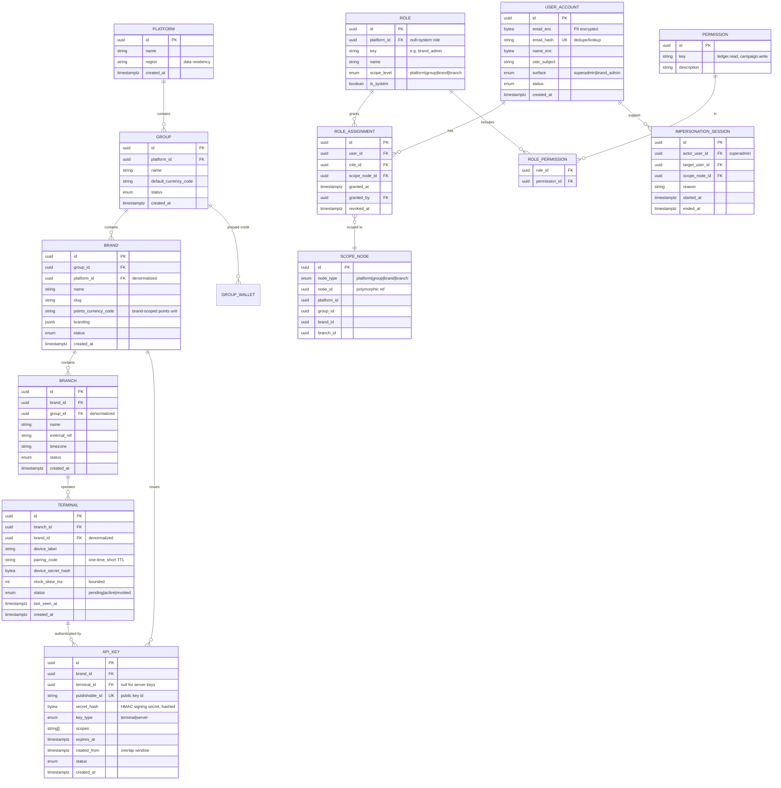
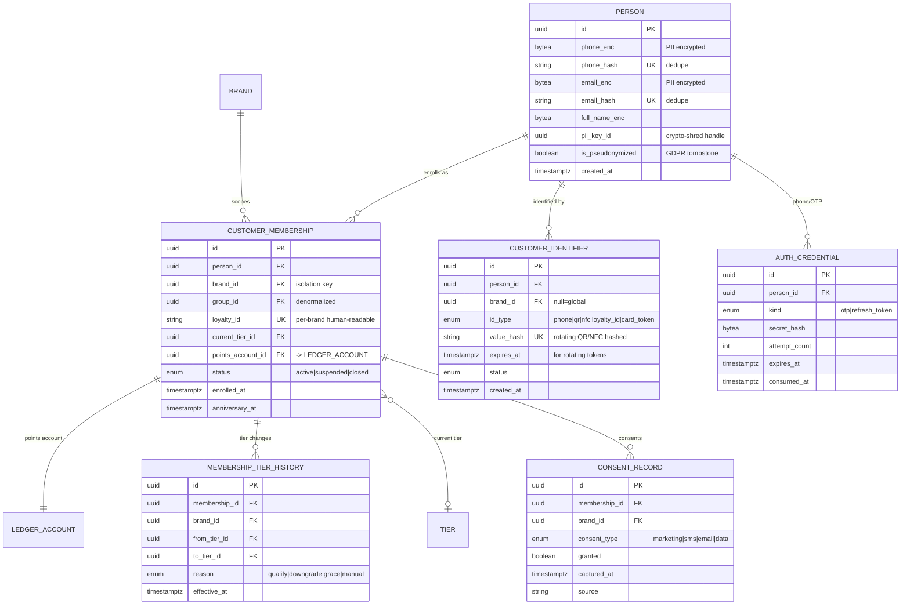
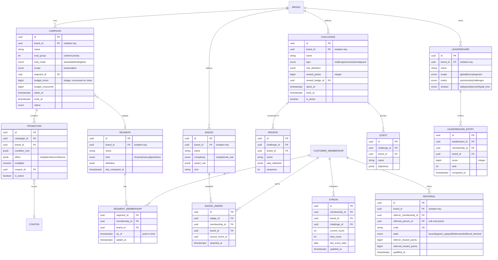

# Data Model / ERD

This document defines the physical PostgreSQL data model for the RFM Loyalty Engine: a multi-tenant, closed-loop, B2B2C loyalty platform built as a NestJS modular monolith on a single shared Postgres schema. Tenant isolation is enforced by `tenant`-key columns + Row-Level Security (RLS) + an app-layer scoping guard (defense in depth). All entities live in one schema; the diagrams below are split thematically only for legibility.

## Design invariants (apply to every table)

These rules are assumed throughout the dictionary and are not repeated per-table unless there is an exception.

- **Money & points are integers.** Money is stored as `bigint` in minor units (e.g. cents/fils) paired with an ISO-4217 `currency_code char(3)`. Points are stored as `bigint` in whole points (1 point = 1 minor unit, no fractions; rounding is an explicit recorded policy). Never `float`/`numeric` for balances.
- **Surrogate keys are `uuid` (v7, time-ordered)** generated app-side for index locality, except high-volume append-only ledger/event tables which additionally carry a `bigint` `seq` (`GENERATED ALWAYS AS IDENTITY`) for total ordering and replay.
- **Tenant scoping columns.** The hierarchy is `platform → group → brand → branch`. Every tenant-scoped table carries the columns it is isolated by. **Loyalty data is scoped to `brand_id`** (closed-loop). **Wallet/credit data is scoped to `group_id`** (prepaid credit pools sit at the group level). Tables carry `group_id` and/or `brand_id` (and `branch_id` where relevant) `not null`, and indexes lead with the isolation key.
- **RLS.** Every tenant table has `ENABLE ROW LEVEL SECURITY` + `FORCE ROW LEVEL SECURITY`. Policies filter the isolation column against `current_setting('app.current_brand_id', true)` / `app.current_group_id`, with a `nullif(..., '')` fail-closed guard (unset context ⇒ zero rows). `USING` (read filter) and `WITH CHECK` (write guard) are both specified. The app connects as a non-owner, no-bypass login role; migrations run as a separate owner role. Context is set via `SET LOCAL` inside the request transaction (transaction-pooler safe).
- **Timestamps.** `created_at timestamptz not null default now()`; mutable tables also carry `updated_at`. Append-only/immutable tables (marked **IMMUTABLE**) have **no** `updated_at` and are protected by a trigger/grant that rejects `UPDATE`/`DELETE`.
- **Idempotency.** Every mutating command path carries an `idempotency_key` and is deduped via the `idempotency_key` table and/or a natural unique constraint (e.g. `(brand_id, source_event_id)`).
- **Soft delete / status** via an enum `status` column rather than physical deletes for configuration entities; PII erasure is handled by pseudonymization/crypto-shredding, never by deleting ledger rows.
- **PII** columns are envelope-encrypted at rest (per-record data key wrapped by KMS); the column type is `bytea` (ciphertext) with a sibling `*_key_id` reference for crypto-shredding.

---

## 1. Tenancy & Identity

The tenant hierarchy plus all admin/terminal authentication and RBAC. RBAC roles bind to a **scope node** (a row in any of platform/group/brand/branch) so one human can be e.g. Brand Admin on Brand A and Branch Manager on Branch B.



---

## 2. Customer & Membership

Global **person** identity (deduped by phone/email) with **per-brand membership** records and **per-brand point wallet** (the ledger account). One human can be a member of many brands; balances stay closed-loop per brand. Identifiers (phone, QR, NFC, loyalty ID) resolve to a membership at the POS.



---

## 3. Ledger & Wallet

Two double-entry, append-only, immutable ledgers on one engine: **(1) POINTS ledger** (account per customer-per-brand, plus brand control accounts) and **(2) CREDIT/WALLET ledger** (account per group). Materialized balance rows are updated in the **same transaction** as journal entries, guarded by `SELECT … FOR UPDATE` + `CHECK` non-negative constraints. Every mutation carries an idempotency key. Redemption critical sections run at `REPEATABLE READ`/`SERIALIZABLE`.

```mermaid
erDiagram
    LEDGER_ACCOUNT ||--o{ JOURNAL_ENTRY : "debited/credited"
    LEDGER_ACCOUNT ||--|| BALANCE : "materialized"
    JOURNAL_TRANSACTION ||--|{ JOURNAL_ENTRY : "balanced set"
    JOURNAL_TRANSACTION }o--o| JOURNAL_TRANSACTION : "reverses"
    IDEMPOTENCY_KEY ||--o| JOURNAL_TRANSACTION : "dedupes"
    POINT_LOT ||--o{ POINT_LOT_CONSUMPTION : "FIFO consumed"

    GROUP_WALLET ||--|{ WALLET_LEDGER_ACCOUNT : "accounts"
    WALLET_LEDGER_ACCOUNT ||--o{ WALLET_ENTRY : "debited/credited"
    WALLET_LEDGER_ACCOUNT ||--|| WALLET_BALANCE : "materialized"
    WALLET_TRANSACTION ||--|{ WALLET_ENTRY : "balanced set"
    GROUP_WALLET ||--o{ TOP_UP : "funded by"
    GROUP_WALLET ||--o{ COST_RULE : "priced by"

    LEDGER_ACCOUNT {
        uuid id PK
        uuid brand_id FK "isolation key"
        enum account_type "member_points|points_liability|points_expense|breakage_income|promo_pool"
        enum normality "debit|credit"
        uuid owner_membership_id FK "null for control accts"
        string points_currency_code
        timestamptz created_at
    }
    JOURNAL_TRANSACTION {
        uuid id PK
        bigint seq "IDENTITY, total order"
        uuid brand_id FK
        enum kind "earn|redeem|expire|breakage|adjust|reversal"
        uuid reverses_transaction_id FK
        uuid source_event_id "loyalty_transaction etc"
        uuid idempotency_key_id FK
        enum state "pending|posted|voided"
        timestamptz occurred_at
        timestamptz created_at
    }
    JOURNAL_ENTRY {
        uuid id PK
        bigint seq "IDENTITY"
        uuid transaction_id FK
        uuid account_id FK
        uuid brand_id FK "denormalized isolation"
        enum direction "debit|credit"
        bigint amount_points "integer, >0"
        enum point_state "pending|active|expired|subtracted"
        timestamptz created_at
    }
    POINT_LOT {
        uuid id PK
        uuid account_id FK
        uuid brand_id FK
        uuid earn_entry_id FK
        bigint original_points
        bigint remaining_points
        enum state "pending|active|expired"
        timestamptz activate_at "activation delay"
        timestamptz expires_at "FIFO bucket"
        timestamptz created_at
    }
    POINT_LOT_CONSUMPTION {
        uuid id PK
        uuid lot_id FK
        uuid redeem_entry_id FK
        bigint points_consumed
        timestamptz created_at
    }
    BALANCE {
        uuid account_id PK "FK"
        uuid brand_id FK
        bigint posted_debits "integer"
        bigint posted_credits "integer"
        bigint pending_debits
        bigint pending_credits
        bigint lock_version "optimistic"
        timestamptz updated_at
    }
    IDEMPOTENCY_KEY {
        uuid id PK
        uuid brand_id FK "or group_id"
        string actor_id "terminal/user/member"
        string key UK "with actor+scope"
        string request_hash
        enum recovery_point "started|finished"
        jsonb response_snapshot
        timestamptz locked_at
        timestamptz expires_at "short TTL"
    }
    GROUP_WALLET {
        uuid id PK
        uuid group_id FK "isolation key"
        string currency_code
        enum drawdown_trigger "issuance|redemption|hybrid"
        bigint min_balance_threshold "integer minor units"
        bigint auto_topup_amount
        boolean auto_topup_enabled
        enum overdraft_policy "block|allow_credit|queue"
        enum status
        timestamptz created_at
    }
    WALLET_LEDGER_ACCOUNT {
        uuid id PK
        uuid wallet_id FK
        uuid group_id FK "isolation key"
        enum account_type "deposit_liability|cash_clearing|platform_fee|reserve"
        enum normality "debit|credit"
        string currency_code
        timestamptz created_at
    }
    WALLET_TRANSACTION {
        uuid id PK
        bigint seq "IDENTITY"
        uuid group_id FK
        enum kind "topup|drawdown|fee|reversal|breakage_credit"
        uuid source_event_id "redemption id"
        uuid idempotency_key_id FK
        enum state "pending|posted|voided"
        timestamptz occurred_at
    }
    WALLET_ENTRY {
        uuid id PK
        bigint seq "IDENTITY"
        uuid wallet_transaction_id FK
        uuid account_id FK
        uuid group_id FK "denormalized"
        enum direction "debit|credit"
        bigint amount_minor "integer"
        string currency_code
        bigint cost_per_point_used "stored for reproducibility"
        timestamptz created_at
    }
    WALLET_BALANCE {
        uuid account_id PK "FK"
        uuid group_id FK
        bigint posted_debits
        bigint posted_credits
        bigint lock_version
        timestamptz updated_at
    }
    TOP_UP {
        uuid id PK
        uuid wallet_id FK
        uuid group_id FK
        bigint amount_minor "integer"
        string currency_code
        enum method "card|bank|manual"
        string psp_reference
        string idempotency_key UK
        enum status "pending|settled|failed"
        timestamptz created_at
    }
    COST_RULE {
        uuid id PK
        uuid wallet_id FK
        uuid group_id FK
        uuid brand_id FK "null=group-wide"
        enum mode "fixed|tiered|weighted_avg"
        bigint cost_per_point "integer minor units"
        jsonb tier_table "per-reward cost"
        numeric platform_markup_pct
        timestamptz effective_from
        timestamptz effective_to
    }
```



---

## 4. Loyalty Config & Rewards

Earn/redemption **rules as data** (serializable JSON condition trees), tiers + benefits, expiry & rounding policy, and the rewards layer (catalog, vouchers, coupons, redemptions). Rules are versioned and never executed as code; the engine emits effects.

```mermaid
erDiagram
    BRAND ||--o{ EARN_RULE : "configures"
    BRAND ||--o{ REDEMPTION_RULE : "configures"
    BRAND ||--o{ TIER : "defines"
    TIER ||--o{ TIER_BENEFIT : "grants"
    BRAND ||--|| EXPIRY_POLICY : "sets"
    BRAND ||--|| ROUNDING_RULE : "sets"
    BRAND ||--o{ REWARD_CATALOG_ITEM : "offers"
    REWARD_CATALOG_ITEM ||--o{ REDEMPTION : "redeemed as"
    REDEMPTION_RULE ||--o{ REDEMPTION : "governs"
    BRAND ||--o{ COUPON : "issues"
    COUPON ||--o{ VOUCHER : "instances"
    VOUCHER ||--o| REDEMPTION : "consumed in"
    CUSTOMER_MEMBERSHIP ||--o{ REDEMPTION : "redeems"

    EARN_RULE {
        uuid id PK
        uuid brand_id FK "isolation key"
        string name
        int version
        enum trigger "spend|visit|sku|category|channel|behavior|signup|review|referral"
        jsonb condition_tree "AND/OR/NOT typed attrs"
        jsonb effect "addLoyaltyPoints props"
        bigint points_per_unit "integer"
        bigint per_txn_cap "integer guardrail"
        enum stacking_mode "stackable|first|highest"
        boolean is_active
        timestamptz effective_from
        timestamptz effective_to
    }
    REDEMPTION_RULE {
        uuid id PK
        uuid brand_id FK
        string name
        int version
        jsonb condition_tree
        bigint points_cost "integer"
        bigint min_balance
        jsonb eligibility "min_spend/eligible_sku"
        boolean is_active
        timestamptz effective_from
    }
    TIER {
        uuid id PK
        uuid brand_id FK "isolation key"
        string name
        int level "ordinal"
        enum qualify_metric "spend|points|visits|purchases"
        bigint qualify_threshold "integer"
        enum review_period "calendar|rolling|anniversary"
        int grace_period_days
        numeric point_multiplier
        boolean is_active
    }
    TIER_BENEFIT {
        uuid id PK
        uuid tier_id FK
        uuid brand_id FK
        enum benefit_type "multiplier|discount|free_shipping|early_access|priority"
        jsonb config
        boolean is_active
    }
    EXPIRY_POLICY {
        uuid id PK
        uuid brand_id FK UK
        enum mode "rolling|fixed|none"
        int window_months "default 12"
        int activation_delay_days "pending hold"
        int notify_days_before "pre-expiry"
        boolean is_active
    }
    ROUNDING_RULE {
        uuid id PK
        uuid brand_id FK UK
        enum strategy "floor|round|ceil"
        int decimal_places "0 = whole points"
        enum remainder_handling "drop|carry"
    }
    REWARD_CATALOG_ITEM {
        uuid id PK
        uuid brand_id FK "isolation key"
        string name
        enum reward_type "discount|free_item|gift_card|voucher|experience"
        bigint points_cost "integer"
        bigint unit_cost_minor "integer, for CPP/wallet"
        jsonb config
        int stock "null=unlimited"
        enum status
        timestamptz created_at
    }
    COUPON {
        uuid id PK
        uuid brand_id FK "isolation key"
        string code UK "per brand"
        enum value_type "percent|fixed|free_item"
        bigint value "integer"
        bigint min_spend_minor
        int max_uses
        int per_customer_limit
        boolean single_use
        timestamptz valid_from
        timestamptz valid_to
        enum status
    }
    VOUCHER {
        uuid id PK
        uuid coupon_id FK
        uuid brand_id FK
        uuid membership_id FK "issued to"
        string code UK
        enum state "issued|reserved|redeemed|expired|void"
        timestamptz expires_at
        timestamptz issued_at
    }
    REDEMPTION {
        uuid id PK
        bigint seq "IDENTITY"
        uuid brand_id FK "isolation key"
        uuid membership_id FK
        uuid catalog_item_id FK
        uuid voucher_id FK
        uuid redemption_rule_id FK
        bigint points_spent "integer"
        uuid journal_transaction_id FK "ledger burn"
        enum state "authorized|captured|voided|expired|reversed"
        timestamptz hold_expires_at "TTL auto-release"
        string idempotency_key
        timestamptz created_at
    }
```

---

## 5. Campaigns & Gamification

Campaigns/promotions grouped into ordered **evaluation groups** with modes (stackable/first/highest) and scope; **segments** (incl. RFM-driven) target campaigns; gamification mechanics (challenge, mission, streak, badge, quest, leaderboard) and double-sided referral. Gamification awards fire in real time and write to the same points ledger.



---

## 6. Loyalty Transactions, Reporting, Audit & Eventing

The transactional context (`loyalty_transaction` as a state machine + lines), CQRS read-model rollups + RFM snapshots, the transactional outbox + webhook delivery, the tamper-evident audit log, and notifications.

```mermaid
erDiagram
    CUSTOMER_MEMBERSHIP ||--o{ LOYALTY_TRANSACTION : "transacts"
    TERMINAL ||--o{ LOYALTY_TRANSACTION : "originates"
    LOYALTY_TRANSACTION ||--|{ TRANSACTION_LINE : "lines"
    LOYALTY_TRANSACTION ||--o{ JOURNAL_TRANSACTION : "commits on close"
    LOYALTY_TRANSACTION }o--o| LOYALTY_TRANSACTION : "reverses/returns"

    BRAND ||--o{ ROLLUP_DAILY_METRIC : "aggregates"
    BRAND ||--o{ ROLLUP_MEMBER_ACTIVITY : "aggregates"
    BRAND ||--o{ RFM_SNAPSHOT : "scores"
    GROUP ||--o{ ROLLUP_WALLET_DAILY : "aggregates"

    DOMAIN_EVENT ||--o{ WEBHOOK_DELIVERY : "delivered via"
    WEBHOOK_ENDPOINT ||--o{ WEBHOOK_DELIVERY : "targets"
    BRAND ||--o{ AUDIT_LOG : "records"
    BRAND ||--o{ NOTIFICATION : "sends"

    LOYALTY_TRANSACTION {
        uuid id PK
        bigint seq "IDENTITY"
        uuid brand_id FK "isolation key"
        uuid branch_id FK
        uuid membership_id FK
        uuid terminal_id FK
        enum state "open|closed|cancelled|partially_returned"
        bigint gross_amount_minor "integer"
        string currency_code
        uuid parent_transaction_id FK "for returns"
        string idempotency_key UK "client-generated"
        timestamptz occurred_at
        timestamptz closed_at
    }
    TRANSACTION_LINE {
        uuid id PK
        uuid transaction_id FK
        uuid brand_id FK
        string sku
        string category
        int quantity
        bigint unit_price_minor "integer"
        bigint line_amount_minor "integer"
        boolean returned
        jsonb custom_attributes
    }
    ROLLUP_DAILY_METRIC {
        uuid id PK
        uuid brand_id FK "isolation key"
        date metric_date
        uuid branch_id FK "null=brand-wide"
        bigint txn_count
        bigint points_earned
        bigint points_redeemed
        bigint points_expired
        bigint revenue_minor
        bigint active_customers
        timestamptz refreshed_at
    }
    ROLLUP_MEMBER_ACTIVITY {
        uuid membership_id PK "FK"
        uuid brand_id FK
        date last_purchase_date
        int purchase_count
        bigint lifetime_spend_minor
        bigint current_points
        timestamptz refreshed_at
    }
    ROLLUP_WALLET_DAILY {
        uuid id PK
        uuid group_id FK "isolation key"
        date metric_date
        bigint topups_minor
        bigint drawdowns_minor
        bigint fees_minor
        bigint closing_balance_minor
        timestamptz refreshed_at
    }
    RFM_SNAPSHOT {
        uuid id PK
        uuid brand_id FK "isolation key"
        uuid membership_id FK
        date as_of "point-in-time"
        int recency_score "1-5"
        int frequency_score "1-5"
        int monetary_score "1-5"
        string rfm_code
        enum segment "champion|loyalist|at_risk|dormant|new"
        timestamptz computed_at
    }
    DOMAIN_EVENT {
        uuid id PK
        bigint seq "IDENTITY, outbox order"
        uuid brand_id FK "or group_id"
        string event_type "points_earned|tier_upgraded"
        string aggregate_id
        jsonb payload
        enum status "pending|published|failed"
        timestamptz occurred_at
        timestamptz published_at
    }
    WEBHOOK_ENDPOINT {
        uuid id PK
        uuid brand_id FK "isolation key"
        string url
        bytea signing_secret_enc "HMAC"
        bytea prev_signing_secret_enc "rotation overlap"
        string[] event_types
        enum status
        timestamptz created_at
    }
    WEBHOOK_DELIVERY {
        uuid id PK
        uuid endpoint_id FK
        uuid domain_event_id FK
        uuid brand_id FK
        int attempt_count
        int http_status
        enum state "pending|delivered|failed|dlq"
        timestamptz next_retry_at
        timestamptz delivered_at
    }
    AUDIT_LOG {
        uuid id PK
        bigint seq "IDENTITY"
        uuid platform_id FK
        uuid brand_id FK "null for platform-level"
        uuid actor_user_id FK
        uuid impersonation_session_id FK
        string action
        string entity_type
        uuid entity_id
        jsonb before
        jsonb after
        string prev_hash "hash chain"
        string entry_hash "tamper-evident"
        timestamptz occurred_at
    }
    NOTIFICATION {
        uuid id PK
        uuid brand_id FK "isolation key"
        uuid membership_id FK
        enum channel "email|sms|push|in_app"
        enum kind "pre_expiry|tier_change|earn|reward|low_balance"
        jsonb payload
        enum status "queued|sent|failed"
        timestamptz scheduled_for
        timestamptz sent_at
    }
```



---

## Table Dictionary

Legend: **Scope** = the tenant-isolation column(s) carried on the table (RLS key). **A/I** = Append-only/Immutable (no `UPDATE`/`DELETE`; corrections via reversing rows). All surrogate PKs are `uuid` v7 unless noted; all tables carry `created_at`.

### Tenancy & Identity

| Table | Key columns | Scope | Key FKs | Notable constraints / indexes | A/I |
|---|---|---|---|---|---|
| `platform` | `id`, `region` | — (root) | — | One row per deployment in practice; `region` drives data residency. | No |
| `group` | `id`, `name`, `default_currency_code` | `platform_id` | → `platform` | `(platform_id)` idx; unique `(platform_id, name)`. | No |
| `brand` | `id`, `slug`, `points_currency_code` | `group_id` (+ denorm `platform_id`) | → `group`, `platform` | **Primary loyalty isolation key.** Unique `(group_id, slug)`; idx leads with `brand_id` everywhere downstream. `points_currency_code` is the brand-scoped points unit (open-loop ready). | No |
| `branch` | `id`, `name`, `timezone`, `external_ref` | `brand_id` (+ denorm `group_id`) | → `brand` | Idx `(brand_id)`; `timezone` for expiry/rollup day boundaries. | No |
| `scope_node` | `id`, `node_type`, `node_id` | denorm `platform/group/brand/branch_id` | polymorphic | Resolves RBAC scope to a hierarchy node; unique `(node_type, node_id)`. Carries all four ancestor ids for fast subtree checks. | No |
| `user_account` | `id`, `email_hash`, `oidc_subject`, `surface` | `platform_id` (admins are platform-global, scoped via assignments) | — | `email_enc`/`name_enc` are **PII** (bytea, envelope-encrypted). Unique `email_hash`. `surface` ∈ {superadmin, brand_admin}. | No |
| `role` | `id`, `key`, `scope_level`, `is_system` | `platform_id` (null = system) | → `platform` | Unique `(platform_id, key)`; system roles seeded. | No |
| `permission` | `id`, `key` | — (global catalog) | — | Unique `key` (e.g. `ledger.read`). | No |
| `role_permission` | `(role_id, permission_id)` | via role | → `role`, `permission` | Composite PK; M:N join. | No |
| `role_assignment` | `id`, `granted_at`, `revoked_at` | resolved via `scope_node` | → `user_account`, `role`, `scope_node` | **ABAC isolation anchor**: a token resolves only to scopes from non-revoked assignments. Idx `(user_id, scope_node_id)`; `revoked_at` null = active. | No (soft revoke) |
| `api_key` | `id`, `publishable_id`, `secret_hash`, `key_type`, `scopes` | `brand_id` | → `brand`, `terminal` | `secret_hash` stores HMAC signing secret **hashed** (never plaintext). Unique `publishable_id`. `rotated_from` + `expires_at` support overlapping dual-key rotation. | No |
| `terminal` | `id`, `device_label`, `device_secret_hash`, `clock_skew_ms` | `branch_id` (+ denorm `brand_id`) | → `branch`, `brand` | `pairing_code` one-time/short-TTL; `device_secret_hash` mints short-lived tokens. `clock_skew_ms` bounds offline replay. Status `pending→active→revoked`. | No |
| `impersonation_session` | `id`, `reason`, `started_at`, `ended_at` | via `scope_node` | → `user_account` (actor, target), `scope_node` | Superadmin support tooling; every action under it is tagged in `audit_log.impersonation_session_id`. | **Yes** |

### Customer & Membership

| Table | Key columns | Scope | Key FKs | Notable constraints / indexes | A/I |
|---|---|---|---|---|---|
| `person` | `id`, `phone_hash`, `email_hash`, `pii_key_id`, `is_pseudonymized` | **global** (cross-brand identity; not brand-scoped) | — | `phone_enc`/`email_enc`/`full_name_enc` are **PII** (bytea). Unique `phone_hash`, `email_hash` for dedupe. GDPR erasure = crypto-shred via `pii_key_id` + set `is_pseudonymized`; row is never deleted (ledger integrity). Access governed by app-layer guard, not brand RLS. | No |
| `customer_membership` | `id`, `loyalty_id`, `points_account_id`, `current_tier_id`, `anniversary_at` | `brand_id` (+ denorm `group_id`) | → `person`, `brand`, `tier`, `ledger_account` | **Per-brand closed-loop membership.** Unique `(brand_id, person_id)` and unique `loyalty_id`. 1:1 with its points `ledger_account`. Idx `(brand_id, status)`. | No |
| `customer_identifier` | `id`, `id_type`, `value_hash`, `expires_at` | `brand_id` (null = global, e.g. phone) | → `person`, `brand` | Resolve-at-POS lookup. `value_hash` stores hashed rotating QR/NFC. Unique `(id_type, value_hash)`; `expires_at` for rotating tokens. | No |
| `membership_tier_history` | `id`, `from_tier_id`, `to_tier_id`, `reason`, `effective_at` | `brand_id` | → `customer_membership`, `tier` | Tier ledger; idx `(membership_id, effective_at)`. | **Yes** |
| `auth_credential` | `id`, `kind`, `secret_hash`, `attempt_count`, `expires_at` | via `person` | → `person` | OTP/refresh tokens hashed. Short `expires_at`; `attempt_count` for per-phone rate limiting; `consumed_at` enforces single-use OTP. | No |
| `consent_record` | `id`, `consent_type`, `granted`, `captured_at` | `brand_id` | → `customer_membership` | Append-style consent trail; latest per `(membership_id, consent_type)` wins. | **Yes** |

### Ledger & Wallet

| Table | Key columns | Scope | Key FKs | Notable constraints / indexes | A/I |
|---|---|---|---|---|---|
| `ledger_account` | `id`, `account_type`, `normality`, `points_currency_code` | `brand_id` | → `brand`, `customer_membership` (owner) | Points ledger accounts: per-member `member_points` + brand control accounts (`points_liability`, `points_expense`, `breakage_income`, `promo_pool`). `normality` fixed per type. Idx `(brand_id, account_type)`, `(owner_membership_id)`. | No (account row); entries are immutable |
| `journal_transaction` | `id`, `seq`, `kind`, `state`, `occurred_at` | `brand_id` | → `journal_transaction` (`reverses`), `idempotency_key` | **IMMUTABLE** once `posted`. Per-tx invariant `Σ debit = Σ credit` (trigger). `seq` IDENTITY for replay order. Corrections via `reverses_transaction_id`, never edits. Unique `(brand_id, source_event_id)` for dedupe. Redemption critical sections at SERIALIZABLE. | **Yes** |
| `journal_entry` | `id`, `seq`, `direction`, `amount_points`, `point_state` | `brand_id` (denorm) | → `journal_transaction`, `ledger_account` | **IMMUTABLE, append-only.** `amount_points bigint > 0` (CHECK). `point_state` ∈ pending/active/expired/subtracted. Idx `(account_id, created_at)`, `(transaction_id)`. **Integer points only.** | **Yes** |
| `point_lot` | `id`, `original_points`, `remaining_points`, `activate_at`, `expires_at`, `state` | `brand_id` | → `ledger_account`, `journal_entry` (earn) | FIFO expiration buckets; `activate_at` = pending→active delay; expiry clock starts at activation. `remaining_points` decremented on burn (mutable). Idx `(account_id, state, expires_at)` for FIFO scan. | No (mutable balance projection) |
| `point_lot_consumption` | `id`, `points_consumed` | `brand_id` (via lot) | → `point_lot`, `journal_entry` (redeem) | **IMMUTABLE** record of which lots a redemption drew from (FIFO trace). | **Yes** |
| `balance` | `account_id` (PK), `posted_*`, `pending_*`, `lock_version` | `brand_id` | → `ledger_account` | **Materialized** points balance, updated in the same tx as entries under `SELECT … FOR UPDATE`. `CHECK (posted_credits - posted_debits >= 0)` enforces non-negative liability / no double-spend. `lock_version` optimistic; available = credits − debits − pending. | No |
| `idempotency_key` | `id`, `key`, `request_hash`, `recovery_point`, `response_snapshot` | `brand_id` or `group_id` | → (referenced by transactions) | Unique `(scope, actor_id, key)`. Same key + different `request_hash` ⇒ 409. `response_snapshot` replayed on retry; short `expires_at` TTL. Backs Redis SETNX fast path. | No (TTL-expired) |
| `group_wallet` | `id`, `drawdown_trigger`, `min_balance_threshold`, `auto_topup_amount`, `overdraft_policy` | `group_id` | → `group` | **Prepaid credit pool at group level.** `drawdown_trigger` ∈ issuance/redemption/hybrid (default redemption). `overdraft_policy` ∈ block/allow_credit/queue. All amounts **integer minor units**. | No |
| `wallet_ledger_account` | `id`, `account_type`, `normality`, `currency_code` | `group_id` | → `group_wallet` | Wallet accounts: `deposit_liability` (credit-normal float), `cash_clearing`, `platform_fee`, `reserve`. | No (entries immutable) |
| `wallet_transaction` | `id`, `seq`, `kind`, `state`, `occurred_at` | `group_id` | → `idempotency_key` | **IMMUTABLE** once posted. `kind` ∈ topup/drawdown/fee/reversal/breakage_credit. Per-tx `Σ debit = Σ credit`. Unique `(group_id, source_event_id)`. | **Yes** |
| `wallet_entry` | `id`, `seq`, `direction`, `amount_minor`, `cost_per_point_used` | `group_id` (denorm) | → `wallet_transaction`, `wallet_ledger_account` | **IMMUTABLE, append-only.** `amount_minor bigint` + `currency_code`. **`cost_per_point_used` persisted per line** so statements are reproducible. | **Yes** |
| `wallet_balance` | `account_id` (PK), `posted_*`, `lock_version` | `group_id` | → `wallet_ledger_account` | Materialized; `CHECK` non-negative for deposit liability; reconciled daily to held cash. | No |
| `top_up` | `id`, `amount_minor`, `method`, `psp_reference`, `idempotency_key` | `group_id` | → `group_wallet` | Unique `idempotency_key` (propagated to PSP to avoid double charge). `amount_minor` integer. Status pending→settled→failed; settlement posts a `wallet_transaction`. | No |
| `cost_rule` | `id`, `mode`, `cost_per_point`, `tier_table`, `platform_markup_pct`, `effective_from/to` | `group_id` (+ optional `brand_id`) | → `group_wallet`, `brand` | `mode` ∈ fixed/tiered/weighted_avg. `cost_per_point` **integer minor units**; `tier_table` jsonb per-reward cost. Time-versioned via `effective_from/to`; the rule in force is snapshotted onto each `wallet_entry`. | No (versioned) |

### Loyalty Config & Rewards

| Table | Key columns | Scope | Key FKs | Notable constraints / indexes | A/I |
|---|---|---|---|---|---|
| `earn_rule` | `id`, `version`, `trigger`, `condition_tree`, `effect`, `points_per_unit`, `per_txn_cap`, `stacking_mode` | `brand_id` | → `brand` | **Rules as data.** `condition_tree` jsonb = serializable AND/OR/NOT tree over typed namespaced attrs; safe RE2-style regex only. `points_per_unit`/`per_txn_cap` **integer** guardrails. Versioned; `is_active` + `effective_from/to`. Engine emits effects, never mutates. | No (versioned) |
| `redemption_rule` | `id`, `version`, `condition_tree`, `points_cost`, `eligibility` | `brand_id` | → `brand` | Governs burn eligibility (min_balance, min_spend, eligible_sku). `points_cost` integer. | No (versioned) |
| `tier` | `id`, `level`, `qualify_metric`, `qualify_threshold`, `review_period`, `grace_period_days`, `point_multiplier` | `brand_id` | → `brand` | Unique `(brand_id, level)`. `qualify_threshold` **integer**. Tier recompute is an idempotent scheduled batch, not per-txn. | No |
| `tier_benefit` | `id`, `benefit_type`, `config` | `brand_id` | → `tier` | M:1 to tier; `benefit_type` drives engine effects. | No |
| `expiry_policy` | `id`, `mode`, `window_months`, `activation_delay_days`, `notify_days_before` | `brand_id` (unique) | → `brand` | One per brand (`UK brand_id`). Rolling sliding-window default 12 mo; `notify_days_before` drives pre-expiry notifications. Expiry executes as a breakage **ledger event**, never a silent delete. | No |
| `rounding_rule` | `id`, `strategy`, `decimal_places`, `remainder_handling` | `brand_id` (unique) | → `brand` | `decimal_places = 0` ⇒ whole integer points. Explicit recorded rounding policy (remainder drop/carry). | No |
| `reward_catalog_item` | `id`, `reward_type`, `points_cost`, `unit_cost_minor`, `stock` | `brand_id` | → `brand` | `points_cost` integer; `unit_cost_minor` feeds wallet CPP/drawdown. `stock` null = unlimited. | No |
| `coupon` | `id`, `code`, `value_type`, `value`, `max_uses`, `per_customer_limit`, `single_use` | `brand_id` | → `brand` | Unique `(brand_id, code)`. Value-window + usage caps. `value` integer (percent or minor units per `value_type`). | No |
| `voucher` | `id`, `code`, `state`, `expires_at` | `brand_id` | → `coupon`, `customer_membership` | Per-instance issuance of a coupon to a member. Unique `code`. State machine issued→reserved→redeemed→expired→void. | No (state machine) |
| `redemption` | `id`, `seq`, `points_spent`, `state`, `hold_expires_at`, `idempotency_key` | `brand_id` | → `customer_membership`, `reward_catalog_item`, `voucher`, `redemption_rule`, `journal_transaction` | **Reserve-then-capture.** State authorized→captured / voided / expired / reversed. `hold_expires_at` TTL auto-releases held points. `journal_transaction_id` links the immutable burn. Unique `(brand_id, idempotency_key)`. `points_spent` integer. | No (state machine; underlying ledger is immutable) |

### Campaigns & Gamification

| Table | Key columns | Scope | Key FKs | Notable constraints / indexes | A/I |
|---|---|---|---|---|---|
| `campaign` | `id`, `eval_group`, `eval_mode`, `scope`, `budget_minor`, `budget_consumed` | `brand_id` | → `brand`, `segment` | Evaluation groups ordered by `eval_group`; `eval_mode` ∈ stackable/first/highest; `scope` ∈ session/item. `budget_*` **integer**, consumed on session close. Idx `(brand_id, status, starts_at)`. | No |
| `promotion` | `id`, `condition_tree`, `effect`, `multiplier` | `brand_id` | → `campaign`, `coupon` | Rules-as-data effect emitter inside a campaign. `multiplier` numeric (a rate, not a balance). | No |
| `segment` | `id`, `kind`, `definition`, `last_computed_at` | `brand_id` | → `brand` | `kind` ∈ rfm/rule/manual/predictive. `definition` jsonb. Recomputed on schedule. | No |
| `segment_membership` | `(segment_id, membership_id)`, `as_of` | `brand_id` | → `segment`, `customer_membership` | `as_of` makes membership **point-in-time** reproducible. Idx `(brand_id, segment_id)`. | No (recomputed) |
| `challenge` | `id`, `type`, `rule_definition`, `reward_points`, `reward_badge_id` | `brand_id` | → `brand`, `badge` | Unifies challenge/mission/streak/quest container; `reward_points` integer. Awards fire **real-time** to the ledger. | No |
| `mission` | `id`, `step_definition`, `sequence` | `brand_id` | → `challenge` | Ordered steps of a challenge. | No |
| `quest` | `id`, `objectives` | `brand_id` | → `challenge` | Grouped objectives. | No |
| `streak` | `id`, `current_count`, `best_count`, `last_event_date` | `brand_id` | → `customer_membership`, `challenge` | Per-member streak counter; idx `(membership_id, challenge_id)`. Mutable counter. | No |
| `badge` | `id`, `complexity`, `award_rule` | `brand_id` | → `brand` | `complexity` ∈ simple/multi_rule. | No |
| `badge_award` | `id`, `awarded_at`, `source_event_id` | `brand_id` | → `badge`, `customer_membership` | **IMMUTABLE** award event; unique `(badge_id, membership_id)` for one-time badges. | **Yes** |
| `leaderboard` | `id`, `scope`, `metric`, `window` | `brand_id` | → `brand` | `scope` ∈ global/micro/segment (micro = rank vs nearby peers). | No |
| `leaderboard_entry` | `id`, `score`, `rank`, `computed_at` | `brand_id` | → `leaderboard`, `customer_membership` | `score` integer; recomputed snapshot. Idx `(leaderboard_id, rank)`. | No (recomputed) |
| `referral` | `id`, `code`, `state`, `referrer_reward_points`, `referred_reward_points` | `brand_id` | → `customer_membership` (referrer), `person` (referred) | **Double-sided.** Unique `code`. State issued→signed_up→qualified→rewarded/fraud_blocked. Rewards post to the same points ledger on `qualified`. Fraud caps enforced. | No (state machine) |

### Loyalty Transactions, Reporting, Audit & Eventing

| Table | Key columns | Scope | Key FKs | Notable constraints / indexes | A/I |
|---|---|---|---|---|---|
| `loyalty_transaction` | `id`, `seq`, `state`, `gross_amount_minor`, `idempotency_key`, `parent_transaction_id` | `brand_id` (+ `branch_id`) | → `customer_membership`, `terminal`, `loyalty_transaction` (parent) | **Session state machine**: open→closed→cancelled/partially_returned. Ledger effects commit **only on close**; cancel/return emit reversing journal txns. Unique `(brand_id, idempotency_key)` (client-generated, store-and-forward safe). `gross_amount_minor` integer. Idx `(brand_id, occurred_at)`, `(membership_id)`. | No (state machine; commits are immutable) |
| `transaction_line` | `id`, `sku`, `category`, `quantity`, `line_amount_minor`, `returned`, `custom_attributes` | `brand_id` | → `loyalty_transaction` | Per-item; `*_minor` integer. `returned` flag drives per-item rollback. `custom_attributes` jsonb = schema-flexible attrs addressable by rules. | No |
| `rollup_daily_metric` | `id`, `metric_date`, `points_earned/redeemed/expired`, `revenue_minor`, `active_customers` | `brand_id` (+ optional `branch_id`) | → `brand`, `branch` | **CQRS read model.** Per-brand/branch/day grain; refreshed by scheduled job (`INSERT … ON CONFLICT`). Served off **read replica**. Unique `(brand_id, branch_id, metric_date)`. All measures integer. | No (recomputed) |
| `rollup_member_activity` | `membership_id` (PK), `last_purchase_date`, `purchase_count`, `lifetime_spend_minor`, `current_points` | `brand_id` | → `customer_membership` | Per-member denormalized read model feeding RFM. Refreshed on schedule. | No (recomputed) |
| `rollup_wallet_daily` | `id`, `metric_date`, `topups_minor`, `drawdowns_minor`, `fees_minor`, `closing_balance_minor` | `group_id` | → `group` | Wallet statement source; unique `(group_id, metric_date)`. Integer measures. | No (recomputed) |
| `rfm_snapshot` | `id`, `as_of`, `recency/frequency/monetary_score`, `rfm_code`, `segment` | `brand_id` | → `customer_membership` | Scheduled batch (NTILE quantiles); **`as_of` for point-in-time reproducibility.** Scores 1–5. Unique `(brand_id, membership_id, as_of)`. Idx `(brand_id, segment, as_of)`. | **Yes** (per as-of snapshot) |
| `domain_event` | `id`, `seq`, `event_type`, `aggregate_id`, `payload`, `status` | `brand_id` or `group_id` | — | **Transactional OUTBOX**: written in the **same DB tx** as the state change; a separate BullMQ publisher emits after commit (exactly-once-ish). `seq` IDENTITY for order. **IMMUTABLE** payload; only `status`/`published_at` transition. | **Yes** (payload) |
| `webhook_endpoint` | `id`, `url`, `signing_secret_enc`, `prev_signing_secret_enc`, `event_types` | `brand_id` | → `brand` | HMAC-SHA256 signing; `prev_signing_secret_enc` supports overlapping {current, previous} rotation. Secrets envelope-encrypted. | No |
| `webhook_delivery` | `id`, `attempt_count`, `http_status`, `state`, `next_retry_at` | `brand_id` | → `webhook_endpoint`, `domain_event` | At-least-once with exponential backoff → DLQ (`state=dlq`). Consumers dedupe on `domain_event_id`. Idx `(state, next_retry_at)` for worker scan. | No |
| `audit_log` | `id`, `seq`, `action`, `entity_type`, `entity_id`, `before`, `after`, `prev_hash`, `entry_hash` | `platform_id` + `brand_id` (null = platform-level) | → `user_account`, `impersonation_session` | **IMMUTABLE, tamper-evident hash chain** (`entry_hash = H(prev_hash ‖ row)`), WORM-anchored. Logs **every** admin/system action incl. impersonation. `before`/`after` redact PII. Idx `(brand_id, occurred_at)`. | **Yes** |
| `notification` | `id`, `channel`, `kind`, `payload`, `status`, `scheduled_for` | `brand_id` | → `customer_membership` | Outbound queue (pre-expiry, tier change, earn, reward, low-balance). Worker-driven; idx `(status, scheduled_for)`. | No |

---

## Cross-cutting notes

- **Integer storage everywhere.** Every points column (`amount_points`, `points_cost`, `points_per_unit`, `points_spent`, `reward_points`, rollup point measures, `score`) is `bigint` whole points. Every money column (`*_minor`, `cost_per_point`, `unit_cost_minor`, `budget_minor`, `gross_amount_minor`) is `bigint` minor units paired with a `currency_code`. No `float`/`numeric` for balances; `numeric` is used only for rate-like multipliers/percentages (`point_multiplier`, `platform_markup_pct`) which are never summed into balances.
- **Idempotency columns.** Mutating-path tables carry an idempotency handle: `journal_transaction.idempotency_key_id`, `wallet_transaction.idempotency_key_id`, `top_up.idempotency_key`, `redemption.idempotency_key`, `loyalty_transaction.idempotency_key`, all backed by the central `idempotency_key` table (unique `(scope, actor_id, key)`, `request_hash` mismatch ⇒ 409, `response_snapshot` for replay, short TTL). Ledger dedupe is additionally enforced by `unique (brand_id|group_id, source_event_id)` on the transaction tables.
- **Append-only / IMMUTABLE tables** (no `UPDATE`/`DELETE`; corrections = reversing rows; protected by trigger + restricted grants): `journal_transaction`, `journal_entry`, `point_lot_consumption`, `wallet_transaction`, `wallet_entry`, `membership_tier_history`, `consent_record`, `badge_award`, `impersonation_session`, `domain_event` (payload), `audit_log`, and per-`as_of` `rfm_snapshot`. Balances (`balance`, `wallet_balance`, `point_lot.remaining_points`) and read-model rollups are mutable derived projections, always re-derivable by replaying the immutable entries.
- **Tenant isolation summary.** Loyalty domain → `brand_id`. Wallet/credit domain → `group_id`. Admin/RBAC → resolved through `scope_node` + `role_assignment`. `person` is deliberately **global** (cross-brand dedupe) and is guarded by the app-layer scoping guard rather than brand RLS; all brand-scoped access to a person goes through `customer_membership`. Every brand/group-scoped table has indexes leading with the isolation key, RLS `USING` + `WITH CHECK` fail-closed policies, and is sharding-ready with `brand_id` (or `group_id`) as the leading key for a future Citus distribution column.
- **GDPR erasure.** PII lives only on `person` (and encrypted blobs in `audit_log.before/after`, `notification.payload` which are redacted). Erasure = crypto-shred the `person.pii_key_id` data key + set `is_pseudonymized`, preserving the immutable financial ledger (which references `membership_id`/`account_id`, never raw PII).
