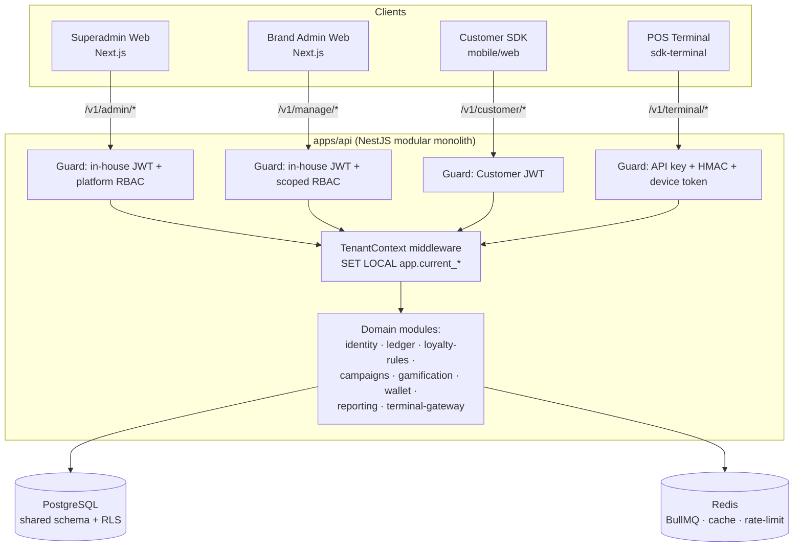
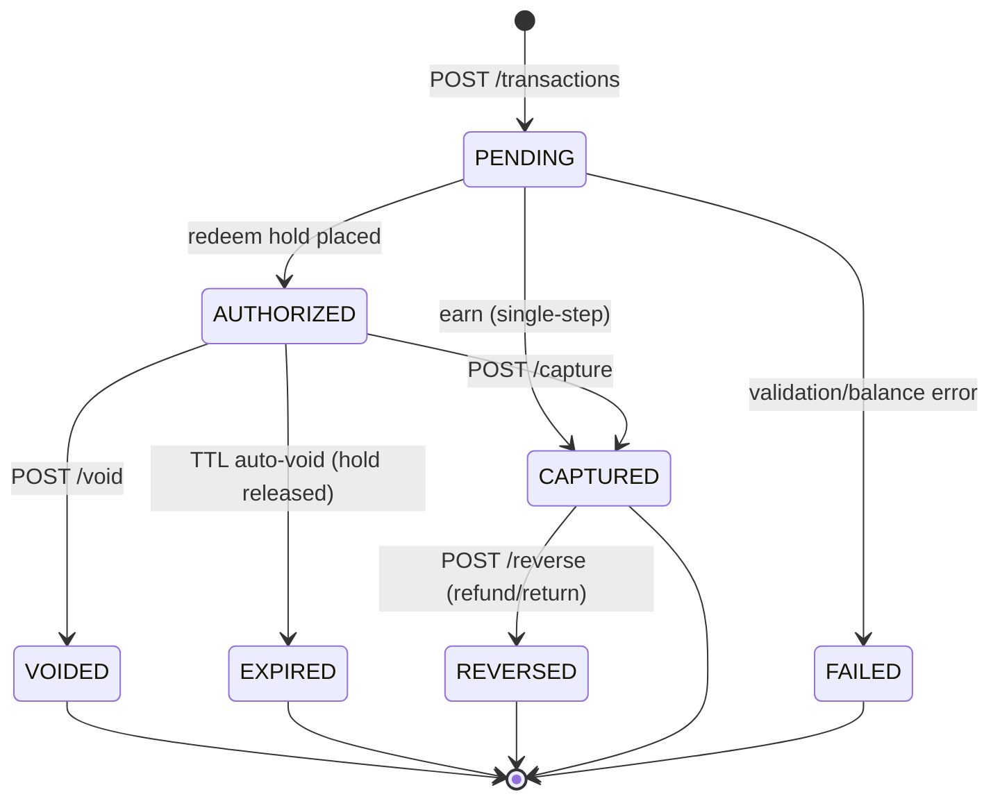

# API Surface Map

> Phase 0 — Document 03
> RFM Loyalty Engine — multi-tenant, closed-loop, B2B2C loyalty platform
> Status: Baseline (aligned to locked architectural decisions)
> Last revised: 2026-06-13

This document is the authoritative inventory of every externally reachable HTTP surface the platform exposes, grouped into the four API audiences. It defines, per surface: base path & versioning, auth mechanism, RBAC/tenant scoping, and an exhaustive grouped endpoint table. Cross-cutting conventions (versioning, idempotency, pagination, error envelope, rate limiting, OpenAPI generation) are specified once at the end and apply to every surface unless a surface explicitly overrides them.

All four surfaces are served by the single `apps/api` NestJS modular monolith. They are distinct NestJS route groups (modules + path prefixes + dedicated auth guards), **not** distinct deployments. This keeps the monolith peelable later: each surface already has a clean boundary that can be lifted into its own gateway when (if) a module is extracted into a service.

---

## 1. Surface overview

| Surface | Audience | Base path | Auth | Primary scope key |
|---|---|---|---|---|
| **A. Superadmin API** | Platform operators (your staff) | `/v1/admin/*` | Email + password + TOTP MFA (in-house, no third-party IdP) → scoped JWT | `platform` (root); may descend to any node |
| **B. Brand Admin API** | Merchant/group/brand/branch staff | `/v1/manage/*` | Email + password + TOTP MFA (in-house) → scoped JWT | `group` / `brand` / `branch` scope node |
| **C. Customer API** | End consumers (via mobile/web SDK) | `/v1/customer/*` | Phone + OTP → access JWT + refresh token | global `person_id` + per-`brand_id` membership |
| **D. Terminal/POS API** | POS devices / integrators | `/v1/terminal/*` | Per-terminal API key (publishable id) + HMAC-signed requests → short-lived bearer token | `terminal_id` bound to a `branch_id` (⊂ `brand_id`) |



**Tenant context propagation (all surfaces).** Every authenticated request resolves a scope from *verified token claims only* (never client headers, never query params). A `TenantContext` middleware opens the request transaction and issues `SET LOCAL app.current_platform / app.current_group / app.current_brand / app.current_branch` before any query runs, so PostgreSQL RLS policies and the app-layer tenant-scoping guard both enforce isolation (defense in depth). Unset context fails closed (zero rows). See Doc 02 (Data Model & RLS) for the policy definitions.

---

## 2. Surface A — Superadmin API

Platform-operator control plane. Manages the tenant hierarchy (platform → group → brand → branch), merchant onboarding, the prepaid wallet/credit ledger, cost rules, platform configuration, global cross-tenant reporting, and audited impersonation/support tooling.

### A.1 Base path & versioning
- Base path: `/v1/admin`
- Path-based major versioning (`/v1`, future `/v2`). Additive changes only within a major.
- Response header `Loyalty-Version: 1` on every response.

### A.2 Auth mechanism
- **In-house identity service** — email + password (argon2id) + mandatory **TOTP MFA**, issuing scoped short-lived JWTs (access + refresh, rotating); httpOnly session cookies for the web apps. **No third-party IdP** (decision 2026-06-13). We still apply RFC 9700 hardening (no Implicit/ROPC, exact redirect-URI matching) in our own first-party OAuth2 authorization-code + PKCE flow used for SPA token exchange.
- **MFA mandatory** for all superadmin principals (TOTP or passkey).
- Exchange yields a short-lived access JWT (≤15 min) + refresh token. Tokens carry `scope_node=platform:<id>` and `roles[]`.
- Sender-constrained tokens (DPoP) recommended; tokens carry no PII.

### A.3 RBAC / scoping notes
- Authorization decided by the central PDP (Cedar/OPA-style policy engine). RBAC selects *function*; ABAC scope tags enforce *isolation*.
- Superadmin roles bind to the **platform** node and may descend into any group/brand/branch. Built-in roles: `platform.owner`, `platform.admin`, `platform.support` (read + impersonate), `platform.finance` (wallet/cost/reporting), `platform.readonly`.
- Superadmin requests still set `app.current_*` to the *target* node being acted on, and RLS is satisfied via an **audited security-definer path** for legitimate cross-tenant reads — never by loosening policies.
- **Every** mutating action and every impersonation is written to the tamper-evident, hash-chained audit log with full actor + target + scope context.

### A.4 Endpoints

**Identity & access (platform staff)**
| METHOD path | Purpose |
|---|---|
| `POST /v1/admin/auth/login` | Email+password login; returns a TOTP MFA challenge if enrolled |
| `POST /v1/admin/auth/mfa` | Verify TOTP code; issue access+refresh JWTs |
| `POST /v1/admin/auth/token` | Refresh-token rotation (or first-party auth-code + PKCE exchange) |
| `POST /v1/admin/auth/refresh` | Rotate access token via refresh token |
| `POST /v1/admin/auth/logout` | Revoke session/refresh token |
| `GET /v1/admin/me` | Current principal, roles, scope |
| `GET /v1/admin/staff` | List platform staff users |
| `POST /v1/admin/staff` | Invite/create platform staff user |
| `GET /v1/admin/staff/{userId}` | Get staff user |
| `PATCH /v1/admin/staff/{userId}` | Update staff user (status, profile) |
| `DELETE /v1/admin/staff/{userId}` | Deactivate staff user |
| `GET /v1/admin/roles` | List platform roles & permissions |
| `PUT /v1/admin/staff/{userId}/roles` | Assign roles (scope-bound) to staff user |

**Tenant hierarchy — Groups**
| METHOD path | Purpose |
|---|---|
| `GET /v1/admin/groups` | List groups (filter, paginate) |
| `POST /v1/admin/groups` | Create group |
| `GET /v1/admin/groups/{groupId}` | Get group |
| `PATCH /v1/admin/groups/{groupId}` | Update group |
| `DELETE /v1/admin/groups/{groupId}` | Soft-delete / archive group |
| `POST /v1/admin/groups/{groupId}/suspend` | Suspend group (program + API access) |
| `POST /v1/admin/groups/{groupId}/reactivate` | Reactivate group |

**Tenant hierarchy — Brands**
| METHOD path | Purpose |
|---|---|
| `GET /v1/admin/brands` | List brands (filter by group, status) |
| `POST /v1/admin/groups/{groupId}/brands` | Create brand under group |
| `GET /v1/admin/brands/{brandId}` | Get brand |
| `PATCH /v1/admin/brands/{brandId}` | Update brand |
| `DELETE /v1/admin/brands/{brandId}` | Soft-delete / archive brand |
| `POST /v1/admin/brands/{brandId}/suspend` | Suspend brand |
| `POST /v1/admin/brands/{brandId}/reactivate` | Reactivate brand |
| `GET /v1/admin/brands/{brandId}/admins` | List brand-admin users |
| `POST /v1/admin/brands/{brandId}/admins` | Provision initial brand-admin user |

**Tenant hierarchy — Branches**
| METHOD path | Purpose |
|---|---|
| `GET /v1/admin/brands/{brandId}/branches` | List branches |
| `POST /v1/admin/brands/{brandId}/branches` | Create branch |
| `GET /v1/admin/branches/{branchId}` | Get branch |
| `PATCH /v1/admin/branches/{branchId}` | Update branch |
| `DELETE /v1/admin/branches/{branchId}` | Archive branch |

**Merchant onboarding**
| METHOD path | Purpose |
|---|---|
| `POST /v1/admin/onboarding/applications` | Create onboarding application (prospective merchant/group) |
| `GET /v1/admin/onboarding/applications` | List applications & status |
| `GET /v1/admin/onboarding/applications/{appId}` | Get application detail |
| `PATCH /v1/admin/onboarding/applications/{appId}` | Update onboarding data (KYC, contacts, residency region) |
| `POST /v1/admin/onboarding/applications/{appId}/approve` | Approve → provisions group/brand/branch + initial admin + wallet |
| `POST /v1/admin/onboarding/applications/{appId}/reject` | Reject application |
| `GET /v1/admin/onboarding/checklist/{appId}` | Onboarding readiness checklist |

**Prepaid wallet / credit ledger (scoped to `group_id`)**
| METHOD path | Purpose |
|---|---|
| `GET /v1/admin/groups/{groupId}/wallet` | Get wallet account + balances (posted/pending/available) |
| `GET /v1/admin/groups/{groupId}/wallet/ledger` | List wallet ledger entries (append-only, paginated) |
| `POST /v1/admin/groups/{groupId}/wallet/top-ups` | Record/initiate a top-up credit (idempotent) |
| `POST /v1/admin/groups/{groupId}/wallet/adjustments` | Manual adjustment (credit/debit) with reason — posts reversing-safe entry |
| `POST /v1/admin/groups/{groupId}/wallet/reversals` | Reverse a prior wallet entry (compensating entry) |
| `GET /v1/admin/groups/{groupId}/wallet/statements` | List period statements |
| `POST /v1/admin/groups/{groupId}/wallet/statements/{period}/export` | Generate statement export (CSV/PDF/journal-entry CSV) — async job |
| `GET /v1/admin/groups/{groupId}/wallet/auto-topup` | Get auto-top-up config |
| `PUT /v1/admin/groups/{groupId}/wallet/auto-topup` | Set min-balance threshold, preset amount, payment method |
| `GET /v1/admin/groups/{groupId}/wallet/alerts` | Get low-balance alert config |
| `PUT /v1/admin/groups/{groupId}/wallet/alerts` | Set alert thresholds (warning/critical/blocked) |

**Cost-rule & economics config**
| METHOD path | Purpose |
|---|---|
| `GET /v1/admin/groups/{groupId}/cost-rules` | Get cost-rule config (CPP mode, markup, drawdown trigger) |
| `PUT /v1/admin/groups/{groupId}/cost-rules` | Set drawdown trigger (`issuance`/`redemption`/`reserve-settle`), CPP mode (`fixed`/`tiered`/`weighted_avg`), platform markup |
| `GET /v1/admin/brands/{brandId}/cost-rules` | Brand-level cost overrides (if delegated) |
| `PUT /v1/admin/brands/{brandId}/cost-rules` | Set brand-level cost overrides |
| `GET /v1/admin/groups/{groupId}/breakage-model` | Get URR/breakage-rate model + default |
| `PUT /v1/admin/groups/{groupId}/breakage-model` | Set/override URR and breakage method (proportional/remote) |
| `GET /v1/admin/groups/{groupId}/escheatment` | Get per-jurisdiction escheatment config |
| `PUT /v1/admin/groups/{groupId}/escheatment` | Set dormancy/de-minimis rules, NAUPA reporting toggles |

**Platform configuration**
| METHOD path | Purpose |
|---|---|
| `GET /v1/admin/config/feature-flags` | List platform & per-tenant feature flags |
| `PUT /v1/admin/config/feature-flags/{flagKey}` | Set feature flag (scope-targetable) |
| `GET /v1/admin/config/plans` | List SaaS plans / entitlements |
| `POST /v1/admin/config/plans` | Create plan |
| `PATCH /v1/admin/config/plans/{planId}` | Update plan |
| `PUT /v1/admin/groups/{groupId}/plan` | Assign plan to group |
| `GET /v1/admin/config/data-retention` | Get default retention/residency policies |
| `PUT /v1/admin/config/data-retention` | Set retention/residency policies |
| `GET /v1/admin/config/regions` | List write/read regions for residency routing |

**Global reporting (cross-tenant; served off read replicas / rollups)**
| METHOD path | Purpose |
|---|---|
| `GET /v1/admin/reports/overview` | Platform KPIs (active tenants, points issued/redeemed, GMV) |
| `GET /v1/admin/reports/tenants` | Per-tenant activity rollups |
| `GET /v1/admin/reports/liability` | Global outstanding points-liability snapshot (ASC 606) |
| `GET /v1/admin/reports/wallet-funding` | Wallet balances & funding/runway across groups |
| `GET /v1/admin/reports/revenue` | Platform revenue/markup recognized |
| `POST /v1/admin/reports/exports` | Request a global report export (async) |
| `GET /v1/admin/reports/exports/{exportId}` | Poll export job status / download link |

**Impersonation & support (fully audited)**
| METHOD path | Purpose |
|---|---|
| `POST /v1/admin/impersonation/sessions` | Start impersonation of a brand-admin or customer (reason required) |
| `GET /v1/admin/impersonation/sessions` | List active/past impersonation sessions |
| `GET /v1/admin/impersonation/sessions/{sessionId}` | Get impersonation session detail |
| `POST /v1/admin/impersonation/sessions/{sessionId}/end` | End impersonation session |
| `GET /v1/admin/support/customers/lookup` | Cross-tenant customer lookup (PII-minimized, audited) |
| `GET /v1/admin/support/transactions/{txnId}` | Inspect any ledger transaction (read-only, audited) |
| `GET /v1/admin/audit-logs` | Query tamper-evident audit log (actor/target/scope/time filters) |
| `GET /v1/admin/audit-logs/{entryId}/verify` | Verify hash-chain integrity for an entry |

**Webhook & key management (platform-level)**
| METHOD path | Purpose |
|---|---|
| `GET /v1/admin/webhooks` | List platform webhook endpoints |
| `POST /v1/admin/webhooks` | Register platform webhook endpoint (event subscriptions) |
| `GET /v1/admin/webhooks/{endpointId}` | Get webhook endpoint |
| `PATCH /v1/admin/webhooks/{endpointId}` | Update endpoint (URL, events, status) |
| `DELETE /v1/admin/webhooks/{endpointId}` | Delete endpoint |
| `POST /v1/admin/webhooks/{endpointId}/rotate-secret` | Rotate signing secret (overlapping `{current,previous}`) |
| `GET /v1/admin/webhooks/{endpointId}/deliveries` | List delivery attempts (status, retries, DLQ) |
| `POST /v1/admin/webhooks/{endpointId}/deliveries/{deliveryId}/redeliver` | Replay a delivery from DLQ |
| `POST /v1/admin/webhooks/{endpointId}/test` | Send a test event |
| `GET /v1/admin/api-keys` | List platform API keys (hashed; never returns secret) |
| `POST /v1/admin/api-keys` | Mint platform API key (scoped, returns secret once) |
| `POST /v1/admin/api-keys/{keyId}/rotate` | Rotate key (dual-key window) |
| `DELETE /v1/admin/api-keys/{keyId}` | Revoke key immediately |

---

## 3. Surface B — Brand Admin API

Merchant-facing control plane for configuring and operating a loyalty program. Scoped to a group/brand/branch node. Loyalty configuration is **brand-scoped** (closed-loop); some surfaces (wallet visibility) read up to `group_id`.

### B.1 Base path & versioning
- Base path: `/v1/manage`
- Same path-based major versioning and `Loyalty-Version` header as Surface A.

### B.2 Auth mechanism
- **Email + password + TOTP MFA (in-house)** → scoped JWT; MFA enforceable per-group policy.
- Access JWT (≤15 min) + refresh token. Token claims carry `scope_node` (e.g. `brand:<id>` or `branch:<id>`) and `roles[]`. **Tenant is derived from the verified token claim, never from a header.**

### B.3 RBAC / scoping notes
- Roles bind to a scope node and resolve only that node and its descendants. Built-in roles: `group.admin` (all brands in group), `brand.admin`, `brand.manager` (config + campaigns, no billing), `brand.analyst` (read + exports), `branch.manager` (branch-scoped ops + terminal mgmt), `brand.support` (customer lookup + adjustments within limits).
- A `brand.admin` token resolves only its brand and child branches; `app.current_brand` is set from the claim and RLS enforces the closed-loop boundary. Cross-brand reads are impossible even for an authorized user (ABAC isolation tag + RLS backstop).
- Wallet *funding* is read-only here (managed by superadmin/finance); brand admins see balance/runway and receive low-balance alerts.

### B.4 Endpoints

**Auth & team management**
| METHOD path | Purpose |
|---|---|
| `POST /v1/manage/auth/token` | Refresh-token rotation (or first-party auth-code + PKCE exchange) |
| `POST /v1/manage/auth/refresh` | Rotate access token |
| `POST /v1/manage/auth/logout` | Revoke session |
| `GET /v1/manage/me` | Current principal, scope, roles |
| `GET /v1/manage/team` | List brand/branch staff users |
| `POST /v1/manage/team` | Invite staff user (scope-bound) |
| `PATCH /v1/manage/team/{userId}` | Update staff user |
| `DELETE /v1/manage/team/{userId}` | Deactivate staff user |
| `PUT /v1/manage/team/{userId}/roles` | Assign scoped roles |
| `GET /v1/manage/roles` | List assignable roles within scope |

**Brand & branch settings**
| METHOD path | Purpose |
|---|---|
| `GET /v1/manage/brand` | Get current brand profile/settings |
| `PATCH /v1/manage/brand` | Update brand profile (name, branding tokens, locale, currency) |
| `GET /v1/manage/branches` | List branches |
| `POST /v1/manage/branches` | Create branch |
| `GET /v1/manage/branches/{branchId}` | Get branch |
| `PATCH /v1/manage/branches/{branchId}` | Update branch |
| `DELETE /v1/manage/branches/{branchId}` | Archive branch |
| `GET /v1/manage/wallet` | Read group wallet balance/runway (read-only) |
| `GET /v1/manage/wallet/alerts` | Low-balance alert status |

**Program config — earn/redeem rules, tiers, expiry, rounding**
| METHOD path | Purpose |
|---|---|
| `GET /v1/manage/program` | Get program config summary |
| `PATCH /v1/manage/program` | Update program-level settings (point name, base currency, rounding policy, FIFO expiry default) |
| `GET /v1/manage/earn-rules` | List earn rules |
| `POST /v1/manage/earn-rules` | Create earn rule (serializable JSON condition tree; per-spend/visit/SKU/category/channel/segment) |
| `GET /v1/manage/earn-rules/{ruleId}` | Get earn rule |
| `PATCH /v1/manage/earn-rules/{ruleId}` | Update earn rule |
| `DELETE /v1/manage/earn-rules/{ruleId}` | Delete earn rule |
| `POST /v1/manage/earn-rules/{ruleId}/activate` | Activate / deactivate rule |
| `POST /v1/manage/earn-rules/validate` | Validate/dry-run a rule DSL against a sample session (no mutation) |
| `GET /v1/manage/redeem-rules` | List redemption rules |
| `POST /v1/manage/redeem-rules` | Create redemption rule |
| `PATCH /v1/manage/redeem-rules/{ruleId}` | Update redemption rule |
| `DELETE /v1/manage/redeem-rules/{ruleId}` | Delete redemption rule |
| `GET /v1/manage/multipliers` | List multipliers (tier/campaign/category/segment/behavioral) |
| `POST /v1/manage/multipliers` | Create multiplier with stacking mode + per-transaction caps |
| `PATCH /v1/manage/multipliers/{multiplierId}` | Update multiplier |
| `DELETE /v1/manage/multipliers/{multiplierId}` | Delete multiplier |
| `GET /v1/manage/tiers` | List tiers |
| `POST /v1/manage/tiers` | Create tier (qualification metric, thresholds, benefits) |
| `PATCH /v1/manage/tiers/{tierId}` | Update tier |
| `DELETE /v1/manage/tiers/{tierId}` | Delete tier |
| `GET /v1/manage/tiers/policy` | Get tier review/reset + grace-period policy |
| `PUT /v1/manage/tiers/policy` | Set review window (calendar/rolling/anniversary), downgrade & grace rules |
| `GET /v1/manage/expiry-policy` | Get points expiry policy |
| `PUT /v1/manage/expiry-policy` | Set rolling/sliding window, pre-expiry notification lead time |
| `GET /v1/manage/attributes` | List custom attribute schema (profile/session/item/event) |
| `POST /v1/manage/attributes` | Define a custom attribute (schema-independent) |
| `DELETE /v1/manage/attributes/{attrId}` | Remove a custom attribute |

**Campaigns & promotions**
| METHOD path | Purpose |
|---|---|
| `GET /v1/manage/campaigns` | List campaigns |
| `POST /v1/manage/campaigns` | Create campaign (effects, conditions, schedule, budget) |
| `GET /v1/manage/campaigns/{campaignId}` | Get campaign |
| `PATCH /v1/manage/campaigns/{campaignId}` | Update campaign |
| `DELETE /v1/manage/campaigns/{campaignId}` | Delete campaign |
| `POST /v1/manage/campaigns/{campaignId}/activate` | Activate / schedule campaign |
| `POST /v1/manage/campaigns/{campaignId}/pause` | Pause campaign |
| `GET /v1/manage/campaign-groups` | List evaluation groups (ordered) |
| `POST /v1/manage/campaign-groups` | Create evaluation group (mode: stackable/first/highest; scope: session/item) |
| `PATCH /v1/manage/campaign-groups/{groupId}` | Reorder / update mode & scope |
| `GET /v1/manage/campaigns/{campaignId}/budget` | Get campaign budget & consumption |
| `PUT /v1/manage/campaigns/{campaignId}/budget` | Set/adjust budget & limits |
| `POST /v1/manage/campaigns/{campaignId}/preview` | Preview effects against a sample session (no commit) |

**Gamification config**
| METHOD path | Purpose |
|---|---|
| `GET /v1/manage/gamification/badges` | List badges/achievements |
| `POST /v1/manage/gamification/badges` | Create badge (simple or multi-rule achievement) |
| `PATCH /v1/manage/gamification/badges/{badgeId}` | Update badge |
| `DELETE /v1/manage/gamification/badges/{badgeId}` | Delete badge |
| `GET /v1/manage/gamification/challenges` | List challenges/missions/quests |
| `POST /v1/manage/gamification/challenges` | Create time-bound challenge/mission/quest |
| `PATCH /v1/manage/gamification/challenges/{challengeId}` | Update challenge |
| `DELETE /v1/manage/gamification/challenges/{challengeId}` | Delete challenge |
| `GET /v1/manage/gamification/streaks` | Get streak rules |
| `PUT /v1/manage/gamification/streaks` | Configure streak mechanics |
| `GET /v1/manage/gamification/leaderboards` | List leaderboards |
| `POST /v1/manage/gamification/leaderboards` | Create (micro/segmented) leaderboard |
| `PATCH /v1/manage/gamification/leaderboards/{lbId}` | Update leaderboard config |
| `GET /v1/manage/gamification/games` | List games-of-chance (spin/scratch) |
| `POST /v1/manage/gamification/games` | Create game-of-chance with prize odds & caps |
| `PATCH /v1/manage/gamification/games/{gameId}` | Update game |

**Reward catalog, vouchers & coupons**
| METHOD path | Purpose |
|---|---|
| `GET /v1/manage/rewards` | List reward catalog items |
| `POST /v1/manage/rewards` | Create reward (cost in points, unit cost, eligibility) |
| `GET /v1/manage/rewards/{rewardId}` | Get reward |
| `PATCH /v1/manage/rewards/{rewardId}` | Update reward |
| `DELETE /v1/manage/rewards/{rewardId}` | Retire reward |
| `GET /v1/manage/coupons` | List coupon definitions |
| `POST /v1/manage/coupons` | Create coupon (validity window, min-spend, eligible SKU, limits) |
| `PATCH /v1/manage/coupons/{couponId}` | Update coupon |
| `DELETE /v1/manage/coupons/{couponId}` | Delete coupon |
| `POST /v1/manage/vouchers/batches` | Generate a voucher batch (codes, single/multi-use) |
| `GET /v1/manage/vouchers/batches` | List voucher batches |
| `GET /v1/manage/vouchers` | Search issued vouchers (status filters) |
| `POST /v1/manage/vouchers/{voucherId}/void` | Void/revoke a voucher |

**Customer management & lookup**
| METHOD path | Purpose |
|---|---|
| `GET /v1/manage/members` | List/search members (phone/email/loyalty ID; PII-minimized) |
| `GET /v1/manage/members/{memberId}` | Get member profile + per-brand membership |
| `PATCH /v1/manage/members/{memberId}` | Update membership status (block/unblock, tags) |
| `GET /v1/manage/members/{memberId}/balance` | Member points balances (active/pending/expired/lifetime) |
| `GET /v1/manage/members/{memberId}/ledger` | Member points ledger (append-only) |
| `POST /v1/manage/members/{memberId}/adjustments` | Manual points adjustment (idempotent, reason, within role limit) |
| `GET /v1/manage/members/{memberId}/tier` | Member tier + progress-to-next |
| `POST /v1/manage/members/{memberId}/tier/override` | Manual tier override (audited) |
| `GET /v1/manage/members/{memberId}/gamification` | Member gamification state |
| `POST /v1/manage/members/{memberId}/erasure` | Initiate GDPR/CCPA erasure (pseudonymize PII, preserve ledger) |
| `GET /v1/manage/members/{memberId}/data-export` | Initiate subject data export (DSAR) |

**Terminal & device management (branch-scoped)**
| METHOD path | Purpose |
|---|---|
| `GET /v1/manage/terminals` | List terminals (filter by branch) |
| `POST /v1/manage/terminals` | Register terminal → returns pairing code (single-use, short TTL) |
| `GET /v1/manage/terminals/{terminalId}` | Get terminal (status, last seen, branch binding) |
| `PATCH /v1/manage/terminals/{terminalId}` | Update terminal (label, branch reassignment, status) |
| `POST /v1/manage/terminals/{terminalId}/rotate-secret` | Rotate device secret (overlapping window) |
| `POST /v1/manage/terminals/{terminalId}/revoke` | Revoke terminal credentials immediately |
| `GET /v1/manage/terminals/{terminalId}/keys` | List publishable key ids for terminal (hashed secrets) |

**Reporting & exports (brand-scoped; off read replicas/rollups)**
| METHOD path | Purpose |
|---|---|
| `GET /v1/manage/reports/overview` | Brand KPI hero stats (members, points issued/redeemed, redemption rate) |
| `GET /v1/manage/reports/transactions` | Transaction rollups (date-range, branch drill-down) |
| `GET /v1/manage/reports/liability` | Brand outstanding points-liability snapshot |
| `GET /v1/manage/reports/breakage` | Issued vs redeemed vs expired (breakage) |
| `GET /v1/manage/reports/rfm` | RFM segments (Champions/Loyalists/At-Risk/Dormant/New) |
| `GET /v1/manage/reports/cohorts` | Cohort retention |
| `GET /v1/manage/reports/churn` | Churn-risk signals |
| `GET /v1/manage/reports/ltv` | LTV by segment |
| `GET /v1/manage/reports/campaigns` | Campaign performance |
| `GET /v1/manage/reports/gamification` | Gamification engagement metrics |
| `POST /v1/manage/reports/exports` | Request export (CSV/Excel/PDF), date-range, async |
| `GET /v1/manage/reports/exports/{exportId}` | Poll export status / download link |

**Webhooks (brand-level)**
| METHOD path | Purpose |
|---|---|
| `GET /v1/manage/webhooks` | List brand webhook endpoints |
| `POST /v1/manage/webhooks` | Register endpoint + event subscriptions |
| `PATCH /v1/manage/webhooks/{endpointId}` | Update endpoint |
| `DELETE /v1/manage/webhooks/{endpointId}` | Delete endpoint |
| `POST /v1/manage/webhooks/{endpointId}/rotate-secret` | Rotate signing secret (overlap window) |
| `GET /v1/manage/webhooks/{endpointId}/deliveries` | Delivery log (status, retries, DLQ) |
| `POST /v1/manage/webhooks/{endpointId}/deliveries/{deliveryId}/redeliver` | Replay delivery |
| `POST /v1/manage/webhooks/{endpointId}/test` | Send test event |
| `GET /v1/manage/event-types` | List subscribable domain event types |

---

## 4. Surface C — Customer API

Consumer-facing surface consumed by the `packages/sdk-customer` (mobile/web). A **global person identity** (deduped by phone/email) holds **per-brand membership** records and **per-brand point wallets**. All loyalty data is scoped to `brand_id`; balances stay closed-loop per brand.

### C.1 Base path & versioning
- Base path: `/v1/customer`
- Brand context is required on every request and resolved from a **brand-scoped client credential** issued to the SDK (publishable brand client id), combined with the customer JWT. The server derives `app.current_brand` from this; clients never pass `brand_id` as a writable scope key.

### C.2 Auth mechanism
- **Phone + OTP** registration/login. SMS OTP is treated as a NIST-restricted authenticator: short single-use codes, per-phone and per-IP rate limits with backoff, separate wrong/expired counters.
- On success: short-lived **access JWT** (≤15 min, no PII in claims) + **refresh token** (rotating). Passkey/TOTP step-up offered as a stronger factor.
- Access token claims: `person_id`, `brand_id`, `membership_id`.

### C.3 RBAC / scoping notes
- A customer can only ever read/write their own data within the resolved `brand_id`. RLS scopes to `(brand_id, person_id/membership_id)`; the app guard double-checks the subject matches the token.
- One human (one `person_id`) may hold memberships across many brands; each Customer API session is pinned to exactly one brand. Switching brand = a new brand-scoped session.
- No PII echoed beyond what the authenticated subject owns.

### C.4 Endpoints

**Registration & auth**
| METHOD path | Purpose |
|---|---|
| `POST /v1/customer/auth/otp/request` | Request OTP for a phone number (rate-limited) |
| `POST /v1/customer/auth/otp/verify` | Verify OTP → issue access + refresh tokens; auto-enroll membership |
| `POST /v1/customer/auth/refresh` | Rotate access token |
| `POST /v1/customer/auth/logout` | Revoke refresh token |
| `POST /v1/customer/auth/passkey/register` | Register a passkey (step-up factor) |
| `POST /v1/customer/auth/passkey/verify` | Authenticate via passkey |

**Profile & consent**
| METHOD path | Purpose |
|---|---|
| `GET /v1/customer/me` | Get profile + membership summary for current brand |
| `PATCH /v1/customer/me` | Update profile (name, email, locale, marketing prefs) |
| `GET /v1/customer/me/consents` | Get consent/marketing/privacy settings |
| `PUT /v1/customer/me/consents` | Update consents |
| `POST /v1/customer/me/data-export` | Request personal data export (DSAR), async |
| `POST /v1/customer/me/erasure` | Request account erasure (pseudonymization; ledger preserved) |
| `DELETE /v1/customer/me/sessions` | Sign out of all devices |

**Balances & transaction history**
| METHOD path | Purpose |
|---|---|
| `GET /v1/customer/balance` | Current points balance (active/pending/expired/lifetime) for brand |
| `GET /v1/customer/balance/expiring` | Upcoming expiring points (FIFO buckets + dates) |
| `GET /v1/customer/transactions` | Paginated points ledger history (earn/burn/adjust/expire) |
| `GET /v1/customer/transactions/{txnId}` | Get a single transaction |
| `GET /v1/customer/tier` | Current tier + progress-to-next + benefits |

**Reward catalog & redemptions**
| METHOD path | Purpose |
|---|---|
| `GET /v1/customer/rewards` | Browse reward catalog (eligible/affordable filters) |
| `GET /v1/customer/rewards/{rewardId}` | Reward detail |
| `POST /v1/customer/redemptions` | Redeem points for a reward (idempotent; reserve-then-commit) |
| `GET /v1/customer/redemptions` | List redemptions (status) |
| `GET /v1/customer/redemptions/{redemptionId}` | Redemption detail |
| `POST /v1/customer/redemptions/{redemptionId}/cancel` | Cancel a pending redemption (releases hold) |

**Vouchers & coupons**
| METHOD path | Purpose |
|---|---|
| `GET /v1/customer/vouchers` | List the customer's vouchers/coupons |
| `GET /v1/customer/vouchers/{voucherId}` | Voucher detail + QR/redeem token |
| `POST /v1/customer/vouchers/claim` | Claim a voucher/coupon by code |

**Gamification state**
| METHOD path | Purpose |
|---|---|
| `GET /v1/customer/gamification` | Aggregate gamification state (points, badges, streaks, active quests) |
| `GET /v1/customer/gamification/badges` | Earned + available badges/achievements |
| `GET /v1/customer/gamification/challenges` | Active/available challenges/missions/quests + progress |
| `POST /v1/customer/gamification/challenges/{challengeId}/join` | Opt into a challenge |
| `GET /v1/customer/gamification/streaks` | Current streak status |
| `GET /v1/customer/gamification/leaderboards/{lbId}` | Leaderboard standing (micro/segmented rank vs peers) |
| `GET /v1/customer/gamification/games` | Available games-of-chance + eligibility |
| `POST /v1/customer/gamification/games/{gameId}/play` | Play spin/scratch (idempotent; emits reward effect in-session) |

**Referrals**
| METHOD path | Purpose |
|---|---|
| `GET /v1/customer/referrals` | Get referral code/link + status |
| `POST /v1/customer/referrals/invite` | Send/generate a referral invite |
| `GET /v1/customer/referrals/rewards` | Track double-sided referral rewards earned |
| `POST /v1/customer/referrals/redeem` | Apply a referral code at signup (referred party) |

**Identification helpers (lane presentation)**
| METHOD path | Purpose |
|---|---|
| `GET /v1/customer/wallet-pass` | Get NFC/wallet pass + rotating QR token for POS scan |
| `POST /v1/customer/wallet-pass/rotate` | Rotate the QR/NFC member token (anti-harvesting) |

---

## 5. Surface D — Terminal / POS Integration API

Narrow, payment-grade surface for POS devices and integrators. Modeled on mature terminal APIs (Stripe Terminal, Square Terminal/Loyalty, Adyen Nexo). Treats points as money: exactly-once semantics, explicit transaction state machine, store-and-forward, signed webhooks + pollable state.

### D.1 Base path & versioning
- Base path: `/v1/terminal`
- **Conservative, additive versioning only.** Never repurpose a field; breaking changes gate behind `/v2`. Idempotency, HMAC signing, and state-machine semantics are frozen within a major version (terminals update slowly). `Loyalty-Version` response header on every response.

### D.2 Auth mechanism
- **Per-terminal API key**: a publishable key id + secret. The secret is used for **HMAC-SHA256 request signing** (AWS SigV4-style canonical request: method + path + timestamp + nonce + body hash), never sent on the wire.
- The device exchanges its key/secret for a **short-lived bearer token (~1h)** scoped to a single `terminal_id`/`branch_id`; the token authenticates each call and the HMAC signature defends against replay/tampering.
- `Idempotency-Key` header **mandatory** on every mutating POST.
- Webhook payloads signed `X-Loyalty-Signature: t=<ts>,v1=<hmac>` over `timestamp.rawbody`; consumers verify on raw bytes, reject >5-min skew, dedupe on `event_id`.

### D.3 RBAC / scoping notes
- A terminal credential resolves exactly one `terminal_id` bound to one `branch_id` (⊂ `brand_id` ⊂ `group_id`). `app.current_branch`/`current_brand` are set from the verified token; RLS confines all reads/writes to that branch's brand.
- Terminals never touch PAN/cardholder data — loyalty rides as a value-added-service tender. The engine only ever sees member tokens + order totals (kept out of PCI scope).
- Bounded clock-skew handling and a per-terminal/per-member **offline exposure cap** limit decline/over-redeem risk.

### D.4 Transaction state machine



- **Earn** at a settled sale collapses to a single `CAPTURED` write. **Redeem** authorizes (holds points, reduces available) then captures on settlement; uncaptured holds auto-release on TTL (mirrors Square 36h/7d), emitting an event the POS can observe.
- Committed entries are **never mutated**; refunds/returns emit a linked `REVERSE` (compensating) ledger transaction, keeping the ledger append-only.

### D.5 Endpoints

**Pairing & provisioning**
| METHOD path | Purpose |
|---|---|
| `POST /v1/terminal/pair` | Exchange single-use pairing code → device secret (stored in keystore) |
| `POST /v1/terminal/token` | Exchange API key + HMAC signature for short-lived bearer token |
| `POST /v1/terminal/token/refresh` | Refresh bearer token before expiry |
| `GET /v1/terminal/device` | Get this terminal's identity, branch binding, config |
| `POST /v1/terminal/device/deactivate` | Self-deactivate (lost/decommissioned device) |
| `GET /v1/terminal/config` | Fetch terminal config (offline caps, clock-skew window, feature flags) |
| `POST /v1/terminal/heartbeat` | Liveness ping + clock-skew sync |

**Customer identification**
| METHOD path | Purpose |
|---|---|
| `POST /v1/terminal/members/resolve` | Resolve `{type: phone\|qr\|nfc\|loyalty_id\|card_token, value}` → short-lived opaque member token |
| `GET /v1/terminal/members/{memberToken}` | Get minimal member context (tier, display name, eligibility flags) |
| `GET /v1/terminal/members/{memberToken}/balance` | Balance inquiry (active/available points) |

**Quote / preview (no mutation)**
| METHOD path | Purpose |
|---|---|
| `POST /v1/terminal/quotes` | Preview earn & redeem effects for a cart (CalculateLoyaltyPoints-style); returns `quote_id` |

**Transactions (earn / redeem authorize → capture/void/reverse)**
| METHOD path | Purpose |
|---|---|
| `POST /v1/terminal/transactions` | Create transaction (earn → CAPTURED, or redeem → AUTHORIZED hold); `Idempotency-Key` required; may reference `quote_id` |
| `GET /v1/terminal/transactions/{txnId}` | **Poll** definitive transaction state (webhook-loss fallback before printing receipt) |
| `POST /v1/terminal/transactions/{txnId}/capture` | Capture an authorized redeem against the settled sale |
| `POST /v1/terminal/transactions/{txnId}/void` | Void an authorized (uncaptured) transaction; releases hold |
| `POST /v1/terminal/transactions/{txnId}/reverse` | Compensating reverse for refund/return (linked entry) |
| `GET /v1/terminal/transactions` | List recent transactions for this terminal (reconciliation) |

**Offline store-and-forward / batch replay**
| METHOD path | Purpose |
|---|---|
| `POST /v1/terminal/batch` | Submit a queued batch of offline-generated, locally-signed transactions for server-authoritative replay (dedupe by client idempotency key) |
| `GET /v1/terminal/batch/{batchId}` | Poll batch processing result (per-item accepted/reversed/failed) |
| `GET /v1/terminal/sync` | Pull authoritative deltas since last sync (downgrades/reversals from offline over-redeem) |

**Webhooks & event acknowledgement**
| METHOD path | Purpose |
|---|---|
| `GET /v1/terminal/events` | Long-poll/pull pending events for this terminal (TTL auto-void, reversal, balance change) |
| `POST /v1/terminal/events/{eventId}/ack` | Acknowledge event receipt (idempotent) |
| `GET /v1/terminal/webhooks` | Get the terminal/integrator webhook config (if push delivery used) |
| `PUT /v1/terminal/webhooks` | Set/rotate webhook URL + signing secret (overlap window) |

---

## 6. Cross-cutting conventions

These apply uniformly to all four surfaces. They are implemented once as shared NestJS interceptors/guards/pipes and shared zod DTOs in `packages/shared`, so behavior is identical everywhere.

### 6.1 Versioning strategy
- **Path-based major versioning** (`/v1`, `/v2`). One major in the path; minors are additive and non-breaking (new optional fields, new endpoints, new enum values consumers must tolerate).
- Breaking changes (removed/renamed fields, changed types, changed semantics) require a new major. Two majors run in parallel during a deprecation window; deprecations announced via `Deprecation` + `Sunset` response headers.
- Every response carries `Loyalty-Version`. The Terminal surface freezes idempotency, signing, and state-machine semantics within a major because devices update slowly.

### 6.2 Idempotency conventions
- All mutating `POST`/`PUT`/`PATCH` accept an `Idempotency-Key` header; it is **mandatory** on the Terminal surface and on all ledger-affecting operations (earn, redeem, capture, void, reverse, wallet top-up/adjustment, manual points adjustment, redemption, game play).
- Keys are client-generated (V4 UUID, ≤255 chars). Server persists `(actor_id, key) → {request_hash, status, response}` for ≥24h.
  - Replay with the same key + same request hash returns the **stored response** (including the original status).
  - Same key + **different** request hash → `409 Conflict` (`idempotency_key_reused`).
  - In-flight duplicate while the first is processing → `409` (`request_in_progress`).
- Idempotency is enforced inside the same DB transaction as the ledger write (unique constraint on `(account, source_event_id)` plus the idempotency table), and per-customer/per-account writes are serialized (`SELECT … FOR UPDATE` / SERIALIZABLE) to prevent lost updates. Derived idempotency keys propagate to any downstream PSP call.

### 6.3 Pagination & filtering conventions
- **Cursor-based pagination** by default (stable under inserts): `?limit=<n>&cursor=<opaque>`; default `limit=50`, max `200`. Response includes `page: { next_cursor, has_more, limit }`.
- Offset pagination (`?page=&page_size=`) is offered only on small admin config lists where total counts matter.
- Filtering: typed query params (`status=`, `created_after=`, `created_before=`, `branch_id=`, `segment=`), ISO-8601 dates/instants, RFC 3339 ranges. Sorting via `sort=field` / `sort=-field` (whitelisted fields only).
- Large result sets and all reporting/export reads are routed to **read replicas / rollup tables**; exports over the synchronous threshold become async background jobs (request → poll/download link → email notification), never streamed inside the request.

### 6.4 Error envelope
Single consistent JSON envelope on every surface. HTTP status is authoritative; the body adds machine-readable detail.

```json
{
  "error": {
    "type": "insufficient_balance",
    "message": "Member has 120 points; redemption requires 500.",
    "code": "LOY-4221",
    "request_id": "req_01HZX...",
    "correlation_id": "svc_8f3a...",
    "details": [
      { "field": "points", "issue": "available_below_required" }
    ],
    "retryable": false,
    "doc_url": "https://docs.<platform>/errors/LOY-4221"
  }
}
```

- `type` is a stable snake_case slug; `code` is a stable catalog id. Conventions:
  - `400 validation_error` (zod DTO failure; `details[]` per field)
  - `401 unauthenticated` / `403 forbidden` (RBAC/scope denial) / `403 tenant_scope_violation`
  - `404 not_found`
  - `409 conflict` (`idempotency_key_reused`, `request_in_progress`, `optimistic_lock_conflict`, `session_too_many_updates`)
  - `422 unprocessable` (business rule, e.g. `insufficient_balance`, `wallet_depleted`, `points_expired`, `tier_ineligible`, `budget_exhausted`)
  - `429 rate_limited` (with `Retry-After`)
  - `5xx internal` / `503 service_unavailable`
- `request_id` is generated per request; `correlation_id` echoes the terminal `ServiceID`/`SaleID` style id where supplied, and is propagated through logs, outbox events, and webhooks for end-to-end tracing.

### 6.5 Rate limiting
- **Per-tenant, tiered token-bucket** limits synced through Redis, with stricter limits on auth/OTP endpoints (per-phone + per-IP with backoff) and on terminal credential exchange.
- Buckets are keyed by surface + scope: per `terminal_id` (Terminal), per `person_id`/`brand_id` (Customer), per principal + `brand_id` (Brand Admin), per principal (Superadmin). Plan/tier entitlements set bucket sizes.
- Standard headers: `RateLimit-Limit`, `RateLimit-Remaining`, `RateLimit-Reset`, and `Retry-After` on `429`.
- Engine-side request serialization (per profile/session) is layered on top: beyond a small concurrency window the engine returns `409 session_too_many_updates` (Talon.One-style) rather than risking lost updates. Global noisy-neighbor guardrails (statement timeout, idle-in-transaction timeout, per-tenant connection caps) back this at the DB layer.

### 6.6 OpenAPI / Swagger generation
- NestJS `@nestjs/swagger` generates an **OpenAPI 3.1** document per surface from decorators and the shared **zod DTOs** (`packages/shared`) via a zod↔OpenAPI bridge, so the schema is the single source of truth for types, validation, and docs.
- Four separate documents are published (one per surface) to keep audience-appropriate scopes clean: `/v1/admin/openapi.json`, `/v1/manage/openapi.json`, `/v1/customer/openapi.json`, `/v1/terminal/openapi.json`, each with a Swagger UI in non-production.
- Specs are committed and diffed in CI (breaking-change detection gate). Typed SDKs are generated from them: `packages/sdk-terminal` and `packages/sdk-customer` are produced from the terminal/customer specs; the Next.js admin apps consume generated types from the admin/manage specs. Security schemes are declared per surface (admin bearer JWT, customer bearer JWT, API-key + HMAC), and the `Idempotency-Key`, `Loyalty-Version`, and `RateLimit-*` headers are documented globally.
