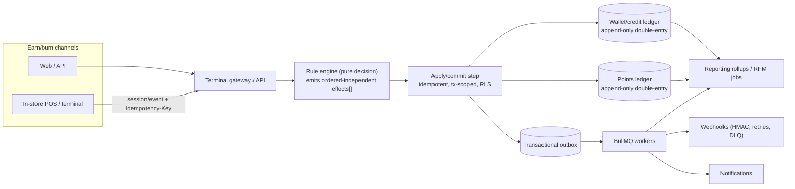

# Feature List (v1 vs deferred)

This document scopes the RFM Loyalty Engine for build. It is organized by capability area; each area carries a table with four columns:

- **v1 (must)** — the table-stakes loop that must ship for a credible closed-loop, multi-tenant, B2B2C launch. If it is not here, we do not launch.
- **v1.x (should)** — fast-follow within the v1 train; built on v1 primitives without schema rewrites; sequenced behind the must-haves.
- **Deferred / v2 (could)** — high-demand or high-complexity capabilities (paid/subscription tiers, coalition, family pooling, full AI personalization). The data model must *accommodate* these now; we do not *build* them now.
- **Notes** — design constraints, anti-patterns to avoid, and grounding in the research digest.

A guiding principle throughout: **the engine decides and emits effects; a separate idempotent apply/commit step mutates the ledger.** We adopt the Talon.One effects model as the core contract. The points ledger and wallet ledger are append-only and double-entry (per the locked decisions); balances are derived and materialized, never mutated blindly. We never store a single mutable balance integer.

The v1 line is deliberately drawn at: **a configurable points engine, basic tiers, earn/burn redemption, coupons/vouchers, referrals, expiry handling, omnichannel identity, prepaid merchant wallet, and brand + superadmin reporting.** Gamification depth, RFM-driven targeting/personalization, paid/subscription tiers, coalition, and family accounts are the explicit deferred layer.

---

## 1. Points engine

| Feature | v1 (must) | v1.x (should) | Deferred / v2 (could) | Notes |
|---|---|---|---|---|
| Append-only points ledger | ✅ Double-entry, immutable journal; account per customer-per-brand; whole-integer points; materialized balance row updated in same tx with `SELECT … FOR UPDATE` + CHECK ≥ 0 | — | — | Never a single mutable integer. Balances derivable by replay. Anti-pattern #1 to avoid across the whole digest. |
| Point states (pending / active / redeemed / expired / adjusted / lifetime) | ✅ pending, active/available, redeemed, expired, manual-adjust, lifetime (tracking) | Subledgers / multiple wallets (base vs promo pool, independent expiry) | — | Pending→active activation delay so returns/fraud claw back before spend. Expiration clock starts at *activation*, not earn. |
| Earning-rule engine (rules-as-data) | ✅ Serializable JSON condition tree (AND/OR/NOT nesting) over namespaced typed attributes (`profile.*`, `session.*`, `item.*`, `event.*`); bounded operators (eq/neq/gt/lt/in/contains/startsWith/regex via RE2); sandboxed evaluator; versioned rules | No-code rule builder UI in brand admin | ML-suggested rules | Hard-coding "1 pt per $1" is anti-pattern. Build the engine even if first rule set is trivial. RE2 only — no catastrophic backtracking. |
| Earn rule types | ✅ per-spend, per-visit/check-in, per-SKU, per-category, per-channel, fixed bonus | per-segment rules; "final step" rule sequencing | — | Transactional + behavioral both addressable. |
| Multipliers (distinct concept) | ✅ tier multiplier + time-bound campaign multiplier; explicit **stacking mode** (combine vs take-highest) + **per-transaction point cap** | category/SKU multiplier; segment-targeted multiplier; behavioral (anniversary/referral) | — | Multiplier ≠ earn rule. Caps are mandatory guardrails. |
| Custom/flexible attributes | ✅ schema-independent custom fields on profile/session/item/event (no engine migration) | Auto-derived filter attributes from item filters/bundles | — | Lets brands model their own data without schema churn. |
| Idempotency on every mutating op | ✅ Idempotency-key table; unique `(customer_id, source_event_id)`; per-customer write serialization (≈3 parallel, queue, then 409) | Redis SETNX check-and-lock with cached response | — | Points are money-equivalent; exactly-once is non-negotiable. |
| Activation / expiry / tier recompute batch | ✅ Nightly job order: activate pending → expire (FIFO buckets) → recompute tiers; idempotent, re-runnable | pre-expiry notification trigger 1–2 months out | — | Real-time earn/burn; eventually-consistent batch for activation/expiry/tier (Voucherify pattern). |
| FIFO expiration buckets | ✅ Redeem shortest-expiry-first; expiry posts a **breakage/reversal ledger event**, never silent deletion | — | — | Silent zeroing breaks audit + ASC 606 breakage recognition. |

---

## 2. Rewards & redemptions

| Feature | v1 (must) | v1.x (should) | Deferred / v2 (could) | Notes |
|---|---|---|---|---|
| Reward catalog | ✅ Brand-scoped catalog; reward types: %/fixed discount, free item, fixed-points-for-reward | Reward customization (member picks reward); experiential rewards | AI reward recommendation | Reward customization is high-demand (81% want / 49% have) — design now, build later. |
| Redemption (burn) | ✅ Reserve-then-commit two-phase: authorize holds points (pending debit) → capture posts → void/timeout restores; non-negative enforced via conditional `UPDATE … WHERE available - :amt >= 0` | Partial redemption; cap auto-redeem checks (≤10/customer/day) | — | Mirrors auth/capture. Held points auto-release on TTL (Square 36h/7d analog). |
| Quote / preview (no mutation) | ✅ `POST /v1/quotes` — "earn X / redeem Y for $Z off" without committing; subsequent earn/redeem references quote id | — | — | CalculateLoyaltyPoints pattern. |
| Refund / reversal | ✅ Compensating **reverse** ledger event linked to original; never mutate committed entry | Partial-return per-item rollback | — | Append-only. Session cancel/reopen emits rollback effects. |
| Reward fulfillment | ✅ Decoupled consumer off the outbox (voucher issuance, notification) with retry | — | Physical-goods fulfillment integration | Fulfillment must survive downstream outages without blocking the txn path. |

---

## 3. Tiers / membership

| Feature | v1 (must) | v1.x (should) | Deferred / v2 (could) | Notes |
|---|---|---|---|---|
| Tier structure | ✅ 3–5 configurable tiers; qualify on configurable metric (spend OR points OR visits); per-tier benefit flags + point multiplier | Unlimited tiers, custom names/thresholds; combination qualification | — | Store as data; brand admin configures. |
| Progress-to-next-tier | ✅ Computed value exposed via API for progress bars from day one | — | — | UI hero/progress-bar requirement (design language). |
| Tier lifecycle | ✅ Review/reset period (calendar OR rolling OR anniversary); grace period; downgrade logic | Downgrade-risk nudges (loss-aversion) | — | Loss aversion > aspiration; surface downgrade risk deliberately. Tier recompute is the nightly batch job, not per-txn. |
| Anniversary handling | ✅ Modeled as scheduled/triggered campaign (reset boundary + bonus trigger) | Anniversary behavioral multiplier | — | Not a separate subsystem. |
| Tier change effects | ✅ `changeLoyaltyTierLevel` effect emitted by engine; tier-upgraded domain event via outbox | — | — | Real-time tier-up celebration via notification consumer. |

---

## 4. Campaigns & promotions

| Feature | v1 (must) | v1.x (should) | Deferred / v2 (could) | Notes |
|---|---|---|---|---|
| Campaign definition | ✅ Condition/effect campaigns over the same rule DSL; validity windows; double-points / happy-hour / seasonal | Drag-and-drop no-code builder | — | Marketers must launch without engineering tickets. |
| Evaluation groups | ✅ Ordered groups with explicit **mode** (stackable / first-campaign / highest-value) and **scope** (session vs item); cascading discounts; hard floor at zero | — | — | Declaratively solves stacking/exclusivity bugs. Item-scope: one campaign per item unit. |
| Budgets & limits | ✅ Budget checked on every session update, **consumed only on session close** (preview vs commit); per-campaign + per-customer caps | — | — | Coupon can be offered then become invalid before checkout if budget exhausted. |
| Segment targeting | ✅ Target by static segment / attribute | RFM-segment targeting (Champions/At-Risk/Dormant → action) | AI/predictive segment targeting; automated surprise-and-delight flows | RFM is a scheduled job feeding targeting; the bridge to AI personalization later. |
| Campaign analytics | ✅ Issued/redeemed/budget-consumed per campaign | Lift/cohort attribution | — | Served off rollups/replica. |

---

## 5. Coupons / vouchers

| Feature | v1 (must) | v1.x (should) | Deferred / v2 (could) | Notes |
|---|---|---|---|---|
| Coupon/voucher subsystem | ✅ Unique codes; validity windows; min-spend / eligible-SKU validation; single-use vs multi-use; per-customer limits | Bulk code generation; QR/barcode coupon | — | Required for both redemption rewards and promo campaigns. |
| Coupon lifecycle effects | ✅ acceptCoupon / rejectCoupon / reserveCoupon / rollbackCoupon effects; reserve on session, commit on close | — | — | Engine emits; apply-step commits. |
| Coupon validation rules | ✅ AND/OR/bracketed rule groups over audience/products/prices/budget/redemptions/metadata | — | — | Same DSL as earning rules (Voucherify shape). |

---

## 6. Gamification

| Feature | v1 (must) | v1.x (should) | Deferred / v2 (could) | Notes |
|---|---|---|---|---|
| Achievements / badges | ✅ Simple single-rule milestone badges; **real-time / in-session** award via gamification module evaluating off events | Multi-dimensional achievements (composed of several rules) | — | Batch/overnight gamification kills the dopamine loop — must be event-driven. Cheapest, highest perceived value first. |
| Progress visualization | ✅ Progress-bar data exposed (achievement %, tier %) | — | — | Design language emphasizes horizontal progress bars. |
| Streaks | — | Consecutive-engagement streaks (loss-aversion) | — | Phase-2 mechanic per digest sequencing. |
| Time-bound challenges / missions / quests | — | Challenges/missions with windows | Quest chains | — |
| Leaderboards | — | — | Micro/segmented leaderboards (rank vs nearby peers) | Never global/full leaderboards — demotivates the majority. |
| Games of chance | — | — | Spin-the-wheel, scratch cards | Highest-complexity gamification layer; defer. |

Gamification is intentionally thin in v1 (badges + progress) and grows in v1.x→v2. The architectural requirement that survives: gamification evaluation runs as a BullMQ worker triggered by domain events, awarding in real time, never on a nightly cron.

---

## 7. Referrals

| Feature | v1 (must) | v1.x (should) | Deferred / v2 (could) | Notes |
|---|---|---|---|---|
| Double-sided referral | ✅ Reward both referrer and referred; unique referral codes/links; attribution on referred user's **qualifying action** (not signup); basic fraud caps | — | — | 78% of programs are double-sided; converts better. Single-sided is an anti-pattern. |
| Ledger integration | ✅ Referral rewards on the **same points ledger** — not a standalone system | — | — | Tie referral into points/VIP, not a silo. |
| Fraud controls | ✅ Self-referral block; per-referrer caps | Velocity/device heuristics | Tiered referral rewards (escalating value) | Weak attribution invites code farming. |

---

## 8. Customer wallets & profiles (identity)

| Feature | v1 (must) | v1.x (should) | Deferred / v2 (could) | Notes |
|---|---|---|---|---|
| Global person identity | ✅ Deduped by phone/email; one human across many brands | Email-based dedupe merge tooling | — | Locked decision: global identity + per-brand membership. |
| Per-brand membership + per-brand point wallet | ✅ Closed-loop balances per brand; membership record per brand | — | Family accounts / point pooling (household wallet) | Model wallet ownership now so a household owner is addable without rewrite. |
| Multi-identifier resolution | ✅ `POST /v1/members/resolve` accepting `{type: phone\|qr\|nfc\|loyalty_id\|card_token, value}` → short-lived opaque member_token | Rotating/signed QR & NFC member codes | NFC wallet passes | Don't echo raw PII per line; resolve once to a token. Prevents member-id harvesting. |
| Profile attributes | ✅ Custom attributes; consent flags; locale | Profile completion as earn trigger | — | Profile completion doubles as gamified data collection. |
| Points statement (per-member) | ✅ Earn/burn/expire/adjust history view | Pre-expiry balance reminders | — | Derived from ledger. |

---

## 9. Earn/burn channels (online + in-store)

| Feature | v1 (must) | v1.x (should) | Deferred / v2 (could) | Notes |
|---|---|---|---|---|
| Terminal/POS REST surface (`/v1/terminal/*`) | ✅ Narrow versioned set: resolve, quotes, transactions (earn or redeem-authorize), capture, void, reverse, GET transaction (poll fallback), device + webhook admin | — | — | Treat as a payment API. Resist field creep; version additively. |
| Terminal auth | ✅ Per-terminal publishable id + secret for **HMAC request signing** (SigV4-style: canonical request, scope, signed headers, timestamp + nonce); short-lived access tokens; two-phase pairing (one-time code → device secret → ~1h bearer) | Overlapping secret rotation {current, previous} | mTLS / workload identity | Long-lived static keys in terminals are an anti-pattern. Scope tokens to store/lane. |
| Mandatory Idempotency-Key | ✅ Required header on every ledger-touching POST; persist key→{status,response,request-hash} ≥24h; replay returns stored response; param mismatch → 409 | — | — | Non-negotiable for money-equivalent points. |
| Transaction state machine | ✅ PENDING → AUTHORIZED → CAPTURED + terminal VOIDED/EXPIRED/REVERSED/FAILED; held points auto-release on TTL | — | — | Earn-at-settled-sale may collapse to single CAPTURED write. |
| Offline store-and-forward | ✅ Provisional local result; client-generated idempotency key; queued + signed; server-authoritative reconcile on sync (may downgrade to reversal); per-member/per-device offline cap + max queue age; bounded clock-skew | — | — | Offline redeem must be provisional. Server is authoritative on sync. |
| Online/web earn-burn | ✅ Same engine via API; consistent near-real-time balance across channels | — | — | Omnichannel identity; 59% prefer mobile interaction. |
| Customer identification at lane | ✅ phone, QR token, loyalty ID, NFC token via resolve step | — | — | Decoupled from the transaction. |
| Android smart-terminal (PAX/Verifone/Clover) | — | Value-added-service tender/Intent so engine never touches PAN | Vendor-specific SDK bundles | Keeps engine out of PCI scope. |

---

## 10. Merchant wallet credits & cost models

| Feature | v1 (must) | v1.x (should) | Deferred / v2 (could) | Notes |
|---|---|---|---|---|
| Prepaid wallet ledger (per group) | ✅ Append-only double-entry credit/wallet ledger; account per **group_id**; integer minor units; balance held as **platform deposit liability**, not revenue | — | — | Locked: credit/wallet ledger scoped to group_id. Treating float as revenue is a serious accounting error. |
| Drawdown trigger (configurable) | ✅ Superadmin enum: REDEMPTION_TIME (default) vs ISSUANCE_TIME | Hybrid "reserve at issuance, settle at redemption" soft-hold | — | Default redemption-time so merchant keeps breakage and doesn't pay for expired points. |
| Cost-Per-Point (configurable) | ✅ FIXED rate per point; CPP stored on **every** wallet-debit line for reproducible statements | TIERED/per-reward-type CPP; WEIGHTED-AVERAGE CPP refreshed from redemption mix | — | Single fixed CPP under skewed catalog under-funds wallet — refresh later. |
| Platform markup/margin | ✅ Configurable markup (% or per-point fee) on each drawdown; recognized as platform revenue separately | — | — | Three monetary layers never conflated: wallet float, outstanding liability, platform revenue. |
| Low-balance guardrails | ✅ Per-merchant min-balance threshold (absolute and/or days-of-runway); tiered alerts (warning→critical→blocked); explicit overdraw policy (block-and-alert default) | Auto-top-up (saved method, preset amount, periodic check) | — | Wallet is a single point of failure for the program if unguarded. |
| Outstanding points liability snapshot | ✅ Periodic snapshot = Outstanding × CPP × URR (= ×(1−breakage)); reporting/alerting only, no cash movement | URR refreshed from merchant's own ≥2yr data (default URR ~70%) | Markov/ML URR models | ASC 606 material-right / contract-liability basis. Breakage recognized **proportionally**, not lump-sum. |
| Statements & invoice-ready exports | ✅ Per-merchant period statement (opening, top-ups, redemptions w/ CPP, fees, breakage credited, closing); CSV/PDF | Journal-entry CSV mapping to deferred-revenue/contract-liability/revenue GL accounts | — | All rate inputs persisted per line → reproducible. |
| Escheatment / unclaimed property | — | Dormancy flags; classify exempt loyalty award vs cash-loaded stored value | NAUPA-format reports; per-jurisdiction dormancy + de-minimis rules | Promotional points issued without consideration generally exempt; Delaware escheats stored value. Configurable, advice-driven. |
| Cohort metadata on points | ✅ issue date, program version, earn rule, expiry, brand; FIFO redemption | — | — | Enables defensible breakage triangles / liability roll-forwards. |

---

## 11. Reporting (brand + superadmin)

| Feature | v1 (must) | v1.x (should) | Deferred / v2 (could) | Notes |
|---|---|---|---|---|
| Read replica + CQRS read models | ✅ All reporting/exports routed to read replica via separate read-only pool; logical CQRS (normalized write / denormalized read) | — | — | Single highest-leverage, lowest-risk move; removes analytics contention from write path. |
| Pre-aggregated rollups | ✅ Per-brand daily-grain rollup tables (transactions, points issued/redeemed/expired, revenue, active customers); scheduled `INSERT … ON CONFLICT` jobs | TimescaleDB continuous aggregates / materialized views (CONCURRENTLY, non-null unique index) | — | Dashboards hit rollups, never raw history. Drill to raw only on demand. |
| RFM segmentation | ✅ Scheduled nightly/quarterly 1–5 R/F/M scoring via NTILE into `(brand_id, customer_id)` segment table **with as-of date**; named segments (Champions/Loyalists/At-Risk/Dormant/New) | Validate RFM codes vs historical retention/LTV gradient | AI/predictive segmentation | Static never-refreshed scores are an anti-pattern. As-of date for point-in-time reproducibility. |
| Cohort retention / churn / LTV | ✅ Scheduled batch aggregates into segment tables | Churn signals fed from RFM | — | All eventually-consistent batch, not live on raw txns. |
| Points-liability / breakage report | ✅ Issued vs redeemed vs expired; liability snapshot reproducible from immutable ledger | Breakage roll-forward with re-estimated URR each period | — | Finance needs this early; never overwrite a running balance. |
| Exports (CSV/Excel/PDF) | ✅ **Async background jobs**, stream ~1k-row batches from replica → object storage → email/poll-for-download; date-range, drill-down; tenant-scoped | Scheduled recurring exports | — | Never synchronous (30–60s timeout). RLS on every export query. |
| Superadmin cross-brand reporting | ✅ Platform/group rollups via **audited security-definer functions**, never by loosening RLS | — | — | Cross-brand reads only through audited path. |
| OLAP store | — | — | DuckDB/pg_duckdb on replica → ClickHouse only at "Postgres wall" | Defer per locked decision; trigger criteria = aggregations over tens-to-hundreds of millions of rows timing out. |

---

## 12. Multi-tenancy & RBAC

| Feature | v1 (must) | v1.x (should) | Deferred / v2 (could) | Notes |
|---|---|---|---|---|
| Shared-schema + RLS isolation | ✅ Single shared schema; `tenant_id`/`brand_id` columns + Postgres RLS on every tenant table; **brand_id is primary isolation key**; loyalty scoped to brand, wallet to group | — | — | Pool model for thousands of tenants. Schema/db-per-tenant hits catalog/pool walls. |
| Defense-in-depth scoping | ✅ App-layer tenant-scoping guard **plus** RLS; both USING and WITH CHECK on every policy; separate insert/update WITH CHECK on brand | — | — | App scoping is everyday mechanism; RLS is backstop. |
| Tenant context propagation | ✅ Transaction-scoped `SET LOCAL app.current_*`; fail-closed (empty default + `NULLIF` guard → zero rows); **never** session-level under pooling | — | — | Session settings leak tenants under transaction pooling. |
| Role hardening | ✅ App runs as non-owner login role (no inherit, no bypass) with FORCE RLS; migrations under separate owner role never on request path | — | — | Owner/bypass roles skip RLS unless forced. |
| Hierarchy scope nodes | ✅ platform → group → brand → branch encoded; roles bound to a scope node | Branch-level visibility policies | — | — |
| RBAC + ABAC | ✅ Functional RBAC roles; **brand/branch as hard ABAC isolation boundary** on every decision; central PDP enforcement at every API | Cedar/OPA policy engine | — | RBAC alone cannot guarantee brand separation (AWS: authorization ≠ isolation). |
| CI isolation tests | ✅ Suite connecting as non-owner app role asserting cross-brand reads/writes return zero rows or are rejected | — | — | Negative cross-brand tests mandatory. |
| Noisy-neighbor guardrails | ✅ statement_timeout, idle-in-txn timeout, per-tenant connection caps, per-brand rate limiting | Per-tenant monitoring dashboards | Citus shard by brand_id; isolate large tenant | Isolation ≠ noisy-neighbor control; separate mitigations. Keep brand_id sharding-ready as leading PK element. |

---

## 13. Security / compliance

| Feature | v1 (must) | v1.x (should) | Deferred / v2 (could) | Notes |
|---|---|---|---|---|
| Auth per surface | ✅ **Fully in-house** (no third-party IdP). Superadmin & Brand Admin: email + password (argon2id) + **TOTP MFA** → scoped JWT + RBAC; Customer: phone/OTP → short JWT (access+refresh, no PII); Terminal: API key + HMAC | Passkeys / WebAuthn for admins | — | Decision 2026-06-13: in-house identity service. RFC 9700 hardening (no Implicit/ROPC, exact redirect match) applied in our own first-party auth-code+PKCE flow. |
| OTP hardening | ✅ Short single-use codes; per-phone + per-IP caps with backoff; separate wrong vs expired counters | Passkey/TOTP fallback | — | SMS OTP is NIST-restricted; uncompensated OTP invites pumping fraud / SIM-swap. |
| PII encryption | ✅ Column-level encryption at rest (per-record envelope, AES-256-GCM, ≥256-bit; per-record data keys wrapped by KMS) + TLS in transit | — | — | Per-record keys enable crypto-shredding. |
| GDPR/CCPA erasure | ✅ Erasure via **crypto-shredding** the subject key; PII kept **off the immutable ledger** (pseudonymous reference only) so ledger + balances stay verifiable; key→record mapping in audit trail | Configurable per-jurisdiction retention schedules | — | EDPB: pseudonymization/masking is NOT erasure; writing PII into the immutable ledger then being unable to erase is the anti-pattern. |
| Audit log | ✅ Full append-only audit on every admin/system action; tenant context logged; tamper-evident hash chain (each entry hashes prior) | WORM anchoring (NIST SP 800-92); Merkle anchoring | Per-region residency pinning | Mutable audit rows without chaining/residency is an anti-pattern. |
| Impersonation / support tooling | ✅ Superadmin impersonation, **fully audited** | — | — | Locked decision. |
| Secrets management | ✅ Centralized manager, least privilege, no hardcoding; secret scanning in pre-commit/pipeline | Automated rotation, dual-key overlap windows | Dynamic short-lived credentials | OWASP Secrets Management. |
| Rate limiting | ✅ Per-tenant tiered token-bucket / sliding-window via Redis; stricter auth/OTP limits; cross-tenant access alerts | — | — | — |
| Data residency | ✅ Per-tenant region pinning (default UAE; a group's write path is pinned to its home region) | Multi-region read replicas for reporting; add regions as countries onboard | — | Decision 2026-06-13: default UAE, multi-country. |

---

## 14. Notifications

| Feature | v1 (must) | v1.x (should) | Deferred / v2 (could) | Notes |
|---|---|---|---|---|
| Transactional notifications | ✅ Earn/redeem confirmations, OTP, tier-change, low-wallet-balance (to merchant + superadmin); via BullMQ worker off outbox events | — | — | Decoupled consumer; retries independently. |
| Pre-expiry notifications | ✅ Scheduled trigger 1–2 months before point expiry (email/SMS) | In-app/push | — | Aggressive opaque expiry damages trust; proactive notice mandatory. |
| Gamification / celebration notifications | — | Badge/streak/achievement real-time push | Surprise-and-delight automated flows | Must be in-session/real-time, never batch. |
| Channel support | ✅ Email + SMS | Push (when customer app exists) | — | Customer mobile app is out of scope for this build. |
| Notification templates | ✅ Per-brand templated content; locale-aware | No-code template editor | AI-personalized content | — |

---

## 15. Webhooks / integration

| Feature | v1 (must) | v1.x (should) | Deferred / v2 (could) | Notes |
|---|---|---|---|---|
| Transactional outbox | ✅ Domain event + ledger change written in same DB tx; separate publisher emits after commit (exactly-once-ish) | — | — | Decouples fulfillment; survives outages. |
| Webhook delivery | ✅ HMAC-SHA256 over `timestamp.rawbody`; `X-Loyalty-Signature: t=…,v1=…`; at-least-once with exponential backoff + DLQ; stable `event_id` for consumer dedupe | Overlapping {current, previous} signing-secret rotation | — | Verify on raw bytes pre-parse, constant-time, reject >5-min skew. |
| Pollable GET fallback | ✅ `GET /v1/transactions/{id}` reaches definitive state before receipt print | — | — | Webhooks can be lost; POS must never be blind. |
| Event ingestion | ✅ Built-in events (session created/updated/closed) + merchant custom events with custom attributes | Async/queued high-traffic events endpoint | Bulk operations API | — |
| API-first / headless | ✅ Every mechanic (members, transactions, earn rules, redemptions, campaigns, rewards, tiers) exposed via REST; OpenAPI/Swagger generated | SDK packages (terminal, customer) hardened | S3/object-storage batch export path | Headless from day one. |
| Versioning | ✅ Path versioning `/v1/`; additive-only; never repurpose a field; `Loyalty-Version` response header; correlation id echoed | — | `/v2` for breaking changes | Terminals update slowly; never change idempotency/signing/state-machine semantics within a version. |

---

## 16. Admin frontends

| Feature | v1 (must) | v1.x (should) | Deferred / v2 (could) | Notes |
|---|---|---|---|---|
| Superadmin web (`apps/web-superadmin`) | ✅ Tenant hierarchy mgmt (platform/group/brand/branch); merchant wallet config + top-up + statements; cross-brand reporting; impersonation; audit viewer | Per-tenant monitoring | — | Next.js App Router + shadcn/ui on Vercel. |
| Brand admin web (`apps/web-brand`) | ✅ Program config (earn rules, tiers, rewards, coupons, campaigns); member lookup + manual point adjust (audited); brand reporting + RFM segments; exports | No-code rule/campaign builder; template editor | AI offer suggestions | Marketers self-serve without eng tickets. |
| Design system | ✅ Light-mode primary, large-radius soft cards, subtle gradients (coral→pink, teal→blue), oversized headings w/ inline icon accents, lime/near-black accents, left icon-rail nav, tab bars, stat hero cards (big numbers + colored % badges), smooth line charts, vertical range/candlestick stat bars, horizontal progress bars, activity-list layouts | — | — | Use frontend-design skill for tokens at build time. Charts via Recharts/visx. |
| Auth integration | ✅ In-house email/password + TOTP MFA + scoped RBAC bound to scope node | — | — | Consistent with Security section. No third-party IdP. |
| Reporting UI | ✅ Stat hero cards, line charts, progress bars, drill-down tables, export buttons (async) | Saved views / scheduled reports | — | Reads from rollups/replica. |

---

## Latest-feature watch (grounded, explicitly deferred)

These are the 2025–2026 trend features from the research digest. They are **deferred** for this build but the data model is designed to absorb them without a rewrite:

| Trend feature | Status | Why deferred / what to design now |
|---|---|---|
| Paid / subscription loyalty tiers | Deferred v2 | High demand, distinct program type. Account/wallet model must allow a tier qualified by subscription state. |
| Coalition loyalty (shared currency across brands) | Deferred v2 | Locked open-loop readiness: model points as ledger accounts in a brand-scoped currency; a coalition currency is just a platform-scoped account type + currency — **no ledger rewrite**. |
| Family accounts / point pooling | Deferred v2 | 76% want / ~44% have. Design wallet ownership so a points wallet can belong to a household, not only a person. |
| Full AI-driven personalization & reward recommendation | Deferred v2 | RFM scheduled scoring in v1 is the deliberate bridge; AI layers on top of segment tables later. |
| Automated surprise-and-delight flows | Deferred v1.x/v2 | Built on campaign + notification + RFM primitives once those are solid. |
| Cashback as alternative currency | Deferred v2 | Just another ledger account type/currency under open-loop-ready model. |
| No-point-expiration option | v1.x | Configurable expiry already supports "never"; expose as a program setting. |
| Reward customization (member picks reward) | v1.x | Catalog model supports it; UI/flow is the work. |
| Gamified data collection | Deferred v1.x | Rides on non-transactional earn (profile completion) + gamification mechanics. |

---

## Out of scope for this build

The following are explicitly **not** in v1, v1.x, or the committed v2 line for this engagement:

1. **Open-loop facilitation / settlement** — actually clearing value between unrelated merchants or with a payment network. We build *open-loop-readiness* (account-type + currency model) only; the closed-loop scope is brand-scoped points.
2. **Customer-facing mobile app / customer web frontend** — no `apps/web-customer` or native app. Customer interactions are via the `sdk-customer` package + APIs only; phone/OTP auth exists, but no first-party consumer UI ships. (Notifications are email/SMS; push is gated on a future customer app.)
3. **Payment processing / card acquiring** — the engine never touches PAN; it sits behind the POS as a value-added-service tender. No PSP integration, no settlement of money tenders.
4. **Physical reward / goods fulfillment & logistics** — no warehouse, shipping, or inventory integration.
5. **Marketing automation suite / email campaign builder** — beyond transactional + pre-expiry notifications and templated content. No full CRM/ESP.
6. **Distributed OLAP cluster (ClickHouse/Druid/Pinot)** — deferred until the documented "Postgres wall"; not provisioned in this build.
7. **Citus / horizontal sharding** — schema kept sharding-ready (brand_id leading) but not deployed.
8. **Microservice decomposition** — modular monolith only; modules are bounded for a future peel-out but not split.
9. **AI agents / ML models** (churn ML, reward-rec ML, Markov URR) — RFM scheduled scoring only.
10. **Escheatment automated filing** — classification flags may appear in v1.x; automated NAUPA filing is out of scope.
11. **In-house no-code drag-and-drop builders** at GA — rules/campaigns/templates are config-driven via forms in v1; visual builders are v1.x.

---

## v1 Definition of Done

v1 is **done** when all of the following are demonstrably true in a staging environment with at least two tenant brands under one group:

**Core loop**
1. A global person can be created and resolved across two brands by phone/QR/loyalty-id/NFC, with **separate closed-loop balances per brand**.
2. A configurable **earning rule** (rules-as-data, evaluated as ordered-independent effects) awards points on a settled sale; points land in **pending**, activate on the nightly batch, and become spendable.
3. A **redemption** runs reserve-then-commit (authorize → capture), enforces non-negative balance at the DB layer, and a **void/timeout** restores held points.
4. A **refund** posts a linked reverse entry; no committed ledger row is ever mutated.

**Correctness & isolation**
5. Every ledger-touching op requires an **Idempotency-Key**; replays return the stored response, param mismatch returns 409; concurrent per-customer writes are serialized.
6. Balances are **derivable by replay** and a reconciliation job proves `sum(credit-normal) == sum(debit-normal)` for both points and wallet ledgers with zero drift.
7. **RLS + app-layer scoping** both enforced; the CI cross-brand negative-isolation suite passes (cross-brand reads/writes return zero rows or are rejected) running as the non-owner app role.
8. Tenant context is **transaction-scoped and fail-closed** (unset context returns zero rows).

**Terminal & channels**
9. The narrow `/v1/terminal/*` surface (resolve, quotes, transactions, capture, void, reverse, GET) is live with **per-terminal HMAC auth** and a working **two-phase pairing** flow.
10. **Offline store-and-forward** queues a provisional transaction and reconciles authoritatively (including downgrade-to-reversal) on reconnect, within an offline cap.
11. Online and in-store earn/burn reflect a **consistent near-real-time balance**.

**Merchant economics**
12. A **prepaid group wallet** with double-entry ledger is drawn down at the configured trigger (redemption-time default) with the **CPP persisted per line**; low-balance alerts fire; a reproducible **statement** (CSV/PDF) generates.
13. An **outstanding-points-liability snapshot** computes from the immutable ledger.

**Tiers, coupons, referrals, campaigns**
14. A **3–5 tier** structure qualifies members on the nightly batch with progress-to-next-tier exposed.
15. A **coupon** validates and redeems; a **double-sided referral** rewards both parties on the referred user's qualifying action.
16. A **campaign** with an evaluation group (stackable/first/highest-value mode, session/item scope) applies multipliers within a per-transaction cap and budget consumed on session close.

**Eventing & reporting**
17. The **transactional outbox** emits domain events; **webhooks** deliver with HMAC signing, retries, DLQ, and a pollable GET fallback.
18. **Per-brand daily rollups** + a scheduled **RFM scoring job** (with as-of date) populate the brand admin reporting UI; **exports run asynchronously** off the read replica.

**Security & compliance**
19. All three auth surfaces work (in-house email/password + TOTP MFA admin; phone/OTP customer; HMAC terminal); **PII is column-encrypted**, **kept off the ledger**, and **GDPR erasure via crypto-shredding** succeeds while ledger balances remain verifiable.
20. A **tamper-evident audit log** records every admin/system action including audited superadmin impersonation.

**Frontends**
21. `web-superadmin` and `web-brand` ship on the locked design language (light-mode, stat hero cards, progress bars, line charts, left icon-rail), each scoped by RBAC to its scope node, with no customer-facing frontend in scope.

When all 21 hold, v1 is shippable; v1.x items are sequenced behind them, and the deferred/v2 line remains designed-for but unbuilt.
