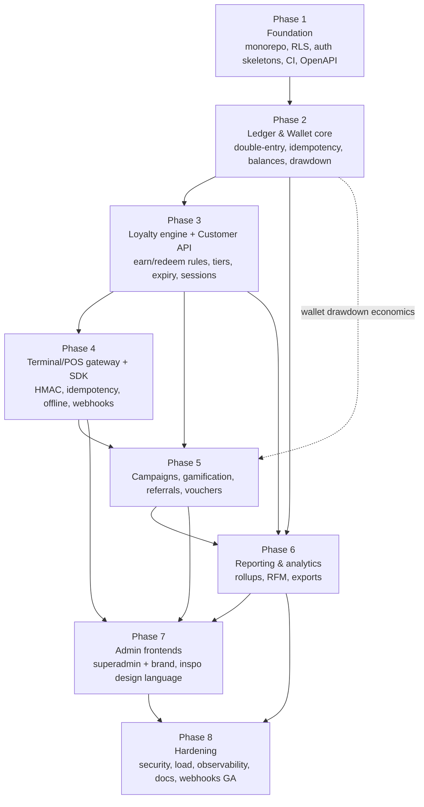
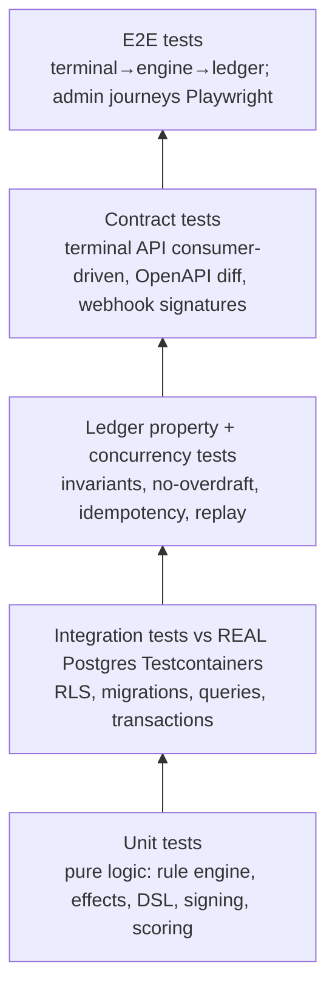

# Phased Build Roadmap

This document defines the phased build sequence for the RFM Loyalty Engine **after Phase 0 plan approval**. It is deliberately not date-bound; each phase is gated by explicit exit/acceptance criteria rather than calendar dates. Phases are ordered so that every later phase consumes only primitives proven in an earlier one — the ledger is correct before the loyalty engine spends from it, the loyalty engine is correct before terminals drive it, and terminals are correct before campaigns layer on top.

The roadmap is consistent with the locked architectural decisions: NestJS modular monolith on Turborepo + pnpm, PostgreSQL single shared schema with `tenant_id` + RLS + app-layer scoping, double-entry append-only ledger, BullMQ/Redis workers with a transactional outbox, CQRS-style read models, and Next.js admin frontends on Vercel.

---

## Guiding principles for sequencing

- **Correctness flows downhill.** The ledger (Phase 2) is the foundation of all monetary truth. Nothing that mutates balances ships before the ledger's property and concurrency tests are green.
- **Walking skeleton first.** Phase 1 produces a deployable, observable, RLS-enforced, OpenAPI-documented skeleton with zero business logic. Every later phase plugs into established rails (CI, migrations, tenancy context, auth guards, outbox).
- **Decision/effect separation from day one.** The loyalty rules engine (Phase 3) is a pure decision function emitting an ordered-independent array of typed effects (Talon.One pattern); a separate apply/commit step interprets effects into ledger mutations. This boundary is established before any rule logic exists.
- **Contract stability for slow-moving clients.** The terminal/POS surface (Phase 4) is treated as a payment API: narrow, versioned, idempotent, HMAC-signed. Its contract is frozen with consumer-driven contract tests before SDK distribution.
- **Read models are downstream and disposable.** Reporting (Phase 6) is built on event-driven rollups that can always be rebuilt from the immutable ledger + event log. It never contends with the write path.
- **Every phase is independently shippable to staging** and leaves the system in a coherent, tested, observable state.

The two off-critical-path opportunities for parallelism are called out per phase: once Phase 3 is stable, the **Reporting track (Phase 6)** and the **Campaign/gamification track (Phase 5)** can proceed concurrently with separate sub-teams, and **frontend scaffolding (Phase 7)** can begin against mocked OpenAPI before the real read models land.

---

## Phase 1 — Foundation

**Goal.** Stand up a deployable, fully wired walking skeleton: the Turborepo monorepo, the Prisma schema with the tenant hierarchy and RLS, transaction-scoped tenancy context, auth skeletons for all four surfaces, CI/CD, and generated OpenAPI. No business logic — but every cross-cutting concern that later phases depend on is real, tested, and enforced.

### Key deliverables

- **Monorepo scaffold (Turborepo + pnpm).** `apps/api` (NestJS), `apps/web-superadmin` (Next.js), `apps/web-brand` (Next.js), `packages/db` (Prisma schema + migrations + RLS SQL), `packages/shared` (zod DTOs/types), `packages/sdk-terminal`, `packages/sdk-customer`, `packages/config` (eslint/tsconfig/tailwind presets). Turborepo task graph for `build`, `lint`, `test`, `typecheck`, `db:migrate` with remote caching.
- **NestJS modular monolith skeleton.** Empty-but-bootstrapped domain modules with clean boundaries and no cross-module imports except through published interfaces: `ledger`, `loyalty-rules`, `campaigns`, `gamification`, `wallet`, `reporting`, `identity`, `terminal-gateway`. A `platform-core` module hosts tenancy context, the Prisma client provider, the outbox infrastructure, and shared guards.
- **Prisma schema — tenant hierarchy + scaffolding.** Tables for the `platform → group → brand → branch` hierarchy. Every tenant-scoped table carries the appropriate scope columns: loyalty data leads with `brand_id`; wallet/credit data leads with `group_id`. Composite indexes lead with the isolation key (e.g. `(brand_id, …)`). Append-only/audit tables and the `outbox` and `idempotency_keys` tables are created (even if unused until Phase 2).
- **Row-Level Security.** RLS enabled and **forced** on every tenant table. Policies separate `USING` (read filter) from `WITH CHECK` (write guard), keyed on `current_setting('app.current_brand_id', true)` / `app.current_group_id` via a `NULLIF(…, '')` guard so unset context **fails closed** (matches zero rows). Migrations run as an **owner role**; the app connects as a dedicated **non-owner, NOINHERIT, no-BYPASSRLS login role**.
- **Transaction-scoped tenancy context.** A NestJS interceptor/middleware opens a transaction per request and issues `SET LOCAL app.current_brand_id = …` (and group/branch) from **verified token claims only** — never from client headers. App-layer tenant-scoping guard runs as defense-in-depth alongside RLS. Pooler is configured for transaction pooling; **session-level `SET` is forbidden** (lint/CI check).
- **Auth skeletons (all four surfaces) — fully in-house, no third-party IdP** (decision 2026-06-13). Admin (superadmin + brand) = in-house email/password (argon2id) + **TOTP MFA**, issuing scoped access+refresh JWTs with rotation; RBAC roles bound to a scope node (platform/group/brand/branch). Customer = phone/OTP stub issuing access+refresh JWT (no real SMS yet — pluggable provider). Terminal = API-key + HMAC verification middleware (verifies signature; no transactions yet). A central authorization decision point (PDP) abstraction is stubbed with RBAC + ABAC brand/branch tags. We build our own identity module (users, credentials, MFA enrolment, sessions, refresh-token store) rather than integrating a vendor.
- **CI/CD pipeline.** Lint, typecheck, unit tests, `prisma migrate` against an ephemeral Postgres (Testcontainers / service container), OpenAPI generation + schema diff gate, and a **negative cross-tenant RLS test suite** that connects as the app role and asserts cross-brand reads/writes return zero rows or are rejected. Deploy `apps/api` + a worker process to **DigitalOcean** (App Platform / Droplets) against a **Supabase** Postgres; frontends to **Vercel** preview.
- **OpenAPI / Swagger.** Auto-generated from NestJS decorators + zod DTOs, published as a build artifact and committed/diffed so breaking changes are visible in PR review. This artifact is the source of truth for SDK generation and frontend mocking.
- **Baseline observability.** Structured JSON logging with `tenant_id`/`brand_id`/`request_id` correlation, OpenTelemetry traces, `/health` + `/ready` probes, and a metrics endpoint — all live before any business logic.

### Exit / acceptance criteria

- A request flows end-to-end through the API with tenancy context set transactionally, and RLS demonstrably isolates two seeded brands.
- The CI negative-isolation suite passes: as the app role, no query can read or write across `brand_id`/`group_id` boundaries; an unset context returns zero rows.
- `pnpm build` / `lint` / `typecheck` / `test` all green via Turborepo; migrations apply cleanly forward on a fresh database.
- OpenAPI document generates and the diff gate is enforced in CI.
- API + worker deploy to staging; health/readiness probes green; a trace for a sample request is visible in the tracing backend.

### Testing focus

- Unit tests for the tenancy interceptor and auth guards.
- **Integration tests against a real Postgres** (Testcontainers) for RLS policies — the single most important test asset created this phase. Run them as the **non-owner app role** so owner BYPASSRLS does not mask gaps.
- Migration up/down idempotency tests.
- Contract smoke test that the generated OpenAPI matches the running routes.

### Sequencing / dependencies

Blocks everything. Internal order: monorepo + config → Prisma schema + RLS → tenancy context → auth skeletons → CI → OpenAPI/observability. Frontend apps need only be bootstrapped (routing + design tokens stub), not built out.

---

## Phase 2 — Ledger & Wallet core

**Goal.** Build the immutable, append-only, double-entry engine that is the system of record for all monetary truth: the **POINTS ledger** (account per customer-per-brand) and the **CREDIT/WALLET ledger** (account per group). Make negative balances and double-spend structurally impossible, make every mutation idempotent, and implement prepaid wallet drawdown. This phase ships no customer-facing features — it ships a correct, hammered, internally-callable ledger API.

### Key deliverables

- **Journal model (append-only).** `journal_transaction` (groups balanced entries) and `journal_entry` (`account_id`, `direction`, `amount_minor` BIGINT, `asset_code`, `occurred_at`, `created_at`, idempotency linkage). A per-transaction constraint/trigger enforces `sum(debits) == sum(credits)`. **No UPDATE/DELETE ever** — corrections are reversing transactions referencing the original.
- **Two ledgers, one engine, distinct asset scoping.** Points stored as whole integers; money as integer minor units. Separate ledger/asset IDs so points and currency never mix in an entry. Points accounts are credit-normal liabilities scoped to `brand_id` (closed-loop, offset by a debit-normal points-expense/issuance account). Wallet accounts are credit-normal stored-value liabilities scoped to `group_id` (offset by debit-normal cash/clearing).
- **Materialized balances.** One balance row per account holding posted/pending debits and credits, `normal_balance`, and `lock_version`. Posted/pending/available computed on read. Balances are updated **in the same DB transaction** as the journal entries, guarded by `SELECT … FOR UPDATE` and `CHECK` constraints. A **conditional decrement** (`UPDATE … WHERE available - :amount >= 0`, treating zero affected rows as insufficient-balance) is the Postgres analogue of `debits_must_not_exceed_credits`.
- **Concurrency strategy.** Default to **optimistic locking** (`lock_version`) for this read-heavy workload; fall back to pessimistic `SELECT … FOR UPDATE` for known hot accounts (shared promo pools, high-traffic merchant wallets). Redemption critical sections run at **REPEATABLE READ / SERIALIZABLE** with bounded retry on serialization failure.
- **Idempotency.** `idempotency_keys` table unique on `(actor_id, key)`, storing request hash, response, and recovery state; operations run in a SERIALIZABLE transaction; replays return the stored response; same-key/different-params returns 409. Mandatory on every mutating op (earn, redeem, top-up, spend, reverse, adjust).
- **Two-phase (reserve → commit) transfers.** Pending entries reserve into `*_pending` without touching posted balances; `post_pending` settles (optionally partial); `void_pending` cancels; a TTL auto-void releases abandoned holds and emits an event. This is the substrate for redemption authorize/capture and wallet draws.
- **Wallet drawdown engine.** Configurable drawdown **trigger** per program (`ISSUANCE_TIME` vs `REDEMPTION_TIME`, default `REDEMPTION_TIME`), plus the hybrid "reserve-at-issuance, settle-at-redemption" mode. Configurable **Cost-Per-Point** (fixed / tiered-per-reward-type / weighted-average) and a platform **markup** per drawdown. The CPP, markup, and any rate inputs are **persisted on every wallet-debit ledger line** so statements are reproducible. Three monetary layers kept strictly separate: prepaid wallet balance (cash float / deposit liability), outstanding points liability (an estimate, not a cash movement), and platform revenue.
- **Transactional outbox.** Ledger mutation + outbox row written in one DB transaction; a BullMQ publisher emits domain events (`points.earned`, `wallet.debited`, `hold.voided`, …) **after commit**. Establishes exactly-once-ish delivery for everything downstream.
- **Reconciliation jobs.** A scheduled job re-derives balances from entries and alerts on drift vs materialized values; global invariant `sum(credit-normal) == sum(debit-normal)`; clearing/suspense accounts that must net to zero with stuck-money alerts.

### Exit / acceptance criteria

- Property tests prove balances always equal the replay of entries; the global zero-sum invariant holds across randomized operation sequences.
- Concurrency tests demonstrate **no lost updates and no overdraft** under high-contention parallel earn/redeem on the same account; double-spend is rejected.
- Idempotent replay of any mutating op returns the original result and produces no duplicate entries; mismatched params return 409.
- Reserve → capture → void lifecycle (including TTL auto-void) restores balances exactly; no orphaned holds.
- Wallet drawdown debits the correct amount with persisted CPP/markup; statements regenerate identically; overdraw is blocked per policy.
- Outbox guarantees an event is emitted iff its transaction committed (crash-injection test).

### Testing focus

- **Ledger property tests** (fast-check/jsverify style): generate random valid operation sequences, assert invariants (zero-sum, non-negative liability, derived == materialized) after each step.
- **Concurrency tests against real Postgres:** N parallel workers hammering one account; assert final balance and absence of negative/over-spend; verify SERIALIZABLE retry path.
- **Crash/idempotency tests:** kill mid-transaction, replay, assert exactly-once.
- Reconciliation drift detection test (inject a deliberate mismatch).
- Wallet statement reproducibility test (regenerate a period and byte-compare totals).

### Sequencing / dependencies

Depends on Phase 1 (schema, RLS, outbox infra, tenancy). Blocks Phase 3 (loyalty spends from this ledger) and Phase 6 (liability reporting reads this ledger). The wallet economics feed Phase 5's campaign cost modeling.

---

## Phase 3 — Loyalty engine + Customer API

**Goal.** Build the headless loyalty rules engine as a **pure decision function** emitting typed effects, the **customer session/transaction state machine** that commits those effects to the ledger idempotently, the earn/redeem/tier/expiry mechanics, and the customer-facing API/SDK.

### Key deliverables

- **Effects model (Talon.One pattern).** The rule engine input is a session/profile/event snapshot; output is an **ordered-independent array of typed effects** (`addLoyaltyPoints`, `deductLoyaltyPoints`, `setLoyaltyPointsExpiryDate`, `changeLoyaltyTierLevel`, `triggerWebhook`, `updateAttribute`, `error`, …). The engine **never mutates balances directly**. A separate apply/commit step interprets effects into Phase 2 ledger operations. Integration logic treats the effects array as an unordered set keyed by `effectType + props`.
- **Customer session state machine.** `open → closed → (cancelled | partially_returned)` with reopen. Ledger effects commit **only on close**; cancel/reopen emits rollback effects that undo prior effects; partial returns roll back per-item effects for returned items only; attribute updates are intentionally not rolled back (audit trail). Re-sending a session update re-evaluates and reconciles for safe retries. Per-profile/per-session **request serialization** prevents lost-update races (bounded parallelism + 409 on contention).
- **Rule DSL.** Serializable JSON tree of composable condition groups (AND/OR/NOT with nesting) over typed, namespaced attributes (`profile.*`, `session.*`, `item.*`, `event.*`) with a bounded operator set (`eq/neq/gt/lt/in/contains/startsWith/regex`). Regex uses a **safe RE2-style engine** with evaluation timeouts. Rules are stored as versioned data and evaluated in a sandboxed interpreter — enabling a no-code builder later with no code deploys. A flexible **custom-attribute** system lets brands attach fields to profiles/transactions/items/events without schema migrations.
- **Earning rules + multipliers.** Per-spend, per-visit/check-in, per-SKU/category, per-channel, fixed-bonus, and per-segment earning. **Multipliers as a distinct layered concept** (tier / time-bound campaign / category-SKU / segment / behavioral) with explicit **stacking mode** (combine vs take-highest) and **per-transaction caps** as guardrails. Non-transactional earning (reviews, referrals, profile completion, app activity) supported via custom events.
- **Point states + expiry.** Points modeled explicitly as pending / active(available) / redeemed / expired / adjusted / lifetime. **FIFO expiration buckets** with an **activation delay** (pending hold) so returns/fraud can claw back before points are spendable; expiry clock starts at activation. Cohort metadata (issue date, program version, earn rule, expiry, brand) persisted for breakage modeling.
- **Tiers.** 3–5 configurable levels qualified on a configurable metric (spend / points / visits / time), with multiplier + benefit flags, a **review/reset job** (calendar / rolling / anniversary), configurable downgrade logic, and a grace period. "Progress to next tier" stored as a computed value for UI progress bars.
- **Periodic recalculation job (idempotent).** Nightly batch in this order: activate pending → expiry sweep → tier recompute. Real-time decisioning stays in the request path; tiers/expiry are eventually-consistent and the job is safely re-runnable. Implemented as a BullMQ scheduled worker.
- **Customer API + `packages/sdk-customer`.** Phone/OTP auth issuing access+refresh JWT (real OTP provider now wired: short single-use codes, per-phone + per-IP caps with backoff, separate wrong/expired counters). Endpoints for profile, balances, transaction history, tier/progress, redeem. Display-API-style read endpoints for the customer app. Global person identity (deduped by phone/email) with per-brand membership + per-brand point wallet — one human, many brands, closed-loop balances.

### Exit / acceptance criteria

- The rule engine is a pure function: identical input → identical effect array, with no side effects (verified by snapshot + reorder-invariance tests).
- A full session lifecycle (open → close, cancel, partial-return, reopen) produces exactly-correct ledger state with all rollbacks applied; replays are idempotent.
- Earn/redeem with multipliers respects stacking mode and per-transaction caps; FIFO expiry retires the shortest-expiry bucket first; activation delay prevents spending pending points.
- The nightly recalc job is idempotent (run twice → same result) and produces correct tier transitions and expiries.
- Customer can authenticate, view an accurate near-real-time balance, and redeem; OTP rate limits enforced.

### Testing focus

- **Engine determinism + reorder-invariance** unit tests (shuffle the effects array; apply step must produce identical ledger state).
- Rule DSL evaluation tests including malicious/regex-DoS inputs (assert timeout/bounding).
- Session state-machine tests for every transition incl. partial returns and reopen.
- Integration tests (real Postgres) for earn → expire → redeem FIFO across cohorts.
- Idempotency of the recalc job; concurrency of per-profile serialization.

### Sequencing / dependencies

Depends on Phase 2 (ledger, idempotency, two-phase holds). Blocks Phase 4 (terminals drive sessions/earn/redeem), Phase 5 (campaigns/gamification emit effects), and Phase 6 (RFM/retention read transaction history). Customer SDK is generated from the OpenAPI artifact.

---

## Phase 4 — Terminal/POS gateway + SDK

**Goal.** Expose the loyalty engine to the point of sale as a **payment-grade API**: narrow, versioned, idempotent, HMAC-signed, with an explicit transaction state machine, offline store-and-forward, and signed webhooks plus pollable state. Ship `packages/sdk-terminal`.

### Key deliverables

- **Narrow versioned surface (`/v1/terminal/*`).** Exactly: `POST /v1/members/resolve` (typed identifier `{type: phone|qr|nfc|loyalty_id|card_token, value}` → short-lived opaque member token), `POST /v1/quotes` (preview earn/discount, no mutation), `POST /v1/transactions` (earn or redeem-authorize), `POST /v1/transactions/{id}/capture`, `/void`, `/reverse` (compensating refund), `GET /v1/transactions/{id}` (poll fallback), plus device + webhook admin. The contract is treated as frozen and additive-only.
- **Transaction state machine.** `PENDING → AUTHORIZED → CAPTURED`, terminal `VOIDED / EXPIRED / REVERSED / FAILED`. Earn at a settled sale may collapse to a single `CAPTURED` write; redemptions authorize-then-capture against the Phase 2 two-phase holds, with **TTL auto-release** mirroring card-auth expiry. Refunds emit a **linked REVERSE** event — never mutate a committed event.
- **Auth: API key + HMAC.** Per-terminal publishable id + secret used for **HMAC request signing** (SigV4-style canonical request: signed headers, timestamp, nonce to defeat replay). Two-tier credentials: a single-use, short-TTL pairing/registration code provisions a device → long-lived device secret in the keystore → device exchanges secret for short-lived (~1h) bearer tokens scoped to a single store/lane. Overlapping `{current, previous}` rotation for device secrets and webhook signing secrets.
- **Mandatory idempotency.** `Idempotency-Key` header required on every POST touching the ledger; key → `{status, response, request-hash}` persisted ≥24h; replay returns stored response; same-key/different-hash returns 409. Engine off the cardholder-data path entirely (loyalty rides as a value-added-service tender/Intent on Android smart terminals).
- **Offline store-and-forward (in the SDK).** When offline: validate the member token locally, compute a provisional result, sign the queued request with its client-generated idempotency key, show a provisional UI state, and forward on reconnect. Server is authoritative on sync and may **downgrade an offline redeem into a reversal** (insufficient balance / expired tier), surfaced as a settle-time event. **Bounded clock-skew handling** and per-member/per-device **offline exposure caps** + max queue age.
- **Webhooks + polling.** Outbound domain events delivered via the Phase 2 outbox → BullMQ webhook worker with exponential-backoff retries + **DLQ**. Signed HMAC-SHA256 over `timestamp.rawbody`; `X-Loyalty-Signature: t=…,v1=…`; consumers verify on raw bytes, reject >5-min skew, dedupe on stable `event_id`. Because webhooks can be lost, `GET /v1/transactions/{id}` is always the definitive fallback before printing a receipt.
- **`packages/sdk-terminal`.** Generated client + the offline queue, signing, retry, and replay logic. A correlation id (ServiceID/SaleID-style) echoed on every response and webhook.

### Exit / acceptance criteria

- Consumer-driven contract tests (Pact-style) pass for resolve/quote/earn/authorize/capture/void/reverse; the OpenAPI contract is frozen and versioned.
- HMAC verification rejects tampered, replayed (stale timestamp / reused nonce), and wrong-key requests; passes valid ones.
- An offline-queued earn and redeem forward correctly on reconnect; a stale offline redeem is reconciled into a reversal; offline caps enforced.
- Idempotent retries (including client-generated keys from offline) never double-earn/double-burn.
- A lost webhook is recoverable via polling; webhook signatures verify on raw bytes; DLQ captures poison messages.

### Testing focus

- **Contract tests** for the terminal API (the contract is the deliverable). Version-compat tests assert additive-only evolution.
- HMAC signing/verification unit tests incl. raw-body verification and replay window.
- Offline replay + reconciliation integration tests with simulated network partitions and clock skew.
- End-to-end earn/redeem from a simulated terminal through the engine to the ledger.

### Sequencing / dependencies

Depends on Phase 3 (sessions, earn/redeem, holds) and Phase 2 (two-phase transfers, idempotency). Webhook delivery uses the Phase 2 outbox. Can run **in parallel with Phase 5** once Phase 3 is stable.

---

## Phase 5 — Campaigns, gamification, referrals, vouchers

**Goal.** Layer the engagement mechanics on top of the proven engine: promotion/campaign stacking with evaluation groups, gamification (badges, streaks, challenges, leaderboards, games of chance) with **real-time in-session reward delivery**, double-sided referrals, and a voucher/coupon subsystem — all expressed as rules/effects, all committing through the Phase 2 ledger.

### Key deliverables

- **Campaign evaluation groups.** Campaigns live in **ordered groups** evaluated top-to-bottom; each group has an evaluation **mode** (`stackable` / `first-campaign` / `highest-value`) and a **scope** (session-level vs item-level). Item scope enforces one campaign per cart-item unit. **Cascading discounts** apply later campaigns to the already-discounted total with a **hard floor at zero**. This declaratively solves stacking/exclusivity/discount-over-cart-value.
- **Budgets & limits as effect constraints.** Budgets checked on every session update but **only consumed on session close** (preview vs commit). Per-campaign / per-customer / per-day caps evaluated **inside the engine**, not the integration. A coupon may be offered then become invalid before checkout if budget is exhausted.
- **Gamification module.** Badges/achievements (simple single-rule and multi-dimensional composed), streaks (loss-aversion), time-bound challenges/missions/quests, **micro/segmented leaderboards** (rank vs nearby peers, not the global top), progress visualization, and games of chance (spin/scratch). **Rewards and celebrations fire in real time / in-session** (event-driven via BullMQ gamification evaluation worker) — never batch/overnight, which kills the dopamine loop. Achievements emit standard effects committed through the ledger.
- **Double-sided referrals.** Unique referral codes/links, end-to-end attribution to the **referred user's qualifying action** (not mere signup), rewards to **both** parties, and fraud caps (self-referral detection, code-farming limits). Tied to the same points ledger — not a standalone system. Optional tiered/escalating referral rewards.
- **Voucher/coupon subsystem.** Unique codes, validity windows, min-spend / eligible-SKU validation rules, single-use vs multi-use, per-customer limits. Coupon effects (`acceptCoupon`/`rejectCoupon`/`reserveCoupon`/rollback) flow through the effects model. Reservation integrates with the two-phase hold pattern.
- **Anniversary & surprise-and-delight triggers.** Modeled as scheduled/triggered campaigns (enrollment-anniversary bonuses, anniversary multipliers), not a separate subsystem.

### Exit / acceptance criteria

- Evaluation-group modes produce correct stacking/exclusivity/highest-value outcomes; cascading discounts never drive totals negative.
- Budgets are previewed but only consumed on close; exceeding a budget mid-flight invalidates the offer correctly.
- Gamification rewards are delivered **in-session** (measured latency budget) and committed idempotently to the ledger.
- Double-sided referral rewards fire only on a qualifying referred action; fraud caps block self-referral and farming.
- Vouchers validate, reserve, redeem, and roll back correctly; per-customer/single-use limits enforced.

### Testing focus

- Evaluation-group stacking/scope/cascading-discount unit tests (including the zero-floor).
- Budget preview-vs-commit and concurrency (two sessions racing for the last unit of budget).
- Gamification real-time delivery latency + idempotency tests.
- Referral attribution + fraud-cap tests.
- Voucher lifecycle + reservation/rollback integration tests.

### Sequencing / dependencies

Depends on Phase 3 (effects model, rule DSL, sessions) and Phase 2 (ledger, holds, wallet economics for funded campaigns). Can run **in parallel with Phase 4**. Feeds Phase 6 (campaign performance reporting) and Phase 7 (campaign builder UI).

---

## Phase 6 — Reporting & analytics

**Goal.** Build CQRS-style read models that never contend with the write path: event-driven pre-aggregated rollups, Postgres materialized views, scheduled RFM/cohort/churn/LTV scoring, the ASC 606 points-liability + breakage reporting, and async exports — all served off **read replicas**.

### Key deliverables

- **Read-replica routing.** A separate read-only connection pool routes all reporting/dashboard/export queries to a streaming read replica, removing analytics contention from the primary. RLS + app-layer scoping enforced on every read query.
- **Pre-aggregated rollup tables.** Per-brand, per-day grain (`brand_daily_metrics`: transactions, points issued/redeemed/expired, revenue, active customers, wallet draws). Maintained by **event-driven** consumers off the outbox + scheduled `INSERT … ON CONFLICT` incremental jobs (managed-Postgres-friendly; avoids full `REFRESH`). Where materialized views are used, they have a **non-nullable, non-partial UNIQUE index** and refresh `CONCURRENTLY` off-peak. Dashboards and date-range filters hit rollups, drilling to raw transactions only on demand.
- **RFM / cohort / churn / LTV.** Scheduled batch jobs (nightly; RFM at least quarterly) writing to segment tables keyed `(brand_id, customer_id)` with an **as-of date** for point-in-time reproducibility. RFM = 1–5 NTILE scoring on Recency/Frequency/Monetary → named segments (Champions, Loyalists, At-Risk, Dormant, New). RFM codes validated against historical retention/LTV gradients before targeting. Segments feed back into Phase 5 campaign targeting.
- **Points-liability & breakage reporting.** Periodic liability snapshots derived from the immutable ledger: `Outstanding Points × Cost-Per-Point × Ultimate Redemption Rate` (= `× (1 − Ultimate Breakage Rate)`). Cohort/vintage triangles for URR/UBR estimation (configurable default URR until ≥2 years of brand history). Breakage recognized on the **proportional pattern**, not lump-sum, with the rate inputs stored so snapshots are reproducible. Outstanding-points-liability export for the brand's own ASC 606 reporting.
- **Wallet statements & invoice-ready exports.** Per-merchant period statements (opening balance, top-ups, redemptions with persisted CPP, platform fees, expiries/breakage, closing balance) and a journal-entry CSV mapping to deferred-revenue / contract-liability / revenue GL accounts.
- **Async export pipeline.** CSV/Excel/PDF exports as **background BullMQ jobs** streaming from the replica in ~1k-row batches to object storage, delivered via email/poll-for-download — never inside a synchronous HTTP request. Tenant scoping enforced on every export.
- **Reporting APIs for both admin surfaces.** Superadmin platform-wide (cross-brand via **audited security-definer functions**, never by loosening RLS) and brand-scoped reporting endpoints with date-range + drill-down.

### Exit / acceptance criteria

- Reporting queries hit the replica; primary write-path latency is unaffected under reporting load (verified).
- Rollups reconcile to raw ledger totals; incremental jobs self-heal via scheduled full refresh (no silent drift from late-arriving events — lookback window applied).
- RFM/cohort/LTV are reproducible from a given as-of date; segments match expected retention gradient.
- Liability snapshots reconcile to the ledger and regenerate identically; breakage recognized proportionally.
- A 100k+-row export completes as a background job and is delivered via download link without an HTTP timeout.

### Testing focus

- Rollup-vs-raw reconciliation tests; late-arriving-event lookback correctness.
- RFM scoring + point-in-time reproducibility tests.
- Liability/breakage reproducibility tests against the immutable ledger.
- Export streaming/memory tests (assert no full-result-set buffering); tenant-scoping on every export.
- Cross-brand leakage tests on reporting endpoints (security-definer path audited).

### Sequencing / dependencies

Depends on Phase 2 (ledger), Phase 3 (transaction history), Phase 5 (campaign/referral events). Can begin **in parallel with Phase 5** for the parts that depend only on Phase 2/3 data. Blocks Phase 7 (admin dashboards consume these read models).

---

## Phase 7 — Admin frontends (superadmin + brand)

**Goal.** Build the two Next.js admin applications with the locked **inspiration design language**, consuming the OpenAPI-typed APIs and the Phase 6 read models. Superadmin operates the platform across all tenants (fully audited, including impersonation); brand admin operates a single brand/group.

### Key deliverables

- **Design system (frontend-design skill at build time).** Light-mode primary; airy generous whitespace; soft large-radius cards; subtle gradients (coral→pink, teal→blue); bold oversized headings with playful inline icon accents; lime/chartreuse + near-black accent palette. Left **icon-rail nav**, tab bars, stat **hero cards** with big numbers + colored % badges, smooth line charts (Recharts/visx), vertical range/candlestick stat bars, horizontal progress bars with %, activity/meeting-style lists. Built on Next.js App Router + React + TS + Tailwind + shadcn/ui, deployed on Vercel. Frontend can begin against **mocked OpenAPI** before real read models are final.
- **`apps/web-superadmin`.** Tenant hierarchy management (group/brand/branch), program configuration, wallet/credit administration with low-balance alerts and auto-top-up config, drawdown-trigger and CPP/markup configuration, platform-wide reporting, audited **impersonation/support tooling**, escheatment/data-retention configuration, and the no-code rule/campaign builder backed by the serializable rule DSL.
- **`apps/web-brand`.** Brand-scoped dashboards (RFM segments, retention, liability, redemption), program/tier/earning-rule configuration, campaign + gamification + referral + voucher management, member lookup, and brand reporting/exports. Tier progress bars, hero stat cards, and segment visualizations from Phase 6.
- **Auth + RBAC in the UI.** In-house email/password + TOTP MFA for admins (no third-party IdP); UI honors scoped RBAC (roles bound to a scope node) and ABAC brand/branch boundaries; every privileged action is audited. The UI never trusts client-set tenant context — scope derives from the verified session.
- **Realtime-ish UX.** Balances, gamification feeds, and campaign metrics reflect near-real-time state; long-running exports show async job status.

### Exit / acceptance criteria

- Both apps pass the design-language review (tokens, components, charts match the inspiration spec) and accessibility checks.
- A brand admin can configure an earning rule, launch a campaign, and view its performance entirely from the UI without engineering involvement.
- Superadmin impersonation is fully audited end-to-end; RBAC/ABAC scope is enforced in the UI and re-validated server-side.
- Dashboards render from Phase 6 read models within latency budget; exports trigger and deliver from the UI.

### Testing focus

- Component/visual regression tests against the design tokens.
- E2E (Playwright) for the critical admin journeys (configure rule → launch campaign → view report; impersonation; export).
- RBAC/ABAC authorization tests in the UI with server-side re-validation.
- Accessibility (axe) and responsive checks.

### Sequencing / dependencies

Depends on Phase 6 (read models) and Phase 5 (campaign/gamification/voucher/referral management surfaces) and Phase 4 (terminal/device admin). Scaffolding (design system, routing, mocked data) can start as early as Phase 1's OpenAPI artifact exists.

---

## Phase 8 — Hardening

**Goal.** Make the platform production-ready: independent security review, load/soak testing, full observability and SLOs, complete documentation, and webhooks promoted to GA with formal delivery guarantees.

### Key deliverables

- **Security review.** Penetration test + threat-model review covering: cross-tenant isolation (RLS + app scoping, negative tests as the app role), terminal HMAC/replay, OTP pumping/SIM-swap resistance, secrets management + rotation, PII column-level encryption + crypto-shredding erasure path, tamper-evident hash-chained audit log, and the GDPR/CCPA pseudonymization/tombstoning flow that preserves the immutable financial ledger (anonymized). Remediate findings before GA.
- **Load & soak testing.** Sustained load on earn/redeem/quote and the terminal gateway; concurrency stress on hot ledger accounts (shared promo pool, high-traffic merchant wallet) to validate the optimistic/pessimistic strategy and SERIALIZABLE retry budgets; reporting load on replicas to confirm no write-path contention; noisy-neighbor guardrails (statement/idle-in-transaction timeouts, per-tenant connection caps, per-brand token-bucket rate limiting) validated under a hostile tenant.
- **Observability & SLOs.** End-to-end OpenTelemetry tracing across API → worker → DB; RED/USE dashboards per domain module; BullMQ queue depth + DLQ alerts; outbox lag alerts; ledger reconciliation-drift alerts; wallet low-balance alerts; SLOs + error budgets defined per surface (customer API, terminal API, admin) with alerting.
- **Documentation.** Public terminal API docs + SDK guides (including offline semantics), customer SDK docs, admin user guides, runbooks (incident response, DLQ drain, reconciliation discrepancy, key rotation, tenant onboarding), and architecture decision records.
- **Webhooks GA.** Formal at-least-once delivery guarantees, documented signing + rotation, DLQ + replay tooling, subscription management UI, and delivery-attempt observability. Promote from beta to GA with versioned event schemas.
- **Disaster recovery & data residency.** Per-tenant region pinning (default UAE; each group's write path pinned to its home region — multi-country), read replicas multi-region for reporting; backup/restore and PITR drills; documented RPO/RTO.

### Exit / acceptance criteria

- Security review findings remediated; no open high/critical issues; negative cross-tenant suite green in CI as a permanent gate.
- Load tests meet latency/throughput SLOs at target volume with no ledger correctness violations under sustained contention.
- Full trace visibility, dashboards, and alerts live; reconciliation/outbox/DLQ alerts fire correctly in fault-injection drills.
- Webhooks GA: delivery guarantees documented and demonstrated; replay tooling validated.
- DR drill (restore + failover) meets documented RPO/RTO.

### Testing focus

- Penetration testing + automated security scanning (secrets, deps, SAST/DAST).
- Load/soak/chaos (kill workers, partition Redis, drop replica) with correctness assertions.
- Fault-injection on outbox/webhook delivery and reconciliation.
- DR restore/failover rehearsal.

### Sequencing / dependencies

Depends on all prior phases. Runs last but its disciplines (security tests, observability, load harness) are seeded incrementally from Phase 1 onward — Phase 8 is the formal gate, not the first time these are considered.

---

## Testing strategy per layer

The testing pyramid is enforced in CI from Phase 1. Each layer below names the technique, where it runs, and what it guards.

- **Unit (fast, no I/O).** The rule engine as a pure function (determinism + **effects-array reorder-invariance**), DSL evaluation incl. regex-DoS bounding, multiplier/stacking math, RFM NTILE scoring, HMAC canonicalization/signing, tenancy-claim resolution, money/points integer arithmetic. Highest count; runs on every commit.
- **Integration against a real Postgres (Testcontainers).** Never mock the database for anything touching RLS, transactions, or constraints. Run suites **as the non-owner app role** so owner BYPASSRLS cannot mask isolation gaps. Covers: RLS read/write isolation + fail-closed on unset context, migration up/down, `WITH CHECK` cross-brand write rejection, materialized-view refresh, rollup-vs-raw reconciliation.
- **Ledger property & concurrency tests.** The crown jewels. **Property-based** (generate random valid operation sequences; assert zero-sum, non-negative liability, derived == materialized after each step). **Concurrency** (N parallel workers on one hot account; assert no lost updates, no overdraft, correct SERIALIZABLE retry; assert reserve→capture→void restores exactly). **Idempotency/crash** (kill mid-transaction, replay, assert exactly-once; same-key/different-params → 409). Outbox crash-injection (event emitted iff committed).
- **Contract tests for the terminal API.** Consumer-driven (Pact-style) provider/consumer verification for resolve/quote/earn/authorize/capture/void/reverse. **OpenAPI diff gate** fails CI on non-additive changes. Webhook **signature contract** (HMAC over raw `timestamp.rawbody`, skew window, `event_id` dedupe). Version-compat tests assert slow-moving terminals keep working across `/v1` evolution.
- **End-to-end.** Simulated terminal → gateway → loyalty engine → ledger (incl. offline queue + reconciliation-to-reversal); customer-app earn/redeem; admin Playwright journeys (configure rule → launch campaign → view report; audited impersonation; async export). Run on staging-like infra against real Postgres + Redis.

Cross-cutting test gates wired into CI permanently: the **negative cross-tenant isolation suite** (as app role), the **OpenAPI diff gate**, and the **ledger property/concurrency suite** — a red result in any of these blocks merge.

---

## Observability / ops checklist

Seeded in Phase 1, completed in Phase 8. Each item is a deployable gate, not aspirational.

**Telemetry**
- Structured JSON logs with `request_id`, `tenant_id`/`brand_id`/`group_id`, `actor_id`, and outbound correlation id on every log line.
- OpenTelemetry distributed tracing spanning API → BullMQ worker → Postgres/Redis; trace-id propagated through the outbox into webhook deliveries.
- RED metrics (rate/errors/duration) per endpoint and per domain module; USE metrics (utilization/saturation/errors) for DB, Redis, and workers.

**Domain-specific alerts**
- **Ledger reconciliation drift** (derived vs materialized balance mismatch; global zero-sum violation) — page immediately.
- **Clearing/suspense stuck money** (non-zero control account) alert.
- **BullMQ queue depth + DLQ** size/age alerts (webhook delivery, expiry sweep, reporting rollup, gamification eval).
- **Outbox publish lag** (uncommitted-vs-published delta) alert.
- **Wallet low-balance / runway** alerts (per-merchant threshold + days-of-runway) to merchant + superadmin; auto-top-up failure alert.
- **OTP abuse** anomaly alerts (per-phone/per-IP spikes); cross-tenant access-attempt alerts.
- **Replication lag** alert on reporting replicas; **replica fallback** behavior verified.

**Operational guardrails**
- `statement_timeout`, `idle_in_transaction_session_timeout`, pooler query timeout, per-tenant connection caps, per-brand token-bucket rate limiting (Redis).
- Transaction pooling only; **session-level `SET` forbidden** (CI lint + runtime assertion).
- Idempotency-key store TTL + cleanup job; redeem-hold TTL auto-void job; expiry/breakage sweep job — all idempotent and monitored.
- Secrets in a dedicated manager (least privilege, encrypted), automated rotation with overlapping `{current, previous}` windows for device secrets, webhook signing secrets, and API keys; leak scanning in pre-commit + CI.

**Runbooks (authored in Phase 8, stubbed earlier)**
- Incident response; DLQ drain/replay; ledger reconciliation-discrepancy resolution (always via reversing entries, never edits); key/secret rotation; tenant onboarding; webhook subscription + replay; DR restore + region failover with documented RPO/RTO.

**Health & deploy**
- `/health` (liveness) + `/ready` (readiness incl. DB + Redis reachability) on API and workers.
- Migrations applied as the owner role in a gated deploy step, separate from the running app role; forward-only with reviewed rollback plan.
- Per-region single primary write node honoring data residency; multi-region read replicas for reporting; blue/green or canary deploy for the API; slow-rolling terminal SDK distribution honoring additive-only API versioning.
